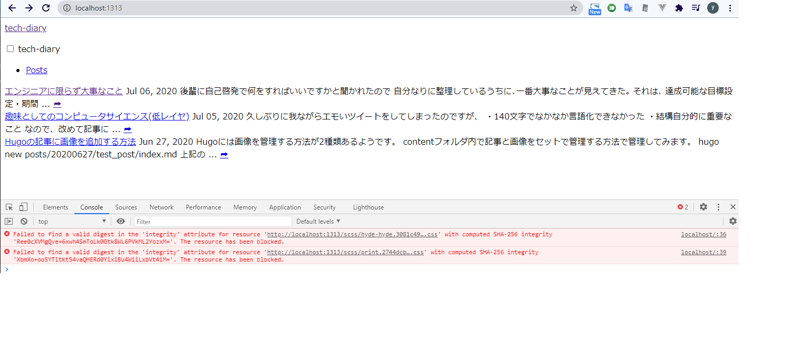

### 久しぶりに触るので git clone から。

```
git clone https://github.com/snyt45/TechDiary.git
```

PC をリストアしたので、hugo のインストールが必要だった。

Powershell を管理者として実行。

```
choco install hugo
```

インストールできたか確認。

```
hugo version
=> Hugo Static Site Generator v0.76.5-60F0725B windows/amd64 BuildDate: 2020-10-14T15:16:53Z
```

hugo のテーマは、submodule で管理してあるのでローカルにコードを持ってくる必要がある。

```
git submodule init

git submodule update
```

ローカルでライブプレビューしてみる。

```
hugo server

=>
Start building sites …
WARNING: calling IsSet with unsupported type "invalid" (<nil>) will always return false.


                   | EN
-------------------+-----
  Pages            | 12
  Paginator pages  |  0
  Non-page files   |  1
  Static files     | 19
  Processed images |  0
  Aliases          |  1
  Sitemaps         |  1
  Cleaned          |  0

Built in 21 ms
Watching for changes in C:\Users\snyt45\desktop\TechDiary\{archetypes,content,themes}
Watching for config changes in C:\Users\snyt45\desktop\TechDiary\config.toml
Environment: "development"
Serving pages from memory
Running in Fast Render Mode. For full rebuilds on change: hugo server --disableFastRender
Web Server is available at http://localhost:1313/ (bind address 127.0.0.1)
Press Ctrl+C to stop
```

### スタイルが反映されない

警告は出るし、http://localhost:1313/にアクセスしてもスタイルが反映されていない。。

コンソールエラーが出ている。

```
Failed to find a valid digest in the 'integrity' attribute for resource 'http://localhost:1313/scss/hyde-hyde.3081c4981fb69a2783dd36ecfdd0e6ba7a158d4cbfdd290ebce8f78ba0469fc6.css' with computed SHA-256 integrity 'Ree0cXVMgQve+6xwh4SmToLk0Gtk8WL6PVkML2YozxM='. The resource has been blocked.
localhost/:39 Failed to find a valid digest in the 'integrity' attribute for resource 'http://localhost:1313/scss/print.2744dcbf8a0b2e74f8a50e4b34e5f441be7cf93cc7de27029121c6a09f9e77bc.css' with computed SHA-256 integrity 'XbmXo+oo5YTltkt54vaQHERd0Yix1Bu4WiiLxbVt4iM='. The resource has been blocked.
```



同じようなエラーが発生している人もいるようだ。  
[Hugo - Failed to find a valid digest in the 'integrity' attribute for resource](https://blog.gerardbeckerleg.com/posts/hugo-failed-to-find-a-valid-digest-in-the-integrity-attribute-for-resource/)

### 原因は改行コード

いくつか見る限り、windows の改行コードが問題のようだ。  
確かに hugo でサイトを作ったときは Mac で作った。そして、いま windows で作業している。  
[Failed to find a valid digest in the 'integrity' attribute for resource · Issue \#269 · xianmin/hugo\-theme\-jane](https://github.com/xianmin/hugo-theme-jane/issues/269)

> Windows では、ファイルをチェックアウトすると、新しい行が\ n から\ r \ n に変更され、チェックサムが無効になります。

[Failed to find a valid digest in the 'integrity' attribute for resource · Issue \#65 · htr3n/hyde\-hyde](https://github.com/htr3n/hyde-hyde/issues/65)

git config -l すると、core.autocrlf=true になっている。

core.autocrlf=true のときの挙動は qiita の記事が参考になる。  
[気をつけて！Git for Windows における改行コード \- Qiita](https://qiita.com/uggds/items/00a1974ec4f115616580)

ということは、  
・リモートは LF  
・ローカルは CRLF  
になっている

実際は、LF と CRLF が混在しているようだ。

### 解決方法

以下のことを行ったら、Windows でも CSS が正しく反映された。

一時的に autocrlf を false にする。これで、GitHub から clone 時に改行コードが LF のまま持ってこれる。

```
git config core.autocrlf false
```

autocrlf が false になったことを確認する。

```
git config core.autocrlf
=> false
```

改めて、clone

```
git clone https://github.com/snyt45/TechDiary.git
```

サブモジュールも反映。

```
git submodule init
git submodule update
```

ライブプレビュー起動。

```
hugo server
```

正しく CSS が反映された！

Github 上は LF のコードを LF のまま編集してプッシュするので、問題はなさそう。
手元で CRLF で動かさないといけない場面では、autocrlf を true にしていたほうがよさそうだ。

### やっと本題のタイトル編集方法

config.toml の title を変更するだけ！

```toml
baseURL = "https://snyt45.com/"
languageCode = "ja"
title = "tech diary" # titleを変更する
theme = "hyde-hyde"
hasCJKLanguage = true

[[menu.main]]
    name = "Posts"
    identifier = "posts"
    url = "/posts/"
```
