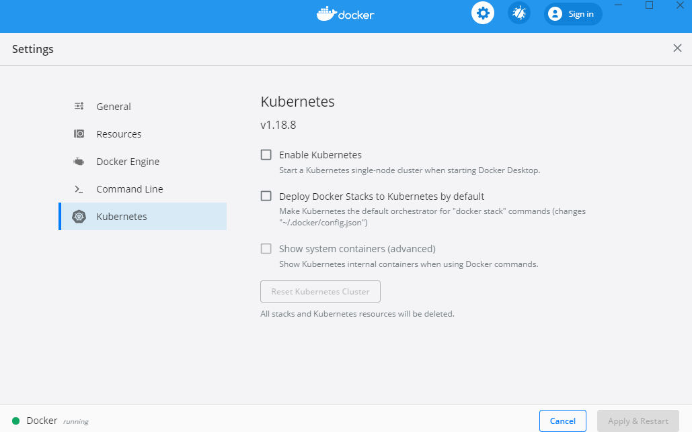
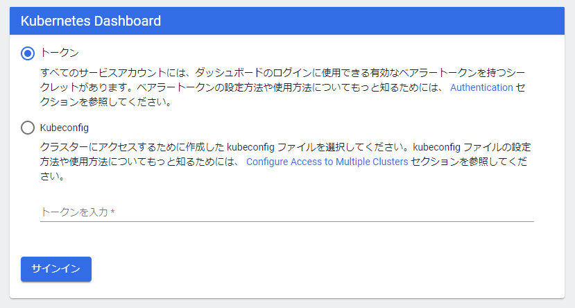
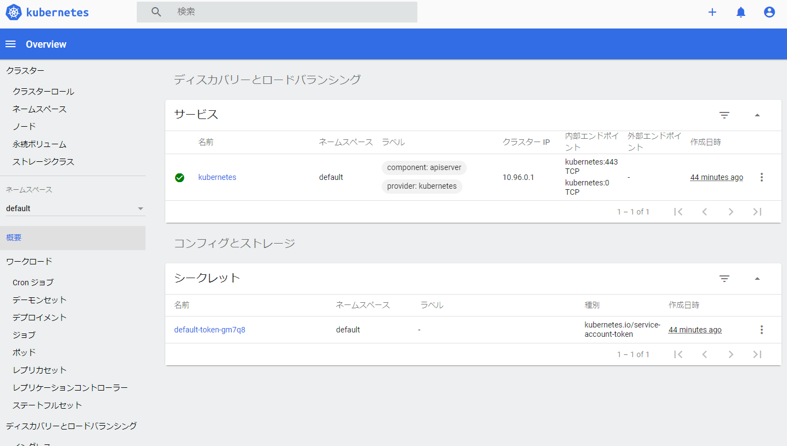

[Docker/Kubernetes 実践コンテナ開発入門：書籍案内｜技術評論社](https://gihyo.jp/book/2018/978-4-297-10033-9)

4 章では主に Docker の Swarm モードを使って複数のサービスを同じネットワーク内で連携しあって、TODO アプリを動かしました。

5 章では Kubernetes(クーベネティス)を使っていきます。

## 5.Kubernetes 入門

- 2017 年秋に正式に Docker が Kubernetes を統合・サポートすることを発表
- 以降、kubernetes は k8s(ケーエイツ)と記載。

### 5.1 Kubernetes とは

- k8s は Google 主導で開発された、コンテナの運用を自動化するためのコンテナオーケストレーションシステム
- k8s は様々な部品を組み合わせることで柔軟性の高いアプリケーションを構築できるのが最大の特徴

#### 5.1.1 Docker の隆盛と Kubernetes の誕生

- Docker が利用され始めた頃、デプロイやコンテナの配置戦略、スケールイン・スケールアウト、サービスディスカバリ、運用のしやすさといった点で課題があった
- その間、様々なオーケストレーションシステムが登場。AWS では ECS の登場でコンテナを使ったアプリケーション開発が現実的に
- その中でもここ数年特に存在感を発揮したのが 2014 年に Google が OSS として公開した k8s
- 様々なプラットフォームで k8s のサポートするサービスが増えた。
  - Google では、Google Kubernetes Engine(GKE)
  - Microsoft では、Azure Kubernetes(AKS)
  - Amazon は、Amazon Elastic Container Service for Kubernetes(ECS)

#### 5.1.2 Kubernetes の位置づけ

- Docker はコンテナを管理するための dockerd という常駐プログラムと CLI から成り立つ
- Swarm は複数のホストを束ねてコンテナオーケストレーションを実現。Swarm は Docker の関連技術。
- k8s は Swarm より機能が充実したコンテナオーケストレーション。Docker、rkt、containerd といったコンテナランタイムを扱える。
- Docker コンテナを管理するという意味で k8s=Swarm とほぼ同じ立ち位置
- k8s は Compose/Stack/Swarm の機能を統合しつつ、より高度に管理できるもの

### 5.2 ローカル環境で Kubernetes を実行する

- Docker 上で k8s を利用する
- 2018 年 7 月より Docker for Windows/Mac の k8s 連携が Stable 版でも利用できるようになった
- k8s 連携はデフォルトでは無効になっているので有効にする必要がある

#### 5.2.1 Docker for Windows/Mac でローカル Kubenetes 環境を構築する

- Windows 環境での構築をやっていきます

- Docker の k8s の設定画面



- k8s の設定

  - 「Enable Kubernetes」にチェック
  - 「Deploy Docker Stacks to Kubernetes by default」にチェック
  - 「Show system containers (advanced)」にチェック
  - Apply & Restart => Install

- kubectl のインストール
  - k8s を操作するためのコマンドラインツール
  - ローカルでもマネージドでも利用する

[kubectl のインストールおよびセットアップ \| Kubernetes](https://kubernetes.io/ja/docs/tasks/tools/install-kubectl/#install-kubectl-on-windows)

1. kubectl をインストール

```
$ curl -LO https://storage.googleapis.com/kubernetes-release/release/v1.10.4/bin/windows/amd64/kubectl.exe
```

2. 環境変数 Path に追加

3. バージョン確認

```
$ kubectl version --client
Client Version: version.Info{Major:"1", Minor:"18", GitVersion:"v1.18.8", GitCommit:"9f2892aab98fe339f3bd70e3c470144299398ace", GitTreeState:"clean", BuildDate:"2020-08-13T16:12:48Z", GoVersion:"go1.13.15", Compiler:"gc", Platform:"windows/amd64"}
```

- ダッシュボードのインストール
  - k8s にデプロイされているコンテナ等を確認できる Web ベースの管理ツール

1. ダッシュボードをデプロイ

```
$ kubectl apply -f https://raw.githubusercontent.com/kubernetes/dashboard/v1.8.3/src/deploy/recommended/kubernetes-dashboard.yaml
/src/deploy/recommended/kubernetes-dashboard.yamlcom/kubernetes/dashboard/v1.8.3/
secret/kubernetes-dashboard-certs created
serviceaccount/kubernetes-dashboard created
role.rbac.authorization.k8s.io/kubernetes-dashboard-minimal created
rolebinding.rbac.authorization.k8s.io/kubernetes-dashboard-minimal created
service/kubernetes-dashboard created
error: unable to recognize "https://raw.githubusercontent.com/kubernetes/dashboard/v1.8.3/src/deploy/recommended/kubernetes-dashboard.yaml": no matches for kind "Deployment" in version "apps/v1beta2
```

error が出ている。

最新はこっちらしい。

[Web UI（ダッシュボード）\| Kubernetes](https://kubernetes.io/docs/tasks/access-application-cluster/web-ui-dashboard/)

```
$ kubectl apply -f https://raw.githubusercontent.com/kubernetes/dashboard/v2.0.0/aio/deploy/recommended.yaml
namespace/kubernetes-dashboard created
serviceaccount/kubernetes-dashboard created
service/kubernetes-dashboard created
secret/kubernetes-dashboard-certs created
secret/kubernetes-dashboard-csrf created
secret/kubernetes-dashboard-key-holder created
configmap/kubernetes-dashboard-settings created
role.rbac.authorization.k8s.io/kubernetes-dashboard created
clusterrole.rbac.authorization.k8s.io/kubernetes-dashboard created
rolebinding.rbac.authorization.k8s.io/kubernetes-dashboard created
clusterrolebinding.rbac.authorization.k8s.io/kubernetes-dashboard created
deployment.apps/kubernetes-dashboard created
service/dashboard-metrics-scraper created
deployment.apps/dashboard-metrics-scraper created
```

2. デプロイ確認

- テキスト通りだと確認できない。

```
$ kubectl get pod --namespace=kube-system -l k8s-app=kubernetes-dashboard
No resources found in kube-system namespace.
```

- 起動している感じはする。

```
$ kubectl get pods --all-namespaces
NAMESPACE              NAME                                         READY   STATUS    RESTARTS   AGE
kube-system            coredns-66bff467f8-hlwqd                     1/1     Running   0          32m
kube-system            coredns-66bff467f8-zjdfl                     1/1     Running   0          32m
kube-system            etcd-docker-desktop                          1/1     Running   0          30m
kube-system            kube-apiserver-docker-desktop                1/1     Running   0          31m
kube-system            kube-controller-manager-docker-desktop       1/1     Running   0          30m
kube-system            kube-proxy-jpglq                             1/1     Running   0          31m
kube-system            kube-scheduler-docker-desktop                1/1     Running   0          31m
kube-system            storage-provisioner                          1/1     Running   0          30m
kube-system            vpnkit-controller                            1/1     Running   0          30m
kubernetes-dashboard   dashboard-metrics-scraper-6b4884c9d5-p7ctj   1/1     Running   0          3m13s
kubernetes-dashboard   kubernetes-dashboard-7b544877d5-rj7zf        1/1     Running   0          3m13s
```

3. ダッシュボードへのプロキシサーバを立ち上げ

```
$  kubectl proxy
Starting to serve on 127.0.0.1:8001
```

以下の URL にアクセス

http://localhost:8001/api/v1/namespaces/kubernetes-dashboard/services/https:kubernetes-dashboard:/proxy/#/login

- k8s のダッシュボード画面



- トークン設定の参考

  - [Windows10 で Docker 環境のお勉強メモ \| Docker / Kubernetes 実践コンテナ開発入門（5\.Kubernetes 入門） \| Tech Memo](https://tech.shiroshika.com/windows10-docker-kubernetes-5-kubernetes/)

- ログインするためのトークンを作成
- ログインする権限をきめるために権限の一覧を表示

```
$ kubectl -n kube-system get secret
NAME                                             TYPE                                  DATA   AGE
attachdetach-controller-token-xfngd              kubernetes.io/service-account-token   3      39m
bootstrap-signer-token-hnj9t                     kubernetes.io/service-account-token   3      39m
bootstrap-token-abcdef                           bootstrap.kubernetes.io/token         6      39m
certificate-controller-token-2j4hd               kubernetes.io/service-account-token   3      39m
clusterrole-aggregation-controller-token-pc7p7   kubernetes.io/service-account-token   3      39m
coredns-token-6kpjb                              kubernetes.io/service-account-token   3      39m
cronjob-controller-token-2dcmq                   kubernetes.io/service-account-token   3      39m
daemon-set-controller-token-slwfc                kubernetes.io/service-account-token   3      39m
default-token-k4nbg                              kubernetes.io/service-account-token   3      39m
deployment-controller-token-k2vtj                kubernetes.io/service-account-token   3      39m
disruption-controller-token-hghx4                kubernetes.io/service-account-token   3      39m
endpoint-controller-token-bz5wl                  kubernetes.io/service-account-token   3      39m
endpointslice-controller-token-b6rvh             kubernetes.io/service-account-token   3      39m
expand-controller-token-h9fbq                    kubernetes.io/service-account-token   3      39m
generic-garbage-collector-token-5699m            kubernetes.io/service-account-token   3      39m
horizontal-pod-autoscaler-token-4x25f            kubernetes.io/service-account-token   3      39m
job-controller-token-f7rxj                       kubernetes.io/service-account-token   3      39m
kube-proxy-token-69cph                           kubernetes.io/service-account-token   3      39m
kubernetes-dashboard-certs                       Opaque                                0      25m
kubernetes-dashboard-token-d6xpr                 kubernetes.io/service-account-token   3      25m
namespace-controller-token-svt2z                 kubernetes.io/service-account-token   3      39m
node-controller-token-b6hxx                      kubernetes.io/service-account-token   3      39m
persistent-volume-binder-token-hzhcz             kubernetes.io/service-account-token   3      39m
pod-garbage-collector-token-tcjvt                kubernetes.io/service-account-token   3      39m
pv-protection-controller-token-tb5rj             kubernetes.io/service-account-token   3      39m
pvc-protection-controller-token-nlksk            kubernetes.io/service-account-token   3      39m
replicaset-controller-token-p76dh                kubernetes.io/service-account-token   3      39m
replication-controller-token-xvp4j               kubernetes.io/service-account-token   3      39m
resourcequota-controller-token-blqfq             kubernetes.io/service-account-token   3      39m
service-account-controller-token-fvbx8           kubernetes.io/service-account-token   3      39m
service-controller-token-dghwr                   kubernetes.io/service-account-token   3      39m
statefulset-controller-token-nn4dp               kubernetes.io/service-account-token   3      39m
storage-provisioner-token-m9m5b                  kubernetes.io/service-account-token   3      38m
token-cleaner-token-zkx4d                        kubernetes.io/service-account-token   3      39m
ttl-controller-token-4pdjw                       kubernetes.io/service-account-token   3      39m
vpnkit-controller-token-vw2xm                    kubernetes.io/service-account-token   3      38m
```

- 「deployment-controller-token-k2vtj」の権限で入る。
- トークンを作成する

```
$ kubectl -n kube-system describe secret deployment-controller-token-k2vtj
$ kubectl -n kube-system describe secret deployment-controller-token-k2vtj
Name:         deployment-controller-token-k2vtj
Namespace:    kube-system
Labels:       <none>
Annotations:  kubernetes.io/service-account.name: deployment-controller
              kubernetes.io/service-account.uid: 5788d424-2204-4061-9751-7d10cd946406

Type:  kubernetes.io/service-account-token

Data
====
token:      eyJhbGc...(中略)
ca.crt:     1025 bytes
namespace:  11 bytes
```

- トークンを入力してログインできたー！



#### コラム Minikube

- Docker に k8s 連携がくるまでは Minikube が k8s 環境構築に利用されていたい。
- Docker の k8s 連携は実行中の dockerd に対して k8s 環境を構築
- Minikube ではローカルに新たに別の dockerd を立て k8s 環境を構築

## 今日の学び

- k8s の歴史が知れた！ここ最近ではあるけど急速に浸透していっている。この機会に触れてよかった。
- Docker には k8s 連携があるので、ローカルで k8s 環境構築が簡単にできた。
