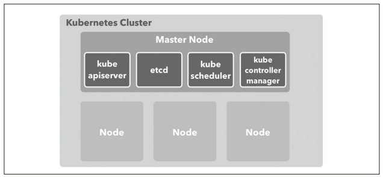
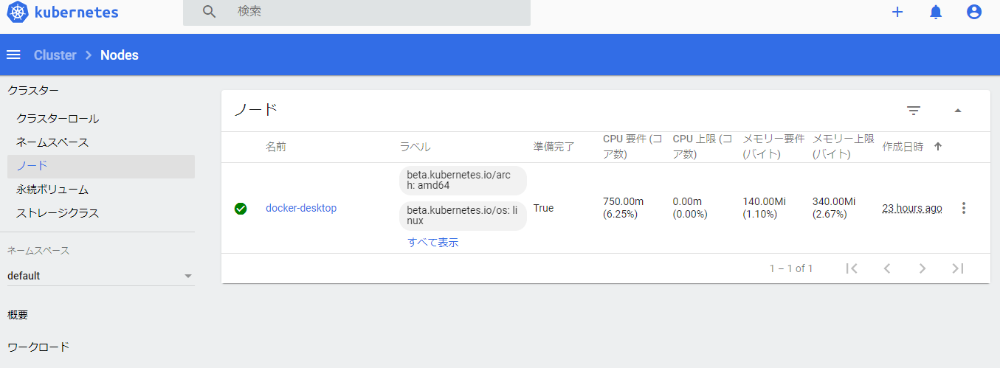
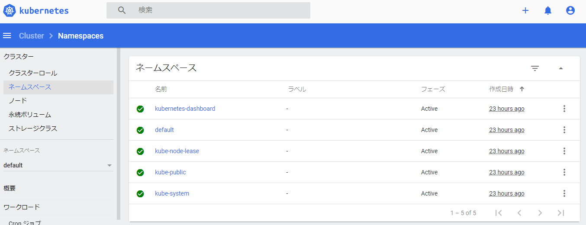

[Docker/Kubernetes 実践コンテナ開発入門：書籍案内｜技術評論社](https://gihyo.jp/book/2018/978-4-297-10033-9)

前回は、k8s のダッシュボードをブラウザから見れるように環境構築を行いました。

その続きをやっていきます。

## 5.3 Kubernetes の概念

- k8s のリソース
  - アプリケーションのデプロイ構成するための部品のようなもの
  - Node、Namespace、Pod といった構成要素のこと

k8s のリソース一覧  
※テキストの一部のみ抜粋

- Node
  - k8s クラスタで実行するコンテナを配置するためのサーバ
- Namespace
  - k8s クラスタ内で作る仮想的なクラスタ
- Pod
  - コンテナ集合体の単位で、コンテナを実行する方法を定義する

## 5.4 Kubernetes クラスタと Node

- k8s クラスタ
  - k8s のリソースを管理する集合体
- Node
  - クラスタが持つリソースで最も大きな概念
  - Docker ホストのことで、k8s でコンテナをデプロイするために利用される
- Master Node

  - k8s クラスタの全体を管理するサーバで最低でも 1 つは配置されている。

- k8s クラスタは次のように Master と Node 群によって構成されている。



- k8s は Node の使用リソース状況や、配置戦略によって適切にコンテナを配置
- Node によってクラスタのキャパシティを調整する
- ローカル環境の k8s は、クラスタ作成時に作られた VM が Node の 1 つとして登録されている

- クラスタに参加している Node の一覧を取得

```
$ kubectl get nodes
NAME             STATUS   ROLES    AGE   VERSION
docker-desktop   Ready    master   23h   v1.18.8
```

- k8s のダッシュボード画面からも確認できる。



### コラム Master を構成する管理コンポーネント

- k8s の Master サーバにデプロイされる管理コンポーネント

- kube-apiserver
  - k8s の API を公開するコンポーネント。kubectl からのリソース操作を受け付ける
- etcd
  - 高可用性を備えた分散キーバリューストア
  - k8s クラスタのバッキングストアとして利用
- kube-scheduler
  - Node を監視
  - コンテナを配置する最適な Node を選択
- kube-controller-manager

  - リソースを制御するコントローラーを実行

- 非マネージド環境で k8s を運用する場合は、Master が単一障害点にならないよう、マルチ Master で 3 台配置するのが一般的

## 5.5 Namespace

- k8s はクラスタの中に入れ子となる仮想的なクラスタを作成できる => Namespace という概念
- クラスタを構築すると default、docker、kube-public、kube-system という Namespace が用意されている

- クラスタが持つ Namespace の一覧を取得

```
$ kubectl get namespace
NAME                   STATUS   AGE
default                Active   23h
kube-node-lease        Active   23h
kube-public            Active   23h
kube-system            Active   23h
kubernetes-dashboard   Active   23h
```

- k8s のダッシュボードからもネームスペースを確認できる



## 今日の学び

- kubectl コマンドで確認した項目はダッシュボードでも確認できるので、ダッシュボード便利。
- クラスタが一番大きな概念でその中に Node がありと Swarm と近いものがある（stack などはない？みたいだが・・・）。
