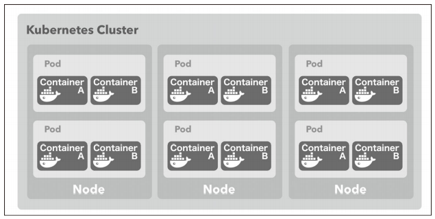

[Docker/Kubernetes 実践コンテナ開発入門：書籍案内｜技術評論社](https://gihyo.jp/book/2018/978-4-297-10033-9)

今日は k8s のリソース（アプリケーションのデプロイ構成するための部品）の Pod（ポッド）について学んでいきたいと思います。

## 5.6 Pod

- Pod はコンテナの集合体の単位。少なくとも 1 つのコンテナを持つ
- k8s と Docker を組み合わせる場合 Pod が持つのは Docker コンテナ単体あるは Docker コンテナの集合体 → Docker でいう Service の単位に近い??
- k8s では Pod の単位でデプロイする → **デプロイする単位ということなので、Docker でいうスタックという単位のほうが近いかも**

- Pod の配置

  - Node のどれかに配置される。
  - 同じ Pod を複数の Node に配置する、1 つの Node に複数配置も可能
  - 1 つの Pod 内のコンテナが複数 Node に渡って配置することはできない

- Pod の粒度

  - リバースプロキシとしての Nginx と、その背後のアプリケーションで 1 つの Pod にまとめるのはポピュラー
  - 同時にデプロイしないと整合性を保てないケースは、同一の Pod にまとめる
  - k8s の Master Node
    - Docker Swarm でいう manager ノードの役割
    - Master Node は管理用のコンポーネントの Pod だけがデプロイされた Node

- => **クラスタがあり、その中に Master Node が最低 1 つとそれ以外の Node で構成される。そして、その Node 群の各 Node の中に Pod が配置されるイメージ**

- 下のイメージの中に Master Node があるかんじ。



### 5.6.1 Pod を作成してデプロイする

- Pod の作成

  - kubectl だけで行うことも可能
  - バージョン管理の観点から yaml ファイルとして定義することがほとんど

- マニフェストファイル

  - k8s の各種リソースを定義するファイル

- simple-pod.yaml
  - nginx と echo で構成される Pod を定義したマニフェストファイル

```
apiVersion: v1
kind: Pod
metadata:
  name: simple-echo
spec:
  containers:
  - name: nginx
    image: gihyodocker/nginx-proxy:latest
    env:
    - name: BACKEND_HOST
      value: localhost:8080
    ports:
    - containerPort: 80
  - name: echo
    image: gihyodocker/echo:latest
    ports:
    - containerPort: 8080
```

- マニフェストファイル

  - kind
    - k8s のリソースの種類を指定
    - kind の値次第で spec 配下のスキーマが変わってくる
  - metadata
    - リソースに付与するメタデータ
    - metadata.name 属性で指定した値がリソースの名称
  - spec
    - リソースを定義するための属性
    - Pod の場合は Pod を構成するコンテナ群を containers として定義

- containers 以下

  - name
    - コンテナ名
  - image
    - Docker Hub のイメージ保存先。ローカルでビルドしたイメージも指定可能
  - ports
    - コンテナが EXPOSE するポートを指定 ※Dockerfile で指定している場合は不要
  - env
    - 環境変数を指定

- この Pod を k8s クラスタに反映
  - apply
    - 新規作成、内容に変更があった場合も反映

```
$ kubectl apply -f simple-pod.yaml
pod/simple-echo created
```

- 動作はするが、このままでは Pod にアクセスできないらしい

### 5.6.2 Pod を操作する

- Pod の一覧取得
  - STATUS が Running => Pod 内のすべてのコンテナ実行状態
  - READY の分母は Pod に定義されたコンテナ数、分子は実行状態になったコンテナ数

```
$ kubectl get pod
```

- kubectl を使ってコンテナの中に入る
  - -c でコンテナ名を指定

```
$  kubectl exec -it simple-echo sh -c nginx
kubectl exec [POD] [COMMAND] is DEPRECATED and will be removed in a future version. Use kubectl kubectl exec [POD] -- [COMMAND] instead.
/ #
```

- Pod 内コンテナの標準出力を表示

```
$ kubectl logs -f simple-echo -c echo
2020/11/06 17:03:12 start server
```

- Pod の削除

```
$ kubectl delete pod simple-echo
pod "simple-echo" deleted
```

- マニフェストファイルベースで Pod 削除
  - マニフェストファイルに記述されている全てのリソースが削除される

```
$ kubectl delete -f simple-pod.yaml
```

### コラム Pod と Pod 内コンテナのアドレス

- Pod ごとに固有の仮想 IP アドレスが割り振られる
- 同一 Pod 内の全てのコンテナの仮想 IP アドレスは同じ
- 同一 Pod 内であれば localhost:80 などでアクセスできる。
- 別の Pod であれば、172.17.0.4:80 のように Pod の仮想 IP:ポート名でアクセスできる。

## 今日の学び

- マニフェストファイルは docker-compose.yml と書き方が似ているが、若干違うので慣れが必要そう。
- Pod は Docker Swarm でいう Stack。同じネットワーク内であればコンテナ間通信ができる。別のネットワークでも仮想 IP を指定すれば通信可能。
