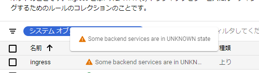
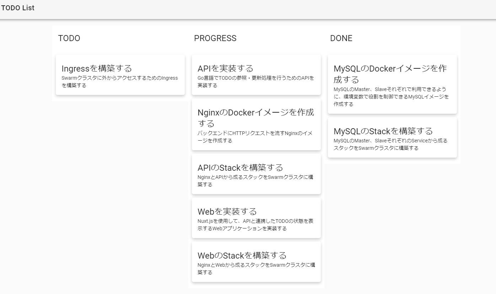

[Docker/Kubernetes 実践コンテナ開発入門：書籍案内｜技術評論社](https://gihyo.jp/book/2018/978-4-297-10033-9)

前回は、TODOAPI を構築しました。

今回も同じように TODO Web アプリケーションを構築して、Ingress で Web アプリケーションをインターネットに公開していきます。

## 6.5 TODO Web アプリケーションを GKE 上に構築する

- todo-web.yaml
  - 静的ファイル(assets)は Node.js を通さず Nginx から返す方法を取る
  - nginx コンテナと web コンテナで Pod を構成

```
apiVersion: v1
kind: Service // Serviceリソース
metadata:
  name: todoweb // Serviceリソースの名前はtodoweb
  labels:
    app: todoweb // Serviceリソースのラベルはapp: todoweb
spec: // Serviceリソースの仕様
  selector:
    app: todoweb // app: todowebラベルを持つPodが対象
  ports:
    - name: http
      port: 80 // app: todowebラベルのhttpポート80を持つPodが対象。またService自身のポートは80
  type: NodePort // 指定されたレンジのポートを割り当て、Nodeはそのポートへの通信をServiceに割り当てる。

---
apiVersion: apps/v1
kind: Deployment // Deploymentリソース
metadata:
  name: todoweb // Deploymentリソースの名前はtodoweb
  labels:
    name: todoweb // Deploymentリソースのラベルはname: todoweb
spec:
  replicas: 2 // Podのレプリカは2
  selector:
    matchLabels:
      app: todoweb // 対象はapp: todowebラベルを持つPod
  template: // Pod Template
    metadata:
      labels:
        app: todoweb // Podのラベルはapp: todoweb
    spec:
      volumes: # ← ①
      - name: assets // assetsという名称のVolumeを作成
        emptyDir: {} // Pod単位に割り当てられる仮想Volumeを作成。Podが削除されると削除される。
      containers: // コンテナ定義
      - name: nginx // コンテナ名
        image: gihyodocker/nginx-nuxt:latest // コンテナイメージ
        imagePullPolicy: Always // ローカルにキャッシュイメージがあればそれを使用。なければイメージをダウンロードしてくる
        ports:
        - containerPort: 80 // コンテナのポート。同一Pod内で衝突しないように。
        env:
        - name: WORKER_PROCESSES
          value: "2"
        - name: WORKER_CONNECTIONS
          value: "1024"
        - name: LOG_STDOUT
          value: "true"
        - name: BACKEND_HOST
          value: "localhost:3000" // 同じPod内のwebコンテナを指している
        volumeMounts: # ← ②
        - mountPath: /var/www/_nuxt // マウントするコンテナのパスを指定
          name: assets // 仮想Volumeのassetsでマウント

      - name: web
        image: gihyodocker/todoweb:latest
        imagePullPolicy: Always
        lifecycle: # ← ③
          postStart:
            exec:
              command:
              - cp
              - -R
              - /todoweb/.nuxt/dist
              - /
        ports:
        - containerPort: 3000
        env:
        - name: TODO_API_URL
          value: http://todoapi // Service名をURLにしたもの
        volumeMounts: # ← ④
        - mountPath: /dist
          name: assets
```

- todo-web をデプロイ

```
$ kubectl apply -f todo-web.yaml
service/todoweb created
deployment.apps/todoweb created
```

- 仮想 Volume によってコンテナ間のディレクトリ共有が可能に。
- web コンテナの assets ファイルを Nginx コンテナにコピーする必要がある。 => Lifecycle イベントを利用

- Lifecycle イベント

  - コンテナの開始時や終了時のタイミングで任意のコマンドを実行するための仕組み

- postStart を使って web コンテナの開始時に、仮想 Volume に assets ファイルをコピーする

- postStart.exec.command で次のコマンドを実行しており、/dist ディレクトリに assets ファイルがコピーされる

```
@web $ cp -R /todoweb/.nuxt/dist /
```

- /dist ディレクトリは assets ボリュームに共有される
- assets ボリュームを nginx コンテナもマウントしているため、/var/www/\_nuxt/に assets が配置される

## 6.6 Ingress で Web アプリケーションをインターネットに公開する

- Ingress を利用して Web アプリケーションをインターネットに公開する
- GCP では Cloud Load Balancing が利用される

- ingress.yaml

```
apiVersion: extensions/v1beta1
kind: Ingress // Ingressリソース
metadata:
  name: ingress // Ingerssリソースの名前はingress
spec:
  rules: // Ingressが受けたリクエストのパス毎にバックエンドに転送。全てをtodowebに転送
  - http:
      paths:
      - path: /*
        backend:
          serviceName: todoweb
          servicePort: 80
```

- ingress をデプロイ

```
$ kubectl apply -f ingress.yaml
ingress.extensions/ingress created
```

- Ingress が作成されると、1 分程でグローバル IP アドレスが振られる

```
$  kubectl get ingress
NAME      HOSTS   ADDRESS         PORTS   AGE
ingress   *       35.xxx.xxx.xx   80      4m52s
```

- そこから完全に準備が整うまで数分かかる



- ステータスが OK になったら準備完了


- Ingress で公開されたグローバル IP アドレスにアドレスにアクセスすると TODO アプリケーションをみることができます。



- Docker のときはスタイルが崩れちゃっていましたが今回はうまくいったようです！！

## 今日の学び

- Ingress でインターネットからのリクエストを Service に委譲するために Service は NodePort で公開する。
- 仮想 Volume を作ると、Pod 内でそれぞれのコンテナから好きなパスでアクセスできる
