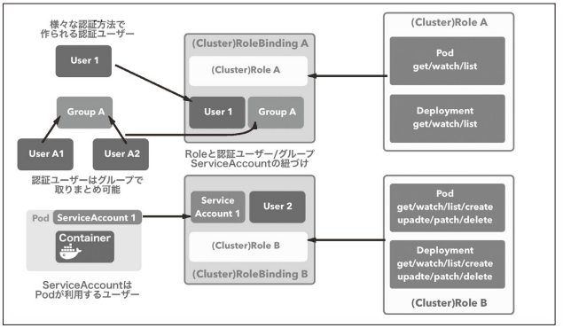

[Docker/Kubernetes 実践コンテナ開発入門：書籍案内｜技術評論社](https://gihyo.jp/book/2018/978-4-297-10033-9)

前回は、バッチ処理に便利な Job、スケジューリングしたタスクの実行に便利な cronJob、暗号化してセキュリティを高める Secret についてやりました。

今回は、ユーザー管理周りについてやっていきます。

## 7.2 ユーザー管理と Role-Based Access Control （RBAC）

- k8s におけるユーザー ※UNIX ユーザーとは別物
  - 認証ユーザー
    - クラスタ外から k8s を操作するためのユーザー
    - 認証ユーザーはグループで取りまとめ可能
  - ServiceAccount
    - Pod が利用するユーザー
    - ServiceAccount は k8s のリソース
    - ServiceAccount と紐づけられた Pod は与えられた範囲内でリソースの操作が可能
- Role-Based Access Control ※以降、RBAC
  - k8s のリソースへのアクセスをロールによって制御

### 7.2.1 RBAC を利用して権限制御を実現する

- RBAC の権限制御

  - 以下の 2 つの要素で成立する
    - k8s API のどの操作が可能であるかを定義したロール(図の Role A、Role B)
    - 認証ユーザー・グループ・ServiceAccount とロールの紐づけ(図の RoleBinding A、RoleBinding A)

- RBAC を利用した権限制御の例



- RBAC での権限制御のために提供されているリソース
  - Role
    - k8s API への操作許可のルール定義。指定の namespace 内でのみ有効
  - RoleBinding
    - 認証ユーザー・グループ・ServiceAccount と Role の紐づけを定義(ざっくりいうと、ユーザーと権限を紐づけ)
  - ClusterRole
    - k8s API への操作許可のルール定義。クラスタ全体で有効
  - ClusterRoleBinding
    - 認証ユーザー・グループ・ServiceAccount と ClusterRole の紐づけを定義

ここからはローカルで確認できないため、メモのみ。

#### ロール・紐づけリソースの作成

- ClusterRole の作成
  - Pod 情報を参照するための権限をロールを定義

```
kind: ClusterRole
apiVersion: rbac.authorization.k8s.io/v1
metadata:
  name: pod-reader
rules:
- apiGroups: [""] # リソースが含まれているAPIグループの名前をリスト指定
  resources: ["pods"] # ルールを適用するリソースをリスト指定
  verbs: ["get", "watch", "list"] # 指定したリソースに対する操作をリスト指定
```

- ClusterRole と認証ユーザーを紐づけるための ClusterRoleBinding を作成
  - ユーザー（gihyo-user）とロール（pod-reader）を紐づけ

```
kind: ClusterRoleBinding
apiVersion: rbac.authorization.k8s.io/v1
metadata:
  name: pod-read-binding
subjects: # ユーザーやグループ、ServiceAccountを指定
- kind: ServiceAccount
  name: gihyo-user
  namespace: default
roleRef: # ユーザーやグループに紐づけるClusterRole名を指定
  kind: ClusterRole
  name: pod-reader
  apiGroup: rbac.authorization.k8s.io
```

#### 認証ユーザー・グループの作成

- ロールのリソース、紐づけるためのリソースは用意したがユーザーがまだ。
- 認証ユーザーの認証方法

  - Service Account トークン方式 ← ★ 今回はこれで認証
  - 静的トークンファイル方式
  - パスワードファイル方式
  - X509 でのクライアント証明書方式
  - OpenID Connect 方式

- gihyo-user という ServiceAccount を追加

```
$ kubectl create serviceaccount gihyo-user
```

- gihyo-user の詳細を確認(yaml 形式で表示)
  - ServiceAccount を作成すると認証情報となる Secret も同時に作成される

```
$ kubectl get serviceaccount gihyo-user -o yaml
```

- Secret から認証トークンを取り出す
  - data.token 部分

```
$ kubectl get secret gihyo-user-token-dwwmp -o yaml
```

- Base64 でエンコードされているためデコードする

```
$ echo 'ZXlKaGJHY2lPaUpTV......' | base64 -D
```

#### 作成した認証ユーザーを利用する

- 必要な認証情報は Master ノードの~/.kube/config に設定されている
- 次のように参照できる

```
$ kubectl config view
apiVersion: v1
clusters:
- cluster:
    insecure-skip-tls-verify: true
    server: https://localhost:6443
  name: docker-for-desktop-cluster
contexts:
- context:
    cluster: docker-for-desktop-cluster # docker-for-desktop-clusterというクラスタを操作している
    user: docker-for-desktop # docker-for-desktopというユーザーを利用して
  name: docker-for-desktop
current-context: docker-for-desktop # 現在のコンテキスト。コンテキストは「どの認証ユーザーでどのk8sクラスタのAPIを操作するかを決める情報」
kind: Config
preferences: {}
users:
- name: docker-for-desktop
  user:
    client-certificate-data: REDACTED
    client-key-data: REDACTED
```

- トークンをセット

```
$ kubectl config set-credentials gihyo-user --token=eyJhbGciOiJSUzI1NiIsImtpZCI......
```

- context を設定
  - gihyo-user が gihyo-k8s クラスタを操作するための情報を設定

```
$ kubectl config set-context gihyo-k8s-gihyo-user --cluster=gihyo-k8s --user=gihyo-user
```

- set-context では context は切り替わらないため、use-context で context を切り替え

```
$ kubectl config use-context gihyo-k8s-gihyo-user
```

- これで kubectl の k8s API の操作は gihyo-user で行われる。

```
$ kubectl get pod --all-namespaces
```

- このユーザーで Pod の一覧を取得

```
$ kubectl get pod --all-namespaces
```

- このユーザーは Pod 閲覧以外の権限をもたないため、他のリソースを参照できない ← ClusterRole で指定しているのか！

- 実行ユーザーを戻す

```
$ kubectl config use-context docker-for-desktop
```

## 今日の学び

- 思った以上にボリュームがあったので ServiceAccount は明日に回す…
- 実際に手を動かせていないので理解度はいまいち…
