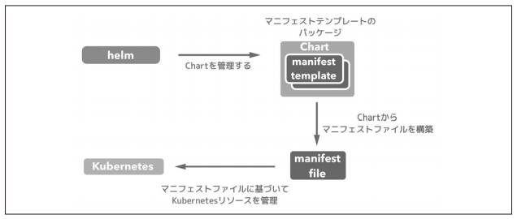

[Docker/Kubernetes 実践コンテナ開発入門：書籍案内｜技術評論社](https://gihyo.jp/book/2018/978-4-297-10033-9)

前回はユーザー管理の途中で力尽きたので、ユーザー管理の続きから。

### 7.2.2 ServiceAccount

- クラスタ内で実行されている実行されている Pod からクラスタ内の他のリソースへのアクセスを制御するためのリソース
- kube-system の namespace では k8s のリソースを制御するための Pod がいくつも実行されている
- これらの Pod は ServiceAccount の働きによって、他の namespace で実行されている Pod や Service、Ingress といったリソース情報の参照や操作ができる
- RBAC によって制限することでフェールセーフなアプリケーション構築もできる

- ServiceAccount を作成し、ClusterRoleBinding で Role と ServiceAccount を紐づけ。
- その後 Pod の定義にて serviceAccountName で ServiceAccount を指定するとその Pod は ServiceAccount の権限のみしか操作ができなくなる。

## 7.3 Helm

- Helm は Kubernetes charts を管理するためのツール。 => パッケージ管理ツール
- charts は設定済みの kubernetes リソースのパッケージ。 => リソースをまとめたパッケージ



- Helm で Charts を管理することで、マニフェストファイルの管理をしやすくすることが大きな目的
- Helm があれば、複数クラスタへのデプロイを簡潔に管理できる
- Helm は Charts を中心とした k8s 開発の総合的な管理ツールとしても使える

### 7.3.1 Helm のセットアップ

- Helm の最新バージョンをインストール
  - [Releases · helm/helm](https://github.com/helm/helm/releases)
- 最終的にはパッケージマネージャでインストールした

```
# 管理者権限でPowerShellを開いて実行
$ choco install kubernetes-helm
# インストールできたことを確認
$ helm help
```

- クラスタに対して初期化処理を行って初めて利用可能になる

- バージョンが違って helm init できないようだ。(v3.4.1)

```
$ helm init
Error: unknown command "init" for "helm"

Did you mean this?
        lint

Run 'helm --help' for usage.
```

- v2 をダウンロードする

```
$ choco uninstall kubernetes-helm

$ choco install kubernetes-helm --version=2.14.0

$ helm version
Client: &version.Version{SemVer:"v2.14.0", GitCommit:"05811b84a3f93603dd6c2fcfe57944dfa7ab7fd0", GitTreeState:"clean"}
Error: could not find tiller
```

- 初期化

```
$ helm init
Creating C:\Users\snyt45\.helm
Creating C:\Users\snyt45\.helm\repository
Creating C:\Users\snyt45\.helm\repository\cache
Creating C:\Users\snyt45\.helm\repository\local
Creating C:\Users\snyt45\.helm\plugins
Creating C:\Users\snyt45\.helm\starters
Creating C:\Users\snyt45\.helm\cache\archive
Creating C:\Users\snyt45\.helm\repository\repositories.yaml
Adding stable repo with URL: https://kubernetes-charts.storage.googleapis.com
Adding local repo with URL: http://127.0.0.1:8879/charts
$HELM_HOME has been configured at C:\Users\snyt45\.helm.
Error: error installing: the server could not find the requested resource
```

- エラーがでてる。そもそもバージョン確認時に tiller がないと怒られていた。
- 最終的には以下の issue 通りにやったら解決した。

  - https://github.com/helm/helm/issues/6473#issuecomment-625964161

- 再度バージョン確認。正しく Server もインストールされた

```
$ helm version
Client: &version.Version{SemVer:"v2.14.0", GitCommit:"05811b84a3f93603dd6c2fcfe57944dfa7ab7fd0", GitTreeState:"clean"}
Server: &version.Version{SemVer:"v2.14.0", GitCommit:"05811b84a3f93603dd6c2fcfe57944dfa7ab7fd0", GitTreeState:"clean"}
```

- Tiller というサーバアプリケーションが kube-system ネームスペースにデプロイされている
- Tiller は helm コマンドからの指示を受け、インストール等の処理を行う役割

```
$ kubectl -n kube-system get service,deployment,pod --selector app=helm
NAME                    TYPE        CLUSTER-IP     EXTERNAL-IP   PORT(S)     AGE
service/tiller-deploy   ClusterIP   10.55.252.98   <none>        44134/TCP   2m42s

NAME                            READY   UP-TO-DATE   AVAILABLE   AGE
deployment.apps/tiller-deploy   1/1     1            1           2m42s

NAME                                 READY   STATUS    RESTARTS   AGE
pod/tiller-deploy-5d79cb9bfd-5zzg8   1/1     Running   0          2m42s
```

## 今日の学び

- 今日は Helm のセットアップができた。すでにテキストはバージョンが低く v3 が出ているようだ。とりあえずは v2 でテキスト通りに進められる準備は整った。
