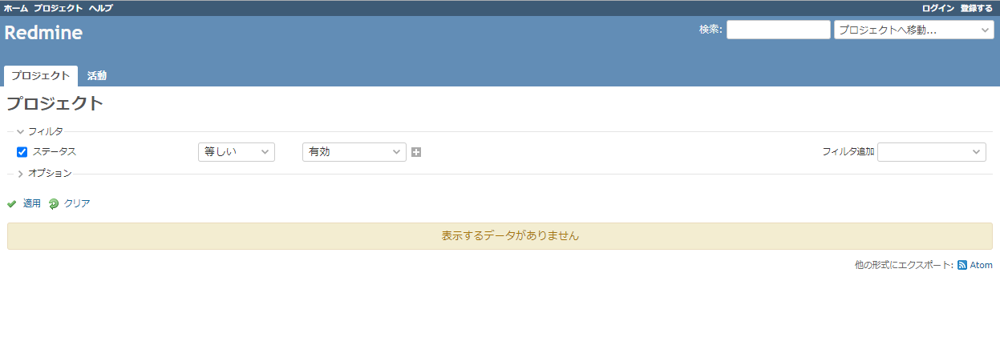

[Docker/Kubernetes 実践コンテナ開発入門：書籍案内｜技術評論社](https://gihyo.jp/book/2018/978-4-297-10033-9)

前回はパッケージ管理ツールの Helm をインストールしました。

今回は Charts のインストール等を進めていきます。

## 7.3.2 Helm の概念

- Helm
  - クライアント(cli)とサーバ(k8s クラスタにインストールされている Tiller)で構成
  - クライアントは、サーバに対して命令を行う役割
  - サーバは k8s クラスタに対してパッケージのインストールや更新、削除の処理を k8s クラスタ上で行う
- Chart
  - マニフェストファイルを構築するためのテンプレート群をパッケージとしてまとめたもの

### Helm リポジトリ

- local
  - Helm のクライアントがインストールされているローカルリポジトリ
  - ローカルで作成した Chart が配置される
- stable
  - 安定した品質を持った Chart が配置されるリポジトリ
  - GitHub リポジトリに配置されている Chart を利用できる
- incubator

  - stable の要件を満たしていない Chart が配置されるリポジトリ

- stable リポジトリはデフォルトで利用可能
- incubator リポジトリはデフォルトで利用不可
- incubator リポジトリを利用するには、次の対応をする必要がある。

```
$ helm repo add incubator https://kubernetes-charts-incubator.storage.googleapis.com/
"incubator" has been added to your repositories
```

- リポジトリから利用できる Chart を検索

```
$ helm search
NAME                                            CHART VERSION   APP VERSION                     DESCRIPTION
incubator/artifactory                           5.2.2           5.2.0                           DEPRECATED Universal Repository Manager supporting all ma...
incubator/aws-alb-ingress-controller            1.0.4           v1.1.8                          DEPRECATED A Helm chart for AWS ALB Ingress Controller
incubator/azuremonitor-containers               2.7.8           7.0.0-1                         DEPRECATED Helm chart for deploying Azure Monitor contain...
incubator/burrow                                0.3.3           0.17.1                          Burrow is a permissionable smart contract machine
......
```

### Chart の構成

```
chart_name/ --- templates/ マニフェストファイルのテンプレートディレクトリ
             | |- xxxxx.yaml 各種Kubernetesリソースのマニフェストテンプレート
             | |- _helper.tpl マニフェスト構築に利用されるテンプレートヘルパー
             | |- NOTE.txt Chartの利用方法等のドキュメントのテンプレート
             |
             |- charts/　　　 依存するChartのディレクトリ
             |- Chart.yaml Chart情報の定義ファイル
             |- values.yaml Chartのデフォルトvalueファイル
```

- values.yaml

  - デフォルト設定

- デフォルト設定を上書きするにはカスタム value ファイルを作成する

## 7.3.3 Chart をインストールする

- Helm を利用して k8s クラスタへアプリケーションをインストール
- Redmine の Chart(stable/redmine)をインストールする
- helm install コマンドで行う
- 更新・削除する際にリリース名が必要になるので、--name でクラスタ内で一意になるリリース名をつける

```
helm install [--name リリース名] Chartリポジトリ/Chart名
```

- helm install 時、Chart に含まれる values.yaml の設定に基づいてインストールされる。
- しかし、カスタム value ファイルでデフォルトの設定値を上書きして利用することがほとんど

- stable 版の Redmine の GitHub リポジトリ

  - [charts/stable/redmine at master · helm/charts](https://github.com/helm/charts/tree/master/stable/redmine#confi%20guration)

- 今回もデフォルト値を上書きしてインストールする
- redmine.yaml

```
redmineUsername: gihyo # ユーザー名をgihyo
redminePassword: gihyo # パスワードをgihyo
redmineLanguage: ja # 言語を日本語

serviceType: NodePort # Ingressを利用せずにNodePort Serviceを使ってServiceを公開
```

- -f オプションでカスタム value ファイルを指定して Redmine をインストール

```
$ helm install -f redmine.yaml --name redmine stable/redmine --version 4.0.0
Error: validation failed: [unable to recognize "": no matches for kind "Deployment" in version "extensions/v1beta1", unable to recognize "": no matches for kind "StatefulSet" in version "apps/v1beta1"]
```

- エラーが出る
- テンプレートヘルパーで apiversion を出力しているみたい。
- https://github.com/helm/charts/blob/master/stable/redmine/templates/_helpers.tpl

```
Return the appropriate apiVersion for deployment.
*/}}
{{- define "redmine.deployment.apiVersion" -}}
{{- if semverCompare "<1.14-0" .Capabilities.KubeVersion.GitVersion -}}
{{- print "extensions/v1beta1" -}}
{{- else -}}
{{- print "apps/v1" -}}
{{- end -}}
{{- end -}}
```

- バージョン固定しているため、古い apiversino になっているのか？？
- バージョンを消して再試行。またエラー。

```
$ helm install -f redmine.yaml --name redmine stable/redmine
Error: failed to download "stable/redmine" (hint: running `helm repo update` may help)
```

- stable/redmine の前提条件を調べる

  - Kubernetes 1.12+
  - Helm 2.11+ or Helm 3.0-beta3+

- k8s のバージョンはどこ見ればいいか分からないけど、多分クリアしている？？
  - `v1.16.13-gke.404`でいいみたい。
  - [GKE と Cloud SQL を使って helm で Redmine を建ててみる \- Qiita](https://qiita.com/sandats/items/3336c274d72ca3052441)

```
$ kubectl version
Client Version: version.Info{Major:"1", Minor:"18", GitVersion:"v1.18.8", GitCommit:"9f2892aab98fe339f3bd70e3c470144299398ace", GitTreeState:"clean", BuildDate:"2020-08-13T16:12:48Z", GoVersion:"go1.13.15", Compiler:"gc", Platform:"windows/amd64"}
Server Version: version.Info{Major:"1", Minor:"16+", GitVersion:"v1.16.13-gke.404", GitCommit:"81e2afbf51b876d15f0af546998c670207fdd592", GitTreeState:"clean", BuildDate:"2020-10-30T23:52:44Z", GoVersion:"go1.13.9b4", Compiler:"gc", Platform:"linux/amd64"}
```

- Helm のバージョンはクリアしている

```
$ helm version
Client: &version.Version{SemVer:"v2.14.0", GitCommit:"05811b84a3f93603dd6c2fcfe57944dfa7ab7fd0", GitTreeState:"clean"}
Server: &version.Version{SemVer:"v2.14.0", GitCommit:"05811b84a3f93603dd6c2fcfe57944dfa7ab7fd0", GitTreeState:"clean"}
```

- とりあえず以下の方法でできた。
  - [charts/stable/redmine at master · helm/charts](https://github.com/helm/charts/tree/master/stable/redmine#this-helm-chart-is-deprecated)

```
$ helm repo add bitnami https://charts.bitnami.com/bitnami
"bitnami" has been added to your repositories

$ helm install -f redmine.yaml --name redmine bitnami/redmine
NAME:   redmine
LAST DEPLOYED: Sat Nov 21 00:45:06 2020
NAMESPACE: default
STATUS: DEPLOYED

RESOURCES:
==> v1/ConfigMap
NAME             DATA  AGE
redmine-mariadb  1     1s

==> v1/Deployment
NAME     READY  UP-TO-DATE  AVAILABLE  AGE
redmine  0/1    1           0          0s

==> v1/PersistentVolumeClaim
NAME     STATUS   VOLUME    CAPACITY  ACCESS MODES  STORAGECLASS  AGE
redmine  Pending  standard  1s

==> v1/Pod(related)
NAME                      READY  STATUS   RESTARTS  AGE
redmine-6c4f898966-nqbtq  0/1    Pending  0         0s
redmine-mariadb-0         0/1    Pending  0         0s

==> v1/Secret
NAME             TYPE    DATA  AGE
redmine          Opaque  2     1s
redmine-mariadb  Opaque  2     1s

==> v1/Service
NAME             TYPE          CLUSTER-IP     EXTERNAL-IP  PORT(S)       AGE
redmine          LoadBalancer  10.55.247.140  <pending>    80:30277/TCP  0s
redmine-mariadb  ClusterIP     10.55.251.137  <none>       3306/TCP      1s

==> v1/ServiceAccount
NAME     SECRETS  AGE
redmine  1        1s

==> v1/StatefulSet
NAME             READY  AGE
redmine-mariadb  0/1    0s


NOTES:


1. Get the Redmine URL:

  NOTE: It may take a few minutes for the LoadBalancer IP to be available.
        Watch the status with: 'kubectl get svc --namespace default -w redmine'


  export SERVICE_IP=$(kubectl get svc --namespace default redmine --template "{{ range (index .status.loadBalancer.ingress 0) }}{{ . }}{{ end }}")
  echo "Redmine URL: http://$SERVICE_IP/"

2. Login with the following credentials

  echo Username: gihyo
  echo Password: $(kubectl get secret --namespace default redmine -o jsonpath="{.data.redmine-password}" | base64 --decode)
```

- リリース一覧でインストールできたことを確認する。

```
$ helm ls
NAME    REVISION        UPDATED                         STATUS          CHART           APP VERSION     NAMESPACE
redmine 1               Sat Nov 21 00:45:06 2020        DEPLOYED        redmine-14.2.13 4.1.1           default
```

- リソース確認
  - リリース名を redmine にしたけど、db しか確認できない…

```
$ kubectl get service,deployment --selector release=redmine
NAME                      TYPE        CLUSTER-IP      EXTERNAL-IP   PORT(S)    AGE
service/redmine-mariadb   ClusterIP   10.55.251.137   <none>        3306/TCP   13m
```

- また、NodePort になっているはずだけど、LoadBalancer のまま…

```
$ kubectl get service,deployment
NAME                      TYPE           CLUSTER-IP      EXTERNAL-IP      PORT(S)        AGE
service/basic-auth        NodePort       10.55.248.194   <none>           80:30060/TCP   3d
service/kubernetes        ClusterIP      10.55.240.1     <none>           443/TCP        3d2h
service/redmine           LoadBalancer   10.55.247.140   35.xxx.xxx.xxx   80:30277/TCP   19m
service/redmine-mariadb   ClusterIP      10.55.251.137   <none>           3306/TCP       19m

NAME                         READY   UP-TO-DATE   AVAILABLE   AGE
deployment.apps/basic-auth   1/1     1            1           3d
deployment.apps/redmine      1/1     1            1           19m
```

- 一旦、EXTERNAL-IP から確認できた。



## 7.3.4 Chart でアプリケーションをアンインストールする

- リリース名を指定して Chart を削除する

```
$ helm delete redmine
release "redmine" deleted
```

- Helm にはロールバック機能がある。指定したリビジョンに戻れる。
- リビジョン番号を確認する

```
$ helm ls --all
NAME    REVISION        UPDATED                         STATUS  CHART           APP VERSION     NAMESPACE
redmine 1               Sat Nov 21 00:45:06 2020        DELETED redmine-14.2.13 4.1.1           default
```

- ロールバックする場合

```
$ helm rollback redmine 1
```

- リビジョンの記録を残さず削除する場合

```
$ helm del --purge redmine
```

## 今日の学び

- helm install で Chart をインストールしてくると、そのまま Chart のマニフェストファイルを使ってクラスタにアプリケーションが展開される。設定等は大変だと思うが、出来てしまえばワンコマンドでアプリケーション構築が出来てしまう夢のようなツール
