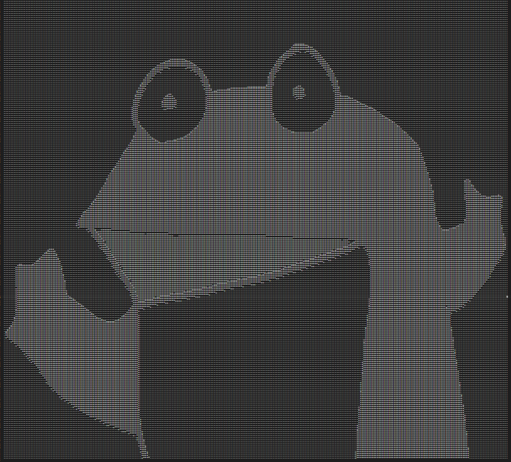
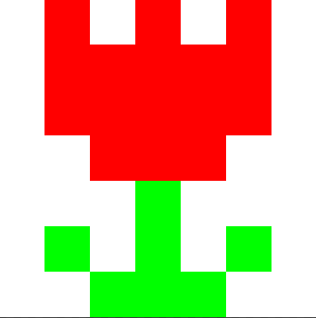

[たった 1 日で基本が身に付く！ Go 言語 超入門：書籍案内｜技術評論社](https://gihyo.jp/book/2020/978-4-297-11617-0)

今日も最終章の続きをやっていきます。

## CHAPTER 8 　 Go 言語の魅力を体験するプログラム

### 画像を処理する

- Go 言語には、画像を読み込んで分析したり、画像を作成して書き出すライブラリなどもある。

### 画像の読み込み

- AI 技術を活用した画像分析が盛ん。Go 言語でもライブラリが用意されている。
- 簡単な画像分析プログラムとして、グレースケールの画像を読み込み、アスキーアートを作成する。

① ファイルから PNG 画像を読み込む
②PNG フォーマットをデコードして情報を取り出す
③ 画素 1 つ１つについて、グレー情報を数値(0 なら黒、255 なら白)で取得する
④ グレー情報の数値を 3 段階に分けて、各画素を文字「\*」「+」「-」のいずれかに変換する

```
package main

import (
	"fmt"
	"image"
	"image/color"
	_ "image/png"
	"io/ioutil"
	"os"
)

func main() {
	reader, ferr := os.Open("wow.png")
	if ferr != nil {
		fmt.Println("ファイルの読み込みエラーです", ferr)
		os.Exit(1)
	}

	img, name, derr := image.Decode(reader)
	if derr != nil {
		fmt.Println("画像の変換エラーです", derr)
		os.Exit(1)
	} else {
		fmt.Println(name, "形式のデータを得ました")
	}

	defer reader.Close()

	marks := []string{"*", "+", "-"}
	var marksStr string

	for y := img.Bounds().Min.Y; y < img.Bounds().Max.Y; y++ {
		for x := img.Bounds().Min.X; x < img.Bounds().Max.X; x++ {
			c := color.GrayModel.Convert(img.At(x, y)).(color.Gray)
			grayness := c.Y / (255 / 3)
			if c.Y == 255 {
				grayness = 2
			}
			marksStr += marks[grayness]
		}
		marksStr += "\n"
	}
	wdata := []byte(marksStr)
	werr := ioutil.WriteFile("ascii_art.txt", wdata, 0777)
	if werr != nil {
		fmt.Println("ファイルの書き込みエラーです", werr)
		os.Exit(1)
	} else {
		fmt.Println("ファイルを保存しました")
	}
}
```

- import のアンダースコア
  - [Go 言語にて依存関係を解決するための import にはアンダースコア（ブランク識別子）を別名とする \- 無理しない感じ](https://hogesuke.hateblo.jp/entry/2014/09/12/080005)
  - go 言語ではパッケージを import したら、プログラム中で使わないとコンパイルエラーになる
  - 例えば、プログラム中では使わないが A パッケージが依存する B パッケージを読み込みたいとき（依存関係を解決したいとき）にブランク識別子(\_)を使うようだ

```
	_ "image/png"
```

- 画像ファイルの読み込みには、os.Open 関数を使う
  - 一つ目の戻り値はファイルの内容で、io.Reader という型をもつ

```
	reader, ferr := os.Open("wow.png")
```

- 次にファイルのデコードには、image.Decode を使う
  - 一つ目の戻り値はデコードした画像で、image.image という型をもつ
  - 二つ目の戻り値はファイルの形式を示す文字列（ここでは png）

```
	img, name, derr := image.Decode(reader)
```

- `reader.Close()`でファイルを閉じるだが、その前に`defer`がついている。
- `defer`は遅延関数
- defer を呼び出した関数が終了する際に実行される
  - [Go 言語の defer でファイルリソースをクローズする \- 雑多なメモ置き場](http://y0m0r.hateblo.jp/entry/20130925/1380117667)

```
defer reader.Close() // 関数の最後にファイルを閉じる
```

- メインのロジックは説明が少なくいまは難しい
  - そのうち公式リファレンスを見て理解できるようになりたい。
  - [io \- The Go Programming Language](https://golang.org/pkg/io/#Reader)

```
	for y := img.Bounds().Min.Y; y < img.Bounds().Max.Y; y++ {
		for x := img.Bounds().Min.X; x < img.Bounds().Max.X; x++ {
			c := color.GrayModel.Convert(img.At(x, y)).(color.Gray)
			grayness := c.Y / (255 / 3)
			if c.Y == 255 {
				grayness = 2
			}
			marksStr += marks[grayness]
		}
		marksStr += "\n"
```

- 作成されたアスキーアート！なんか色々できそうですごい！



### 画像の作成と書き込み

```
package main

import (
	"fmt"
	"image"
	"image/color"
	"image/png"
	"os"
)

func inrange(x, a, b int) bool {
	if a < b && a <= x && x < b {
		return true
	}
	return false
}

func main() {

	const width = 350
	const height = 350
	const celllen = 50

	img := image.NewNRGBA(image.Rect(0, 0, width, height))

	cells := [7][7]int{
		{0, 1, 0, 1, 0, 1, 0},
		{0, 1, 1, 1, 1, 1, 0},
		{0, 1, 1, 1, 1, 1, 0},
		{0, 0, 1, 1, 1, 0, 0},
		{0, 0, 0, 2, 0, 0, 0},
		{0, 2, 0, 2, 0, 2, 0},
		{0, 0, 2, 2, 2, 0, 0},
	}
	colors := [3]color.RGBA{
		color.RGBA{0xff, 0xff, 0xff, 0xff},
		color.RGBA{0xff, 0, 0, 0xff},
		color.RGBA{0, 0xff, 0, 0xff},
	}

	for y := 0; y < height; y++ {
		for x := 0; x < width; x++ {
			for ny := 0; ny < 7; ny++ {
				for nx := 0; nx < 7; nx++ {
					if inrange(x, nx * celllen, (nx + 1) * celllen) &&
					  inrange(y, ny * celllen, (ny + 1) * celllen) {
							img.Set(x, y, colors[cells[ny][nx]])
						}
				}
			}
		}
	}

	f, ferr := os.Create("flower.png")
	if ferr != nil {
		fmt.Println("ファイル作成のエラー：", ferr)
		os.Exit(1)
	}

	derr := png.Encode(f, img)

	if derr != nil {
		f.Close()
		fmt.Println("データ変換のエラー：", derr)
		os.Exit(1)
	}

	ferr = f.Close()
	if ferr != nil {
		fmt.Println("ファイル作成のエラー：", ferr)
		os.Exit(1)
	}
}
```

- これもコード的な解説が少ないので、調べながら。
- `image.Rect(0, 0, width, height)`で 350x350 の画像作成
- `image.NewNRGBA`で NRGBA 構造体のポインタが返る
  - [go \- Golang image パッケージの RGBA 等と NRGBA 等の違い \- スタック・オーバーフロー](https://ja.stackoverflow.com/questions/22413/golang-image%E3%83%91%E3%83%83%E3%82%B1%E3%83%BC%E3%82%B8%E3%81%AErgba%E7%AD%89%E3%81%A8nrgba%E7%AD%89%E3%81%AE%E9%81%95%E3%81%84)

```
	img := image.NewNRGBA(image.Rect(0, 0, width, height)
```

- ここで書き込んでいるらしい

```
	derr := png.Encode(f, img)
```

- 書き出される画像



## 今日の学び

- 画像をライブラリで扱えるのはすごい！ただ、やっていることが高度すぎて今の時点で理解するのは難しそう。。。
- あと、ライブラリを使うと一気にやっていることがブラックボックスに包まれるのでもっと数をこなしてライブラリのコードとかリファレンスを追えるようになりたい。
