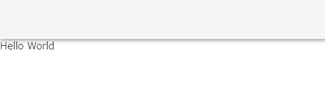

Rails + Vue.js のプロジェクトを作って Vue.js のキャッチアップ中です。
このプロジェクトに Vuetify を導入していきます。

## プロジェクト構成

プロジェクトの構成はこのような感じです。

```
■バックエンド
  ruby: 2.7.1
  Rails: 6.0.3.7
■フロントエンド
  node: 12.18.3
  Vue: 2.6.11
  TypeScript: 4.1.5
■データベース
  MySQL: 5.7
```

環境構築は下記の記事を参考にしました。

[Docker で Rails \+ Vue \+ MySQL の環境構築をする方法【2020/09 最新版】 \- Qiita](https://qiita.com/Kyou13/items/be9cdc10c54d39cded15)

## Vuetify の導入

UI フレームワークの Vuetify を導入していきます。

[Vuetify — A Material Design Framework for Vue\.js](https://vuetifyjs.com/ja/)

Vue CLI によるインストールを行う。

Docker 上に構築しているので下記コマンドでインストールします。

```
docker-compose run --rm front vue add vuetify
```

コマンドを実行すると選択式でインストールが進んでいきます。

npm 本家のレジストリへの接続が遅いのでミラーサイトを使用しますか？という意味です。
今回はミラーサイトを使用せずに本家を使用するため、「No」で進めます。

```
?  Your connection to the default npm registry seems to be slow.
   Use https://registry.npm.taobao.org for faster installation? No
```

プリセットの選択を聞かれますが、「 Configure (advanced) 」を選択し詳細を設定する方を選びます。

```
? Choose a preset: Configure (advanced)
```

App.vue と HelloWorld.vue を既成の Vuetify のテンプレートを使うか聞かれますが、「No」で進めます。

```
? Use a pre-made template? (will replace App.vue and HelloWorld.vue) No
```

カスタムテーマを使うか聞かれますが、「No」で進めます。

```
? Use custom theme? No
```

カスタム CSS を使うか聞かれますが、「No」で進めます。

```
? Use custom properties (CSS variables)? No
```

アイコンフォントは何を使うか聞かれますが、「Material Design Icons」で進めます。

```
? Select icon font Material Design Icons
```

Google フォント、アイコン用のフォントをインターネット経由で読み込むのではなく、Node.js パッケージとしてインストールしたいので、「Yes」で進めます。

```
? Use fonts as a dependency (for Electron or offline)? Yes
```

必要なコンポーネントだけ使用しますか？という意味？？(ここはいまいちわからなかった。)
一旦「Yes」で進めます。

```
? Use a-la-carte components? Yes
```

Vuetify で言語を「Japanese」で進めます。

```
? Select locale Japanese
```

これで Vuetify のインストールが始まります。

特に何もしなくても必要な設定がされますが、
TypeScript を導入しているため`tsconfig.json`に次の文を追加します。

```
    "types": [
      "webpack-env",
      "jest",
      "vuetify" // 追加
    ],
```

これで導入は終わりです。

次に動作確認を行います。

## Vuetify の動作確認

`front/src/App.vue`

```
<template>
  <v-app>
    <router-view />
  </v-app>
</template>
```

`front/src/views/HelloWorld.vue`

```
<template>
  <div> // → テンプレートルートは1つ必要なのでとりあえずdivで対応してエラー回避
    <v-app-bar></v-app-bar>
    <v-main>Hello World</v-main>
  </div>
</template>
```

わかりにくいですが、UI が変わっているのでこれで動作確認完了です。
あとは Vuetify を使って書いていくだけです。


