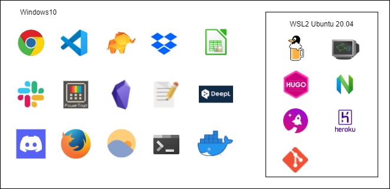

どういう構成で開発しているかと Windows10+WSL2 で開発するメリットについてのメモです。

## どういう構成で使っているの？

Windows10 に WSL2 をインストールして、Linux ディストリビューションは Ubuntu-20.04 を実行して使用しています。

windows10 上には VSCODE など開発に関連するものも入ってますが、基本的には汎用的に使うアプリを入れています。

WSL2 で実行している Linux ディストリビューションには開発に特化したツールを入れています。

また、Mac でパッケージ管理システムといえば Homebrew が有名ですが Windows では使えません。

ですが、WSL2 をインストールすることで Linux が使えるようになります。

**Linux では本家 Homebrew を Linux でも使えるようにした Linuxbrew があるため、Mac と同じようにパッケージ管理できるようになるのでとても便利です。**

セットアップ時に行う設定やインストールなどは dotfiles として GitHub 上で管理しています。

https://github.com/snyt45/windows10-dotfiles

https://github.com/snyt45/wsl-dotfiles

## Windows10+WSL2 で開発するメリット

windwos10 は開発以外、WSL2 は開発のみという感じで切り分けて使っています。

新しく開発関連のツールを入れる際は WSL2 の Linux ディストリビューション上にインストールします。

そのため、Windows 上の環境変数やディレクトリが汚れません。

もし、WSL2 の Linux ディストリビューション上に色々ツールを入れて失敗した場合は Linux ディストリビューションのみリセットが可能です。

そのため、Windows を一からインストールしなおすというオーバーヘッドが発生しません。

また、WSL2 のリセットは数秒で終わるため、壊して試してということが高速で試せませす。

web 開発だと MacOS がデファクトスタンダードだと思いますが、  
今は Windows でも Mac と変わらない開発環境が手に入ります。

WSL2 からは、本物の Linux カーネルが動作しますし、Linux ディストリビューションの起動は 1,2 秒ですし、Windows の Docker を Linux ディストリビューション上でも併用して使えます(Linux に Docker を入れ直さなくてもよい)。

windows から WSL ファイルシステムへのアクセスもエクスプローラーのパスに`\\wsl$`を入力するだけなので非常に簡単です。

また、WSL の IP アドレスは変わってしまうという問題がありましたが今は解消されており、localhost でアクセスできるため非常に快適です。

[「WSL 2」最大の課題であった“localhost”問題が解決 ～「Windows 10」Build 18945 \- 窓の杜](https://forest.watch.impress.co.jp/docs/news/1198651.html)

Windows11 からは WSL の導入がもっと簡単になったと聞いているのでそのうち試してみたいです。
