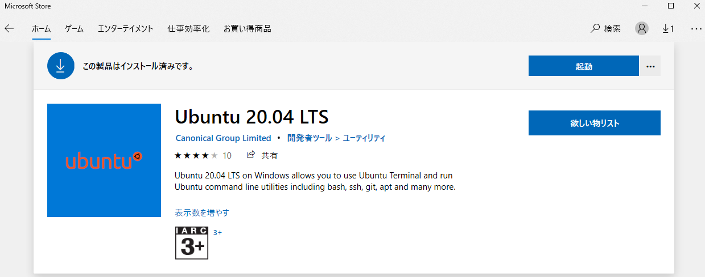

エンジニアとしてスタートアップの Web サービス開発に携わっています。  
仕事で Windows10+WSL2+Docker を使って開発をするようになって 2 か月経ちました。

WSL2 だからといって仕事で困ることはなく、**Windows の使いやすい UI を活かしつつ Windows 上で 100%Linux が使えるという恩恵を受けており、むしろ快適に開発しておりました。**

最近ではさらに Linux ディストリビューションをインポートする方法を覚えたことで  
ついにローカル環境を汚さずに使い捨ての開発環境を手に入れることができました。

**もっと Windows10+WSL2+Docker の良さを伝えたいと思ったので、WSL2 のメリット・デメリットに触れながらローカル環境を汚さずサクッと使い捨ての開発環境を作る方法について書こうと思います。**

また、この方法であればいくらでも欲しい環境を好きなだけ作れてしまうので作りすぎには要注意ですね！笑

**すぐに使い捨ての開発環境が欲しいんだという方は[本題：Windows10+WSL2+Docker でローカル環境を汚さずに使い捨ての開発環境を手に入れる](#本題windows10wsl2dockerでローカル環境を汚さずに使い捨ての開発環境を手に入れる)に飛んでください。**

## WSL2 とは

Mac をお使いの人にも WSL2 の良さが伝わればなと思うので、簡単に WSL2 について触れたいと思います。

**WSL とは、「Windows Subsystem for Linux」の略で簡単にいうと Windows 上で Linux が動くというものです。**

WSL1 では Linux カーネルのシステムコールを Windows カーネルが処理できるシステムコールに変換して実行していましたが一部のシステムコールには対応できておらず一部の Linux アプリ(Docker など)は動作しませんでした。

そこで WSL2 の登場です。

WSL2 は 2 ではありますが、WSL1 とは全く別物となっています。

### WSL2 の特徴：100%の Linux システムコールの互換性

WSL2 では WIndows 上で軽量 VM(仮想マシン)が起動し、その中で実際の Linux カーネルが動作します。
つまり、**全ての Linux アプリが動作するため 100%Linux の資産が使えます。**

ただし、仮想マシンといっても一般の仮想マシンとは違い非常に高速で 1,2 秒で起動しマシンの大量のリソースを占有することはありません。

また、**すごいのが軽量 VM はバックグラウンドで管理および実行されるため使う側は全く意識する必要はありません。**

### WSL2 の特徴：ファイル I/O 操作のパフォーマンスが高速

Microsoft の動画の 2 分 7 秒くらいから WSL1 と WSL2 のパフォーマンス比較が見れます。  
(WSL2 のアーキテクチャについては 10 分 16 秒くらいから見れます。)

**WSL1 に比べて WSL2 は約 3 ～ 6 倍速くなっており、インストールなども高速です。**



### WSL1 と WSL2 のアーキテクチャ

WSL1 と WSL2 のアーキテクチャのイメージです。

> 
> [参考：【連載】WSL2、Visual Studio Code、Docker でグッとよくなる Windows 開発環境 〜 その 2：WSL1＆2 のしくみ 〜](https://tech-lab.sios.jp/archives/21045)

### 朗報：Windows10 Home でも WSL2 は使える！

一般家庭用だと Windows10 Home の方が多いと思いますが、**WSL2 はなんと Windows10 Home でも使えます！**  
(私も個人 PC は Windows10 Home です)

> **WSL 2 は、WSL を使用できるすべてのデスクトップ SKU で使用できます (WINDOWS 10 HOME)。**
>
> 最新バージョンの WSL では、仮想化を有効にするために、Hyper-V アーキテクチャが使用されます。 このアーキテクチャは、"仮想マシン プラットフォーム" のオプション コンポーネントで使用できます。 このオプションのコンポーネントは、すべての SKU 上で使用できます。
>
> [faq's about Linux 用 Windows サブシステム 2 \| Microsoft Docs](https://docs.microsoft.com/ja-jp/windows/wsl/wsl2-faq#wsl-2---hyper-v-------------windows-10-home-----------------)

### WSL2 が使えるということは、Docker も使える！

[Docker 公式のドキュメント](https://docs.docker.jp/docker-for-windows/install-windows-home.html)にもある通り、Windows Home マシンで WSL2 バックエンドを使うと Docker をインストールすることができます。

つまり、**Windows でも特に苦労なく Docker を使うことができます。**

## 本題：Windows10+WSL2+Docker でローカル環境を汚さずに使い捨ての開発環境を手に入れる

ここからが本題です(前置きが長くてすみません)。

まず、Windows10 に WSL2 をインストールする必要があります。

### WSL2 と Linux ディストリビューションのインストール

Microsoft 公式にインストールガイドがあり、「簡略化されたインストール」と「手動インストール」の 2 つの手順があります。

ガイドに従ってインストールを進めてください。

**なんと、「簡略化されたインストール」だと`wsl --install`するだけで WSL2 をインストールできちゃいます。**

[Windows 10 に WSL をインストールする \| Microsoft Docs](https://docs.microsoft.com/ja-jp/windows/wsl/install-win10)

手順に従うと、Windows オペレーティングシステムと完全に統合された Linux ディストリビューションが手に入ります。

**これで Windows 上に隔離された Linux 環境の出来上がりです！**

### Docker Desktop のインストール

Docker 公式のガイドに従ってインストールを進めてください。

[Windows Home に Docker Desktop をインストール — Docker\-docs\-ja 19\.03 ドキュメント](https://docs.docker.jp/docker-for-windows/install-windows-home.html)

### Windows Terminal のインストール

Mac だと iTerm2 などのターミナルがあると思いますが、  
Windows には Windows Terminal がありますので、インストールしておきましょう。

[Windows Terminal をインストールする \| Microsoft Docs](https://docs.microsoft.com/ja-jp/windows/wsl/install-win10#install-windows-terminal-optional)

### Windows10+WSL2+Docker 環境の出来上がり！

これだけで Windows10+WSL2+Docker 環境が出来上がりました。

これが今までの私の環境でした。

詳しい話は[Windows10\+WSL2 で開発するメリット](https://snyt45.com/posts/20210801/windows_wsl2_development/)の記事に書きました。

### WSL2 と Linux ディストリビューションの問題点

これだけでも開発環境は Linux ディストリビューションに構築すれば使い捨てできる完了の出来上がりなのですが、1 つ問題がありました。

それは**Linux ディストリビューション上に仕事で使う開発環境を構築してしまうと気軽に使い捨てできないという点**です。

当たり前といえば当たり前の話ですが、これは使っていて最近気づきました…

### Microsoft Store 経由だと同一の Linux ディストリビューションは複数入れることができない問題

例えば、私の場合は Microsoft Store から「Ubuntu 20.04 LTS」をインストールして使っていました。

じゃあ、もう一つ同じ Linux ディストリビューション入れよう！と思いましたが入れられませんでした。



全く同じ Linux ディストリビューションは入れられませんが、例えば「Ubuntu 18.04 LTS」などバージョンが違えば入れられるみたいです。

ですが、**私は全く同じ Linux ディストリビューションを入れたかった**ので方法を調べてみました。

### 新しく Linux ディストリビューションをインポートする方法を覚えた！

Microsoft 公式のドキュメントにやり方が載っていました！

CentOS をインポートする方法を参考に Ubuntu でインポートを試してみました。

[WSL で使用する Linux ディストリビューションをインポートする \| Microsoft Docs](https://docs.microsoft.com/ja-jp/windows/wsl/use-custom-distro)

こちらの方法は、

1. Linux ディストリビューションの tar ファイルをコンテナから取得する
2. 取得した tar ファイルを WSL にインポートする

という手順になります。

#### 1. Linux ディストリビューションの tar ファイルをコンテナから取得する

1. すでにインストールした Linux ディストリビューションのコマンドラインを開く(この例では Ubuntu)

2. Docker で Ubuntu コンテナを実行

```
docker run -t ubuntu:20.04 bash ls /
```

ubuntu のイメージがなければイメージの取得が始まる。

```
Unable to find image 'ubuntu:20.04' locally
20.04: Pulling from library/ubuntu
16ec32c2132b: Pull complete
Digest: sha256:82becede498899ec668628e7cb0ad87b6e1c371cb8a1e597d83a47fac21d6af3
Status: Downloaded newer image for ubuntu:20.04
/usr/bin/ls: /usr/bin/ls: cannot execute binary file
```

3. grep と awk を使用して Ubuntu のコンテナ ID を取得します。

bash 用のコマンド

```
dockerContainerID=$(docker container ls -a | grep -i ubuntu:20.04 | awk '{print $1}')
```

fish 用のコマンド

```
set dockerContainerID (docker container ls -a | grep -i ubuntu:20.04 | awk '{print $1}')
```

4. C ドライブ上に tar ファイルをエクスポートします。

```
docker export $dockerContainerID > /mnt/c/temp/ubuntu.tar
```

#### 2. 取得した tar ファイルを WSL にインポートする

1. 先ほどエクスポートした tar ファイルを WSL にインポートします。

```
cd C:\temp
wsl --import Ubuntu-20.04_dev C:\Users\snyt45\AppData\Local\Packages\Ubuntu-20.04_dev C:\temp\ubuntu.tar
```

`--import`の補足：

- `--import <Distro> <InstallLocation> <FileName>`
  - `<Distro>` -- `wsl -l`で出てくるディストリビューション名
  - `<InstallLocation>` -- インストール先。ストレージである`ext4.vhdx`が配置される。
  - `<FileName>` -- インポートする tar ファイル

2. Linux ディストリビューションのストレージ`ext4.vhdx`が作成されていることを確認します。


3. `wsl -l`でディストリビューション一覧に追加されていることを確認します。


4. Windows Terminal にディストリビューションが追加されていることを確認します。

追加されていない場合は、Windows Terminal を再起動します。


### Ubuntu のユーザー作成、Windows Terminal の開始ディレクトリ設定、docker コマンドを使えるにする

1. Ubuntu を起動します。

```
wsl -d Ubuntu-20.04_dev
```

Ubuntu を起動すると、`\\wsl$`に追加した Linux ディストリビューションのフォルダが出てくるようになります。


2. Ubuntu を諸々アップデートします。

この後、vim が必要になるためインストールしています。

```
apt update
apt upgrade
apt-get install vim
```

3. ユーザーを作成します。

```
adduser ユーザー名
```

4. 3 で作成したユーザーをログイン時のデフォルトユーザーに指定します。

**設定を反映するには、一度 wsl を再起動(wsl -t [ディストリビューション名])する必要があります。**

```
vi /etc/wsl.conf

# 下記を追加
[user]
default=ユーザー名
```

5. Windows Terminal で追加した Ubuntu を開いた際に開始ディレクトリを設定します。

settings.json を開き、下記のような場所を見つけてそこに`startingDirectory`を追記しましょう。

```
  {
      "guid": "{a32514ec-a5a8-556e-a6a1-a1d48b6f0d84}",
      "hidden": false,
      "name": "Ubuntu-20.04_dev",
      "source": "Windows.Terminal.Wsl",
      "startingDirectory": "//wsl$/Ubuntu-20.04_dev/home/ユーザー名"  // 追加
  }
```

6. Windows Terminal を再起動して Ubuntu を開く

これで、追加したユーザーで Linux のホームディレクトリを開くようになっているはずです。


7. Docker の設定から WSL インテグレーションを有効にする。

WSL インテグレーションを有効にしておきましょう。


これで、**Ubuntu 上でも docker コマンドが使えるようになります。**


このように**WSL2 上に Linux ディストリビューションをインポートする方法を使えば、いくらでも好きな環境を作ることができます。**

あとはコーヒーを飲みながら、好きなツールを入れて遊ぶだけです！

### インポートした Linux ディストリビューションの登録解除

実は**このように Linux ディストリビューションをインポートした場合は、環境のリセットができません。**

そのため、もう一度初めからやり直したくなったら登録解除を行います。

```
wsl --unregister <DistributionName>
```

> 注意: 登録を解除すると、そのディストリビューションに関連付けられているすべてのデータ、設定、ソフトウェアが完全に失われます。 ストアから再インストールすると、ディストリビューションのクリーン コピーがインストールされます。
>
> [ディストリビューションの登録解除と再インストール](https://docs.microsoft.com/ja-jp/windows/wsl/wsl-config#unregister-and-reinstall-a-distribution)

#### 環境のリセットとは

**Microsoft Store 経由で Linux ディストリビューションをインストールした場合は、アプリと機能から簡単にリセットすることができます。**

アプリと機能から「Ubuntu」で検索して、詳細オプションを押下します。  


リセットボタンからリセットできます。  


リセットをした場合は、環境が初期化されます。  
リセットの場合は数秒でリセットが完了します。  
また、再度 Linxu ディストリビューションをインストールする必要がないためすぐに新しい環境で始めることができます。

## まとめ

これでローカル環境を汚さずに使い捨ての環境を手に入れることができました！

仕事の開発環境を WSL2 上に構築してからは最初からやり直したくてもリセットができずに色んなツールを試したくても試せていなかったのですが、これで心置きなく試せますね！

ここ数年で Windows の開発環境は進化を続けており、かなり開発がしやすい環境が整っています！

また WSL2 のインストールのワークフローも改善されていてワンコマンドでできるようになってきています。

WSLg のプロジェクトが進めば、Linux の GUI アプリが簡単に Windows 上で動作します。

一部の Linux の GUI アプリは既にとても簡単な手順で動くようになっています。

思ったよりも Windows の開発環境はいいぞ！という記事でした。



[microsoft/wslg: Enabling the Windows Subsystem for Linux to include support for Wayland and X server related scenarios](https://github.com/microsoft/wslg)

## 参考(自分があとで見る用)

WSL, WSL2 の仕組みについてのわかりやすいスライド  
[Inside wsl](https://www.slideshare.net/SatoshiMimura/inside-wsl-180215871)

Microsoft 公式ページで localhost を使って Windows から Linux アプリに接続できる機能のお知らせ  
[What’s new for WSL in Insiders Preview Build 18945 \| Windows Command Line](https://devblogs.microsoft.com/commandline/whats-new-for-wsl-in-insiders-preview-build-18945/)

Microsoft 公式ページで WSL2 が利用できるようになったお知らせ  
[WSL 2 is now available in Windows Insiders \| Windows Command Line](https://devblogs.microsoft.com/commandline/wsl-2-is-now-available-in-windows-insiders/?WT.mc_id=thomasmaurer-blog-thmaure)

Microsoft 公式ページで WSL1 と WSL2 の比較について  
[WSL1 と WSL2 の比較\| Microsoft Docs](https://docs.microsoft.com/en-us/windows/wsl/compare-versions?WT.mc_id=thomasmaurer-blog-thmaure#wsl-2-architecture)

WSL2 の概要をさらっとつかむのにいいです  
[今度の WSL 2 は「ホンモノ」の Linux。システムコール 100%互換も \| PC\-answers](https://pc-answers.net/?p=7614)

Windows の Docker 環境は混在しており個人的に混乱してましたが順追って解説されていてとても貴重な記事です  
[Windows 10 Home でも使えて、インストールも超簡単な「Docker Desktop for Windows」登場：Windows 10 The Latest（1/2 ページ） \- ＠IT](https://atmarkit.itmedia.co.jp/ait/articles/2011/20/news015.html)

WSL と Docker の機能についてわかりやすい回答があります  
[Docker \- wls2 と Docker の関係性を知りたい｜ teratail](https://teratail.com/questions/309712)

WSL2 の VM の中でコンテナで仕切っている図はわかりやすいです  
[ついに Docker に対応した WSL2 を私見で解説してみた \- ブログなんだよもん](https://koduki.hatenablog.com/entry/2019/05/10/124945)

Windows + Docker の歴史について詳しく書いてあります  
[Windows 上で Docker コンテナを動かす！ その歴史 \#docker \#windows \#linux \#lcow \#wcow \#wsl2 \- クリエーションライン株式会社](https://www.creationline.com/lab/42842)

Docker 公式の WSL2 周りの流れ  
[Creating the best Linux Development experience on Windows & WSL 2 \- Docker Blog](https://www.docker.com/blog/creating-the-best-linux-development-experience-on-windows-wsl-2/)

Windows Home を Docker がサポートした歴史的瞬間  
[Docker Desktop for Windows Home is here\! \- Docker Blog](https://www.docker.com/blog/docker-desktop-for-windows-home-is-here/)

Docker Desktop WSL 2 Backend について  
[Introducing the Docker Desktop WSL 2 Backend \- Docker Blog](https://www.docker.com/blog/new-docker-desktop-wsl2-backend/)
