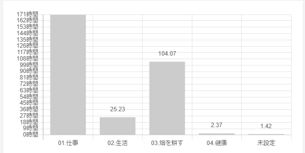

今月からの振返りは気になったトピックだけ振返っていこうと思います！

## トピックごとの振返り

### 仕事

#### 自社

##### UX ワークショップ

着々と新サービスに向けて、事が進んでおります。

自社では「ユーザーに憑依する」というバリューがあり、もっとユーザーの解像度をあげようといことで  
UX ワークショップを開催して全員でユーザーのペルソナを考えたり、コンセプトを振返ったりという機会がありました。

改めてコンセプトを言語化する中で認識ずれがあったり、ユーザーについて全然イメージがわいていなかったりと顕在化しました。

そういう意味ではすこくいい時間だったと思う一方、ユーザーのペルソナを検討したりするのはすごい苦手な作業だなと思いました。

**やはり自分は開発に関して熱量があることはわかりましたが、開発以外の事になると熱量を維持するのが難しいと思い、改めて開発に取り組むことができる環境は自分にとって大事なピースだなと再認識したのでした。**

##### コツコツ運動

少しずつ開発に関する改善をエンジニア全員で取り組んでいます。

週に 1 度 15 分程度ですが、実際に取り組むことですでに 5 つほど改善タスクに着手し改善できています。

改めてこういったことを会社の中で進めていける風土はすごくいいなと思うのでぜひ続けていきたいと思います。

#### 開発支援先

##### テストがあるプロダクトに携わることでテストが少しずつ当たり前に

プロジェクトに参加させて頂くことで新規で開発する機能が増えてきました。

その中でテストを書く機会も多くなってきて、テストを書くのが当たり前になってきて良いことだなと思ってます。

受託開発のときはテストを書く土台がなく障害に対しても場当たり的な対応で、動作確認もその場だけでした。

こういった負債は数値化は難しいですが、明らかに負債になっており開発に支障が出るほどでした。

今は全員がテストを書く環境のため、テストがない環境と比べて比較的安定してサービスが稼働している印象があります。

また、実装するときもテストの恩恵を受けていて素早くミスに気づけますし時間はその分かかりますが**テストっていいなーとしみじみと思います。**

##### 他の人のコードをレビューする

最近では、他の人のコードレビューをすることも多くなってきました。

コードレビューをすることで気づける点も多くありました。

他の人のコードを指摘する際になぜ指摘するのか？ということを言語化する必要があり、言語化するには理解しておく必要があるため、再理解につながります。

また、単純に他の人のレビューを見ることでこういうやり方もあるのかと気づけて、今後の実装する際の引き出しが増えたりと良いことづくめでした。

良いところは積極的に盗んでコードの品質を高めていこうと思います。

##### GraphQL での開発

GraphQL のスキーマ定義をはじめに行っておき、フロント側とサーバーサイド側で認識を合わせたうえで開発を進めていくようにしています。

そのため、お互いにスキーマ定義に沿って開発を行うため手戻りが少なく進められることがメリットだなーと感じています。

一方で、フロント側が画面のコーディング作業をして、GraphQL との繋ぎ込みタイミングはどうしてもサーバーサイド側が完了後からになることが多く、フロントの作業がサーバーサイド完了後になってしまうのは問題だなーと思っています。

query だとモックサーバーでモックを返すようにすればいいのですが、mutation だと実際の挙動を再現するのが難しくいい方法を模索していきたいです。

### 個人

#### 畑を耕す時間が 100 時間を超えた

**夏季休暇があったこともあり、先月に比べて 40 時間以上も畑を耕す時間に取り組めています。**

今月は WSL について調べて記事にしたり、dotfiles 管理周りで色々触ってみたりと積極的に時間が取れているなーと思っていましたが、とても良い傾向なので今後も続けていきたいです。

#### コツコツ朝活で進めている勉強

朝起きてから仕事が始まるまでに 3 つくらいの本を少しずつ進めているのですが、SQL 入門の本がもうすぐで完了しそうです。

7 月からコツコツと進めて約 20h くらいかかっていますが、あれだけ苦手だった SQL も少しずつですが好きになってきました。

**自分のレベルにあった本を選ぶというのと嫌にならない程度で毎日コツコツ進めるというのは他に人に進めたいほどのライフハックです(習慣の力ってすごい)。**

#### オーバーエンジニアリング的な dotfiles 管理

8 月の夏季休暇で dotfiles 管理も見直そうとネットサーフィンしていたら理想な dotfiles を見つけてしまいました。。

**Github Actions、ansible、dependabot、Makefile を使っている[リポジトリ](https://github.com/uu64/dotfiles)です。**  
**[記事](https://uu64.me/blog/2020/11/dotfiles)もありました。**

この構成を見たときに、Github Actions でシェルスクリプトのテストも回していて、ansible、dependabot も触れる良い機会だなと思って、そこからは少しずつコードリーディングしながら自分の dotfiles にも取り入れようと頑張ってます!

ほんとにすごいなーと感動したので、こちらもコツコツと進めていく予定です。
