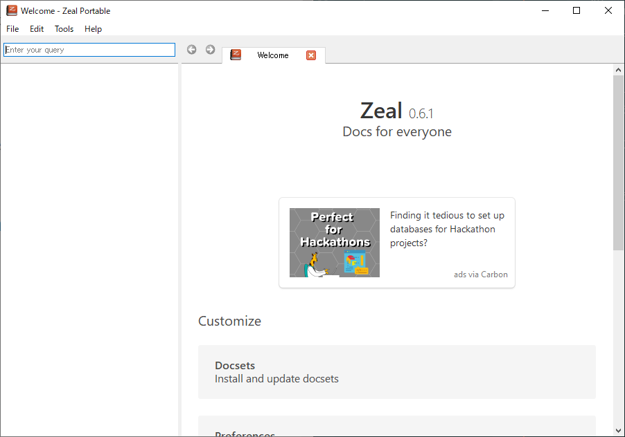
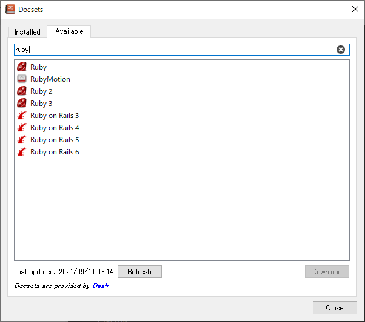
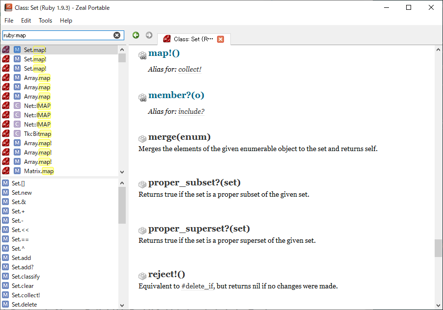
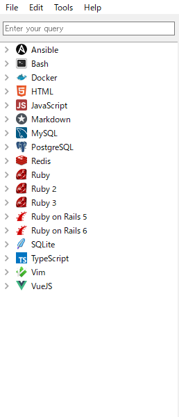

開発支援先で技術顧問の方が Ruby のメソッドを調べる際に[Dash](https://kapeli.com/dash)というアプリを使っているのを見て、

こんな便利なものがあるのかと初めて知りました。

Dash を入れてみようとしたところ Mac のみのようでした。

Windows でも代用できるものか探したところ[Zeal](https://zealdocs.org/)というものがあったのでそちらを入れてみたいと思います。

## Zeal をインストール

scoop にあるか`scoop search zeal`で調べるとあるようです。

`scoop install zeal`でインストールします。

## Zeal を立ち上げる

Zeal を立ち上げるとこのような画面がでてきます。

さっそく、ドキュメントをダウンロードしていきます。

ここでは Ruby のドキュメントをダウンロードしています。

ダウンロードできるドキュメントが[公式サイト](https://zealdocs.org/)に載っており、現在は 205 ほど対応しているようです。

ドキュメントからメソッドを検索してみます。

`ruby:map`は ruby ドキュメントから map という文字列を検索してくれます。

ひとまず使いそうなドキュメントをダウンロードしてみました。

## まとめ

今までググってドキュメントを見ていましたがバージョンが違ったり、公式ドキュメント？なのかよくわからなかったりということがあったのですが、今後は Zeal でインストールしたドキュメントから検索すればよいので検索体験が向上しそうです。

英語ドキュメントなので辛いところはありますが読めない箇所は翻訳しつつ上手く活用しようと思います。
