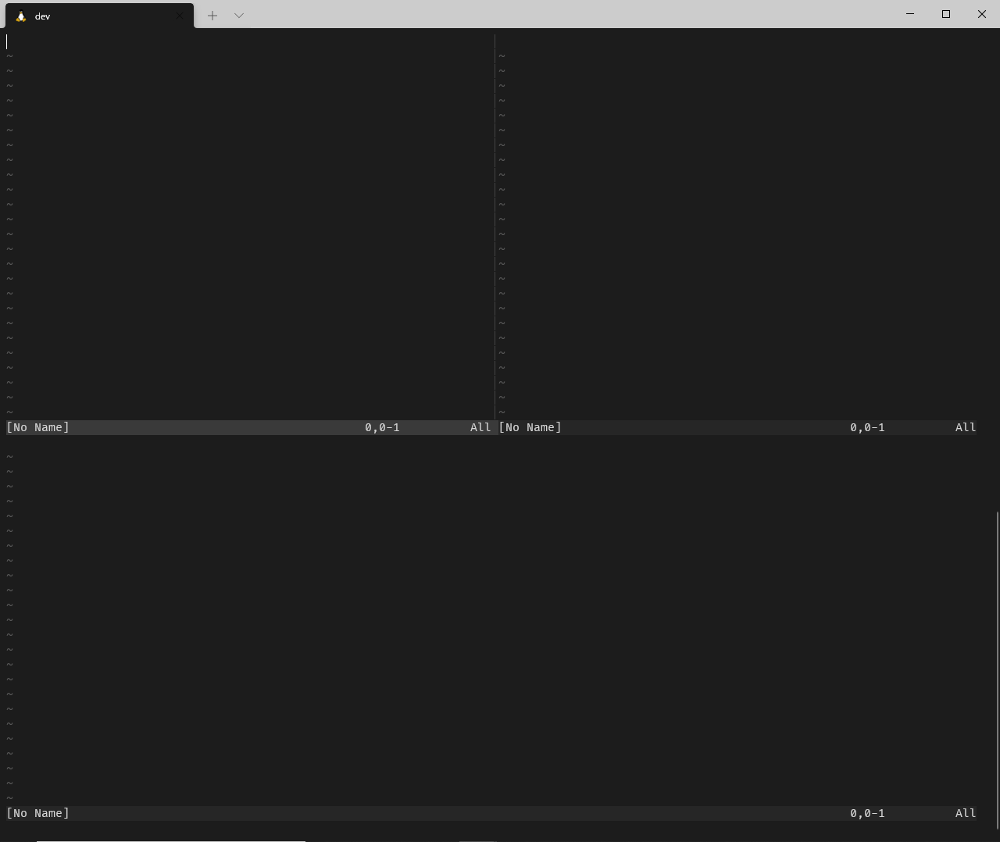

[Vim が好きになる本 \- gorilla0513 \- BOOTH](https://booth.pm/ja/items/1513974)

出先で 1 時間ほど時間があったので積読していたゴリラさんが書かれた「Vim が好きになる本」を 11 章(全 15 章)まで読みました。

キリが良いので 11 章までで初めて知ったことなど色々気づきがあったので**思ったベースで知識の定着も兼ねてアウトプットしようと思います。**

**残念ながら後編があるかはわかりません…**

## 第 3 章 バッファとウィンドウとタブページ

- Vim ではファイルを開くと内容がメモリにロードされる。これがバッファ。

- `:ls`もしくは`:buffers`でバッファを確認できる。
  - `%`はカレントバッファ、`#`は直前に開いていたバッファを指す。

- `:new` 空のウィンドウを水平分割で開く
- `:vnew` 空のウィンドウを垂直分割で開く
  - これは知っておくと地味に便利。

## 第 5 章 ノーマルモード

5 章は筆者いわく一番読んで欲しい章とのことでしたが、かなり知らない情報があってとても勉強になりました。  
忘れたころにまた読み返したいです。

- **モーションはカーソル移動のこと**

- `f[文字]`で右に向かって移動。`;`で順方向に繰り返す。`,`で逆方向に繰り返す。
  - 行内移動が楽になるから手癖にしたい。

■`f[文字]`での行内移動  

- **オペレーターは y や d といった操作のコマンドのこと**

  - オペレーターはカウントとモーションを組み合わせることができる

- 大文字・小文字切り替えに使える便利なオペレーター
  - `gu` + `モーション`でモーションの範囲を小文字にする
    - `guw` 単語を小文字にする
  - `gU` + `モーション`でモーションの範囲を大文字にする
    - `gUw` 単語を大文字にする

これは知らなかったけどめちゃくちゃ便利！

■ 大文字・小文字切り替え  

ちなみにオペレータは`:help operator`とするとオペレータ一覧が出てくるのでオペレータってどれのことだろうか？と調べるときは便利！

- **テキストオブジェクトは、テキストを 1 つの意味のあるまとまりとして扱う**

  - オペレーター、もしくはビジュアルモードの後に使える。
  - ヘルプは`:h object`で引ける

- テキストオブジェクトで使えそうなもの
  - `a"` ダブルクォーテーションで囲まれた文字列(ダブルクォーテーションを含む)
  - `a'` シングルクォーテーションで囲まれた文字列(シングルクォーテーションを含む)
  - `a(` or `a)` ()で囲まれた文字列(()を含む)
  - `a<` or `a>` <>で囲まれた文字列(<>を含む)
  - `a[` or `a]` []で囲まれた文字列([]を含む)
  - `i"` ダブルクォーテーションで囲まれた文字列(ダブルクォーテーションを含まない)
  - `i'` シングルクォーテーションで囲まれた文字列(シングルクォーテーションを含まない)
  - `i(` or `i)` ()で囲まれた文字列(()を含まない)
  - `i<` or `i>` <>で囲まれた文字列(<>を含まない)
  - `i[` or `i]` []で囲まれた文字列([]を含まない)

テキストオブジェクトを`v(ビジュアルモード)`と組み合わせるとすごい便利だったので紹介します。

■`v` + `a(`  
`()で囲まれた文字列(()を含む)`を選択  

■`v` + `iw`  
`単語(空白を含まない)`を選択  

■`v` + `i(`  
`()で囲まれた文字列`を選択  

■`v` + `i'`  
`''で囲まれた文字列`を選択  

■`v` + `i<`  
`<>で囲まれた文字列`を選択  

- `r[文字]`でカーソルの文字を置換

  - これも地味ーに便利なやつ！

- `gJ`は空白を含まないで行連結

■`gJ`で空白を含まないで行連結

## 第 6 章 挿入モード

- **レジスタは y や d などのしたテキストが保存される領域**
- `:reg`でどのレジスタに何が保存されているか確認できる。

- `Ctrl+r=` に続けて`expand("%:p")`とすると挿入モードでファイルのフルパス

■expression 用レジスタで expand の結果をプットする  
これ知らなかったですが使いこなしたらすごそうです。  
VimScript で評価した結果が欲しい場合などに使えそうな予感。

## 第 9 章 置換モード

- `Shift+r`で置換モードになり、文字を置換していくことができる。

## 第 10 章 Terminal-Job モード

- Vim を終了することなく、ターミナルを使用できるのでちゃんと理解して使うととても便利そう。

## 第 11 章 ヘルプ

- `:helpg`で正規表現であいまい検索は知らなかった
- `:h help-summary`、`:h index`、`:h quickref`でヘルプを引くのは最初のほうはよさそう。

## まとめ

最後らへんは結構使わない機能が多くてへえーこんな機能があるんだという感じで呼んでました。  
とくに Terminal-Job モードはちゃんと理解して使うとかなり開発体験変わりそうと思いました。

また、テキストオブジェクトはよくわからんとなっていて調べたこともなかったのでこの本を通して凄さが分かりました。  
すぐに効果が出てくると思うのでテキストオブジェクトは意識しながら開発していきたいと思いました。
