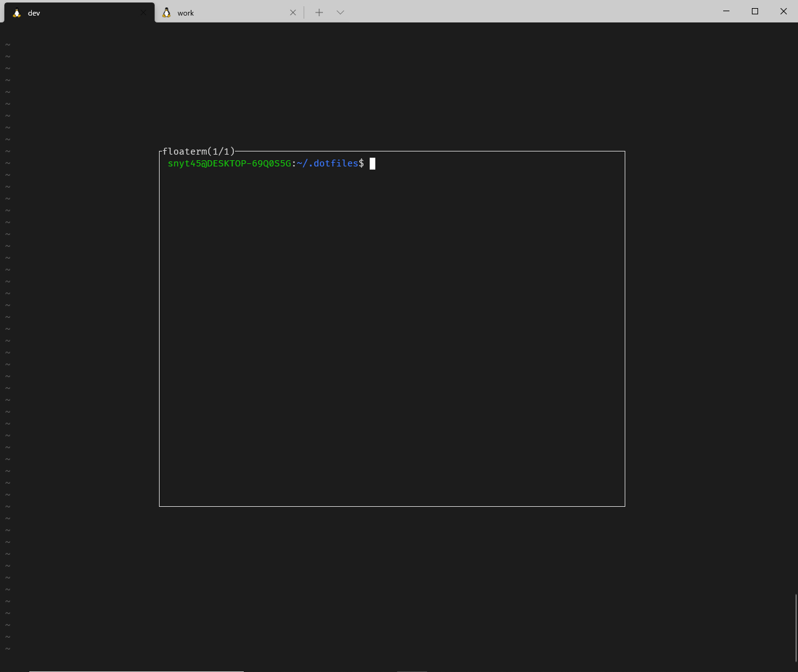

## 前置き

[lazygit](https://github.com/jesseduffield/lazygit)という TUI ツールをご存じですか？  
こちらはターミナル上で`lazygit`と呼び出すことで使うことができます。

下記のような UI(個人的には超好みな UI)で GIT 操作をすることができます。


この lazygit を vim から呼び出せたら最高なのに…と思っていました。

そこで色々調べているときに vim-floaterm という vim のプラグインを知りました。

## vim-floaterm とは

[vim-floaterm](https://github.com/voldikss/vim-floaterm)は、vim から terminal を呼び出すことができるのですが  
terminal をフローティングウィンドウで表示してくれるプラグインです。

下記のような感じで vim から terminal をフローティングウィンドウで表示してくれます。



lazygit + vim-floaterm を組み合わせれば最高にかっこいい git 操作環境が出来上がると思っていました。

## vim-floaterm が動かない！？

vim-floaterm の README を見る感じだと、vim8 で popupwin という機能が動けば良さそうです。

この時点では、vim のバージョンは 8.1 で確か popupwin は vim8 からの新機能と思っていたので、  
なぜフローティングウィンドウにならないのかなーと思っていました。

下記の記事の通り、`:echo has('popupwin')`を実行すると`0`が返ってきており無効だったのが原因でした。

> coc.nvim に限らず Vim の LSP クライアントを活用していくとき、popup-window が有効になっていると便利です。 コマンドラインモードで :echo has('popupwin') を実行したとき、 1 が返ってくると有効になっています。
> [LSP クライアントを coc\.nvim にした話 — kashew_nuts\-blog](https://kashewnuts.github.io/2020/04/08/migrated_lsp_client_to_coc_nvim.html#popup-window)

## 対処法：popup-window を有効にする

popup-window を有効にするためにはバージョンを 8.2 にアップグレードするのが手っ取り早そうです。

vim8.2 は最新バージョンで通常の方法だと公式リポジトリには反映されていないため、下記方法でアップグレードを行いました。

[Ubuntu: Vim の最新バージョンインストール \- Qiita](https://qiita.com/Fell/items/8619385da8e09a59c787)

`:echo has('popupwin')`を実行すると、`1`が返り有効になりました。

これでやっと vim-floaterm が動くようになりました！

## 簡単なデモ

vim から terminal をフローティングウィンドウで呼びだしています。

さらに呼び出しているのは terminal なので terminal 上で実行できる lazygit も呼び出すことができます。

デモでは、

- floaterm の表示/非表示切り替え
- floaterm のウィンドウ複数作成
- floaterm のウィンドウ移動(next/prev)
- floaterm → lazygit 起動

などを行っています。


## vim-floaterm の設定

- ターミナルモード時のショートカットキーの設定をしています。
- vim 終了時に floaterm のインスタンス全てを必ずキルする設定をしています。

```vimrc
tnoremap <silent> <leader>tn <C-\><C-n>:FloatermNew<CR>
tnoremap <silent> <leader>[ <C-\><C-n>:FloatermNext<CR>
tnoremap <silent> <leader>] <C-\><C-n>:FloatermPrev<CR>
tnoremap <silent> <leader>tt <C-\><C-n>:FloatermToggle<CR>
tnoremap <silent> <leader>td <C-\><C-n>:FloatermKill!<CR>

augroup vimrc_floaterm
  autocmd!
  autocmd QuitPre * FloatermKill!
augroup END
```

- vim-which-key 側のキーマップに下記を追加しています。

```vimrc
" t is for terminal
let g:which_key_map.t = {
      \ 'name' : '+terminal' ,
      \ 'g' : [':FloatermNew lazygit' , 'git'],
      \ 't' : [':FloatermToggle'      , 'toggle'],
      \ }
```

上記の設定のショートカットキーについて。

| モード   | コマンド   | 説明                            |
| -------- | ---------- | ------------------------------- |
| normal   | `SPC + tt` | floaterm 表示・非表示切り替え   |
| 〃       | `SPC + tg` | floterm 上で lazygit を呼び出し |
| terminal | `SPC + tn` | floaterm 作成                   |
| 〃       | `SPC + t[` | 次の floaterm へ                |
| 〃       | `SPC + t]` | 前の floaterm へ                |
| 〃       | `SPC + tt` | floaterm 表示・非表示切り替え   |
| 〃       | `SPC + td` | 全ての floaterm を kill         |
