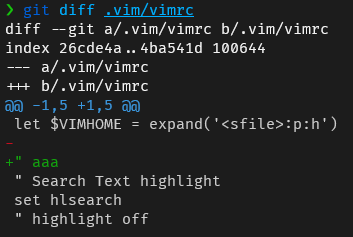

Vim で git 周りの機能を補えるようなプラグインはないかなーと探していたところ、git difftool というコマンドを知りました。

普通に git diff すると、ターミナルに縦に表示されますよね。



これでも良いのですが、VSCode のように左に変更前のペイン、右に変更後のペインを表示する感じにしたかったんです。


lazygit を使っているので Vim を終了して lazygit を開けばそれで済む話ですが、  
Vim でファイルを編集しながらサッと git の差分を確認したいんです。

ただ、fugitive.vim のような高機能は git 用プラグインは入れなくありません(その代わりとして lazygit を入れたため)。

どうにかシンプルなプラグインか何か別の方法ないか調べていたところ git difftool というコマンドを知りました。

## git difftool コマンドとは

[Git \- git\-difftool Documentation](https://git-scm.com/docs/git-difftool)

git diff コマンドとは違って、git difftool コマンドは一般的な diff ツールを使用して変更を表示してくれるコマンドです。

**つまり、自分が好きなツールで diff を見ることができるんです！**

公式ドキュメントを見ていると、そのツールの中に`vimdiff`という名称がありました。

## vimdiff コマンドとは

Vim 上で差分を表示するためのコマンドです。

```
vimdiff file1 file2
```

のようなコマンドを打つと file1 と file2 の差分を表示してくれます。

実際に使ってみると、VSCode のように左に変更前のペイン、右に変更後のペインを表示されるじゃないですか。


これは神機能です。  
しかも Vim があれば使えます。

特に新しいものを入れずにいい感じに git の差分を見るための準備が整いました。

## git difftool に vimdiff を使う方法

git の設定を行います。

```
# 差分ツールはvimdiffを使うように指定
git config --global diff.tool vimdiff
# 差分ツール呼び出す前のプロンプト表示オフ
git config --global difftool.prompt false
```

この設定をした状態で、Vim を開きます。

**コマンドラインモードで次のコマンドを実行すると、vimdiff で git の差分が見れました！**

```
:!git difftool %:p
```


これでめでたし、めでたしなのですが、このまま`:qa`で vimdiff を閉じると`Press ENTER or type command to continue`というメッセージが表示されて、Enter を押さないと元のファイルの画面に戻れず、このワンステップどうにかしたいと思いました。  
※デモの GIF ではすでに対応済みのため出てきません。

## Vim で外部コマンド実行した後のメッセージを表示させない方法

色々調べて下記記事にたどり着きました。

[How do I disable the "Press ENTER or type command to continue" prompt in Vim? \- Stack Overflow](https://stackoverflow.com/questions/890802/how-do-i-disable-the-press-enter-or-type-command-to-continue-prompt-in-vim)

最終的には下記のように vimrc に設定を追記することで解決出来ました(なぜ、この書き方で解決したのかはわかっていませんが・・・)。

```vimrc
map <F5> :wa!<CR>:!git difftool %:p<CR><CR>
```

これで`:qa`で vimdiff を閉じると出てきていたメッセージが表示されずにスムーズに元のファイルに戻ることができるようになりました。

また、F5 キーに割り当てたのでファイルを開いて F5 キーを押すと git の差分が見れるようになりました。

## 番外編：WSL から git difftool で meld を開く設定方法

difftool の中に meld というツールもありました。  
https://meldmerge.org/

シンプルで私好みでしたので、meld を使いたいなーと思い下記の設定をすることで  
WSL から Windows にインストールした meld を開くこともできました(mergetool というのもあることを知ったのでここでは設定しています)。

```
[diff]
        tool = meld
[difftool "meld"]
        cmd = "'/mnt/c/Users/snyt45/scoop/apps/meld/current/Meld.exe' $LOCAL $REMOTE"
[difftool]
        prompt = false
[merge]
        tool = meld
[mergetool "meld"]
        cmd = "'/mnt/c/Users/snyt45/scoop/apps/meld/current/Meld.exe' $LOCAL $BASE $REMOTE --auto-merge"
[mergetool]
        prompt = false
```

meld を difftool にして動作させたときのデモ。


GUI で差分を確認できるのと meld の分かりやすい表示は良かったのですが、  
やはり起動に時間がかかるのと meld を閉じないと Vim 側の操作ができなくなるため  
meld は使わず vimdiff を使っていこうと思います。

ただ、色々試行錯誤してせっかく動いたので記録として残しておきます。
