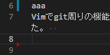

ファイルの左端に git の差分情報を表示するといのうは VSCode でいうこんなやつです。  
(青や赤のやつです。)



似たような vim プラグインとして[vim-signify](https://github.com/mhinz/vim-signify)もあります。

今回は[vim-gitgutter](https://github.com/airblade/vim-gitgutter)を入れてみました。

## インストール方法

プラグイン管理には vim-plug を使っています。  
vimrc に下記を追加して、`:PlugInstall`します。

```vimrc
Plug 'airblade/vim-gitgutter'
```

## 設定

- `set signcolumn=yes`は常に左端のサイン列を表示させます。gitgutter は変更があるとサイン列が表示され、そこに記号が表示されます。常にサイン列を表示させることでガタつかないようにしています。
- `set updatetime=100`はファイルを変更してサイン列に表示されるまでに時間を 100ms にしています。
- サイン列に表示される記号をカスタマイズしています。
- `g:gitgutter_map_keys = 0`はデフォルトのキーマッピングをオフにしています。これは vim-gitgutter をインストールすると色々なショートカットキーが設定されるのが嫌だったのでオフにしています。
- autocomd はサイン列の背景と記号の色を設定しています。`:verbose highlight Statement`を実行すると、最後に適用された設定がどれかがわかるのですが、普通に色を設定すると colorscheme に上書きされていて設定が効かないことが判明したため、autocmd で colorscheme の後に色が設定されるようにしました。

```vimrc
" Always show sign column
set signcolumn=yes

" By default updatetime is 4000 ms
set updatetime=100

" Use fontawesome icons as signs
let g:gitgutter_sign_added = '+'
let g:gitgutter_sign_modified = '>'
let g:gitgutter_sign_removed = '-'
let g:gitgutter_sign_removed_first_line = '^'
let g:gitgutter_sign_modified_removed = '<'

" Default key mapping off
let g:gitgutter_map_keys = 0

" Execute after loading the color schema
" https://teratail.com/questions/29844#reply-46767
augroup vimrc_vim_gitgutter
  autocmd!
  " sign column bg color
  autocmd VimEnter,ColorScheme * highlight SignColumn guibg=bg ctermbg=bg

  " sign column color
  autocmd VimEnter,ColorScheme * highlight GitGutterAdd guifg=#000900 ctermfg=2
  autocmd VimEnter,ColorScheme * highlight GitGutterChange guifg=#bbbb00 ctermfg=3
  autocmd VimEnter,ColorScheme * highlight GitGutterDelete guifg=#ff2222 ctermfg=1
augroup END
```

- デフォルトで設定されるキーマッピングは全てオフにしたため、個別で必要なキーマッピングで割り当て直しています。

```vimrc
" g is for git
let g:which_key_map.g = {
      \ 'name' : '+git' ,
      \ 'b' : [':BlamerToggle'      , 'git blame toggle'],
      \ 'n' : [':GitGutterNextHunk' , 'git next hunk'], # 追加
      \ 'p' : [':GitGutterPrevHunk' , 'git previous hunk'], # 追加
      \ }
```

## デモ


## 参考

参考にさせて頂いた記事です。

[Tightly Integrating Git into Vim :: JakobGM's Homepage](https://jakobgm.com/posts/vim/git-integration/)

[vim で設定可能な色の種類を一覧で確認する方法 \- Qiita](https://qiita.com/omega999/items/15031eece4256eb500e7)

[Ubuntu \- \.vimrc での highlight が効かない｜ teratail](https://teratail.com/questions/29844#reply-46767)
