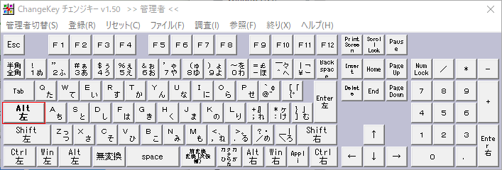
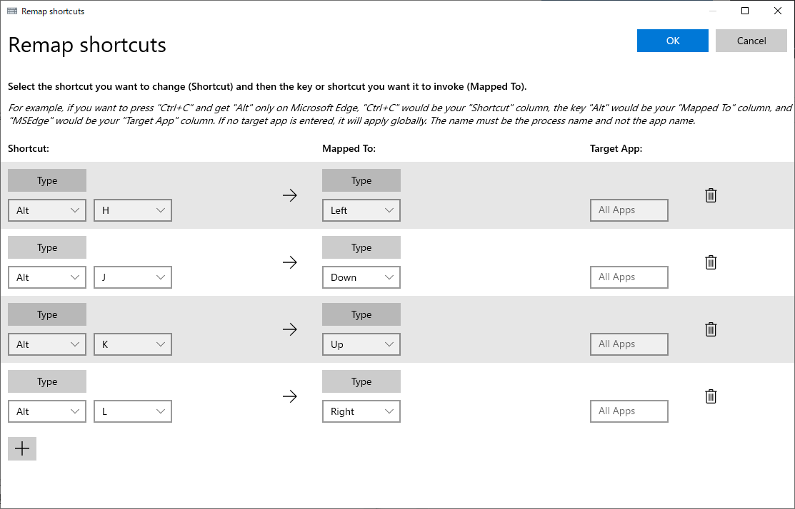

会社のエンジニアの方に下記記事を教えてもらい、個人的に「これは革命だな」と思ったので早速矢印キーを撲滅する設定をしてみました。

[\[Windows 10\] 矢印キーに指を伸ばすエンジニアはザコ！とバカにされた（Change Key と AutoHotkey の導入） \- Qiita](https://qiita.com/riekure/items/49b941fa5159f9948313)

私の場合は、ChangeKey と PowerToys(Keyboard Manager)を使って設定を行いました。

## ChangeKey + PowerToys(Keyboard Manager)を使って矢印キーを撲滅する設定

### 最終的なキー割り当て

今回は、CapsLock キーに Alt キーを割り当て、Alt キーを軸に hjkl を押すことで矢印キーと同じ挙動にしました。

hjkl は Vim での基本的な移動コマンドのため、かなり直感的で使いやすい操作方法になりました。

| キー    | 実行されるキー |
| ------- | -------------- |
| Alt + h | ←              |
| Alt + j | ↓              |
| Alt + k | ↑              |
| Alt + l | →              |

### 1. ChangeKey を使ってキーの割り当てを行う

キー割り当て自体は PowerToys(Keyboard Manager)でも行うことができるのですが、  
キー再マップで CapsLock キーを Alt キーに割り当てると不具合で押しっぱなしになるため Change Key を使用しています。  
(不具合が解消されたら PowerToys(Keyboard Manager)のみで実現できるのですが、残念です…)

まず、Change Key をインストールします。  
LZH ファイルがダウンロードされるので展開するために 7zip で解凍します。

[「Change Key」非常駐型でフリーのキー配置変更ソフト \- 窓の杜](https://forest.watch.impress.co.jp/library/software/changekey/)

1. ChangeKey を管理者として実行します。
2. Caps Lock キーに Alt キーを割り当てて保存します(設定を反映させるために PC の再起動が必要です)。

### 2. PowerToys(Keyboard Manager)を使って、ショートカットの再マップを行う

Microsoft が PowerToys という便利ツールを提供しているのでインストールします。

今回はその中でも Keyboard Manager を使いますが、他の機能もとても便利なのでぜひ有効活用してください。

[Microsoft PowerToys \| Microsoft Docs](https://docs.microsoft.com/ja-jp/windows/powertoys/)

1. Keyboard Manager を開き、ショートカットキーの再マップを行います。
2. 下記画像を参考に割り当てを行います。

## まとめ

Vim を使っていますが、なんだかんだ矢印キーを使うことが多くてキーボードを選ぶ際に矢印キーがあるものを選択肢としていましたが、この設定を入れれば矢印キーがないキーボードも選択肢に入れられますし、Vim のノーマルモード時やターミナルでの移動が便利になったので個人的には革命でした！
