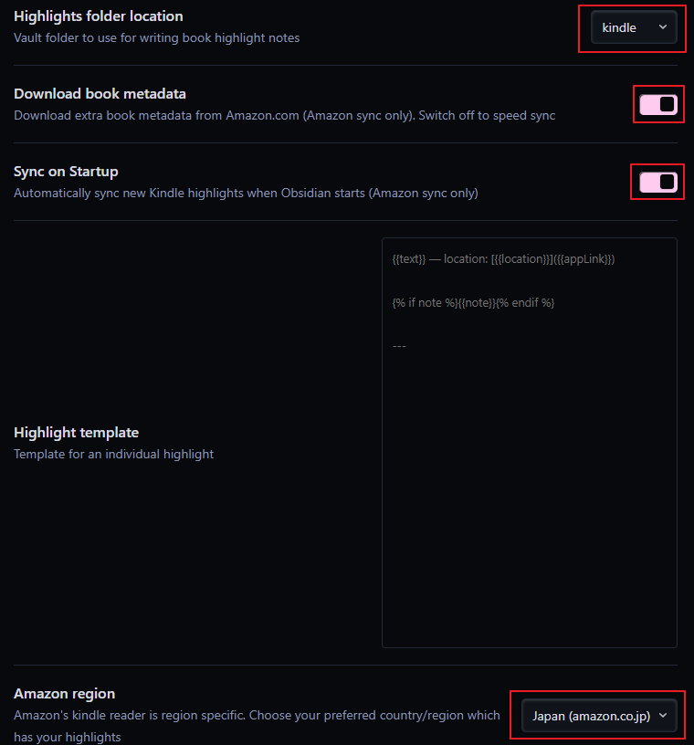
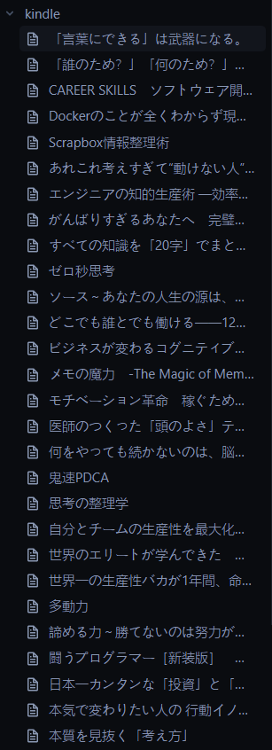
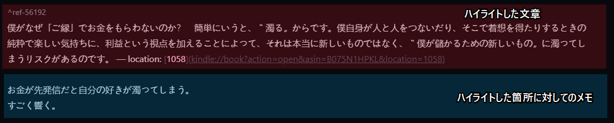

個人的革命第 2 弾。

会社のエンジニアの方に下記記事を教えてもらい、個人的に「これは革命だな」と思ったので早速設定をしてみました。

[Obsidian 流 読書ノートの作り方 \(Kindle Highlights Plugin\) \| Output 0\.1](https://pouhon.net/obsidian-kindle/6507/)

## Obsidian で Kindle のハイライト情報などを同期して神ノートを作る

基本的には参考記事を元にインストールして設定するだけでとても簡単にできました！

Obsidian からプラグインを検索して「Kindle highlights」をインストールします。

インストールしたら、プラグインの設定を行います。

- 「Highlights folder location」を「kindle」に設定
  - 同期する先のフォルダになります。フォルダがなければ、kindle というファルダを作成します。
- 「Download book metadata」を ON にする
  - 本のメタ情報を含めることでノートが充実します。
- 「Sync on Startup」を ON にする
  - Obsidian 起動時に Kindle 情報を同期します。初回は Amazon にログインが必要です。
- 「Amazon region」を「Japan」にする

Obsidian を再起動すると、Amazon のログインが求められるのでログインします。

ログインすると、kindle の同期が始まって「kindle」フォルダに自動でノートが作成されていきます(自己啓発の本が多めですね w)。

作成されたノートを見ると、なんと Kindle で読むときにハイライトした箇所の文章やコメントが反映されています！  
これはすごい！！

下記が実際に自動で作成される神ノートです！  
わかりやすいように画像に色をつけています。

ハイライトした箇所にメモを残している場合は下記のように作成されました！  
メモもしっかり同期してくれるので Obsidian で見返せるようになりかなりいいですね～

## まとめ

Kindle を使っていて、ハイライト機能は便利ですが見返す際に操作が辛かったりして結局見返さなかったり使っていたなかったので、  
個人的にはこのプラグインは控えめにいっても神だとおもいました！  
とても簡単に Obsidian に Kindle のハイライトやメモを同期することができるので Kindle も活用していければと思います。
