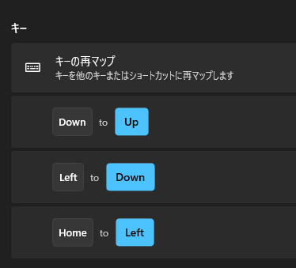
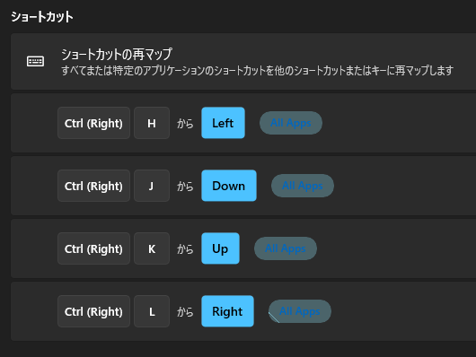

会社に開発環境構築サポートの福利厚生があり、年間 5,000 円補助が受けられます。
毎年 4 月～ 3 月までの 1 年間で繰り越しはないとのことなので、使わないのも勿体ないと思い以前から気になっていた分離キーボードを買うことにしました。

## 買ったのは、BAROCCO MD770 JP（日本語配列）の静音赤軸

## 実際に使ってみた感想

まだ届いてから数時間しか経っていませんが、次の感想を持ちました。

- 日本語配列キーボード → 日本語配列の分割キーボードへの移行なら数時間で慣れる
  - とはいえ、まだ少しぎこちないです…
- PgUp など、右側のキーは正直いらない。むしろ、バックスペース押すときによく打ち間違える…
- 矢印キーの配置がとてもじゃないけど使いにくい(後述する設定で快適になりました)
- 静音赤軸は音も静かで打鍵していて指に負荷がかかるような感じなので良さそう
- 肩を開いて打鍵できるので楽

個人的には今までと変わらない感じで使えて、肩を開きながら打鍵できるので長時間仕事などでは体の負荷が軽減されそうな気がします。

## 矢印キーのリマップ

### 1. 右スペースに Fn キーをリマップ

今回は、右 Fn+ hjkl(Vim)のキーで矢印移動できるようにしていきます。
分割されていて、右スペースは使わないので右スペースに Fn キーをリマップします。
これは説明書に書いてある通りにやりました。

### 2. 右 Fn + hjkl の設定を PowerToys の KeyboardManager で設定する

実は、BAROCCO MD770 はデフォルトで右 Fn+ ijkl の組み合わせで矢印キーのように使えます。ですが、Vim のキーバインドに合わせたいので PowerToys の KeyboardManager で下記の設定をします。

この設定をすると、もともとの ↓(Down)は ↑(Up)になるといった形になるので、キーボード右下にある矢印キーは使えなくなるので注意です。
ただ、右 Fn + hjkl が Vim 風に使えるようになるので一旦これで使っていこうと思います。

### 2022/3/18 追記

`Fn`+hjkl の組み合わせだと不都合があるケースがあったので、MD770 のマクロプログラミング機能で右スペースに`右Ctrl`を割り当てて、PowerToys の KeyboardManager で`右Ctrl`+`hjkl`の組み合わせが矢印キーに対応するように変更しました。

## まとめ

思った以上にすぐ馴染めたのでよさそうです。マクロなど色々設定できたりするようなので便利な設定があれば使ってみたいです。
あと、分離キーボードになると右親指のところに小さめのトラックボールが欲しい。
