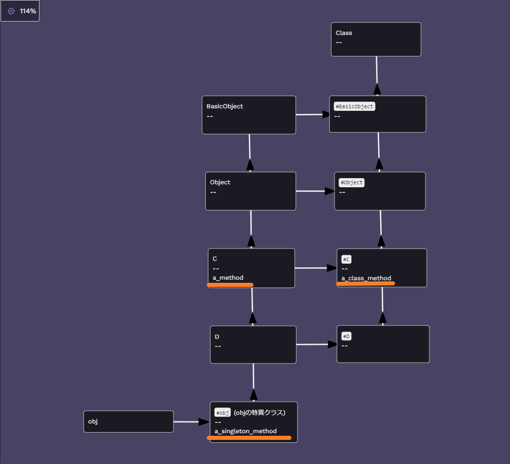

個人的に 1 周して、その後開発支援先の勉強会で 1 周(途中だけど、5 章は終わった)してメタプログラミング Ruby の 5 章は計 2 周しました。
その中で、**5 章の特異クラスの解像度が低いことに気づけた**ので時間を取ってもう 1 度読み直して理解を深めたいと思います。

## 5.3 特異メソッド

「ある場面でのみ、title?メソッドを使えるようにしたい」という問題が発生した。

## 5.3.1 特異メソッドの導入

特定のオブジェクトにメソッドを追加する方法が説明されている。
str1 は title? というメソッドが使えるが、str2 は title? というメソッドが使えないことを示すコード例。

```ruby
str1 = "test string 1"

def str1.title?
  self.upcase == self
end

str1.title? #=> false
str1.methods.grep(/title?/) #=> [:title?]
str1.singleton_methods #=> [:title?]

str2 = "test string 2"
str2.title? #=> NoMethodError
str2.methods.grep(/title?/) #=> []
str2.singleton_methods #=> []
```

**特異メソッド(単一のオブジェクトに特化したメソッド)**を用いることで 5.3 で発生した「ある場面でのみ、title?メソッドを使えるようにしたい」という問題について対処できた。

## 5.3.2 クラスメソッドの真実

クラスは単なるオブジェクトであり、クラス名は単なる定数である。 - クラスは Class クラスを new したオブジェクトであり、定数にそのオブジェクトをバインドしたもの。 - コードにすると下記のようなイメージ。 - `ruby
      MyClass = Class.new{ def my_method; 'hello'; end}
      MyClass.new.my_method #=> 'hello'
      `
また、クラスメソッドはクラスの特異メソッドである

## 5.4.1 特異メソッドの謎

```ruby
class MyClass
  def my_method; end
end

obj = MyClass.new

def obj.my_singleton_method; end # objに特異メソッドを定義
```

obj に特異メソッドを定義。この特異メソッドはどこに住んでいる？ - obj はクラスではないので住めない。そもそもメソッドが住めない。 - MyClass にも住めない。すべてのインスタンスがメソッドを共有してしまう。

## 5.4.2 特異クラスの出現

```ruby
"abc".singleton_class #=> #<Class:#<String:0x00007f4beb3f60e0>>
```

`Object#class`のメソッドは特異クラスを隠してしまう
特異クラスは特別なクラスで、`Object#singleton_class`または`class <<`という構文でないと見つけることができない
**特異クラスはオブジェクトの特異メソッドが住んでいる場所**

## 5.4.3 メソッド探索再び

```ruby
class C
  class << self
    def a_class_method
      'C.a_class_method()'
    end
  end

  def a_method
    'C#a_method()'
  end
end

class D < C; end
obj = D.new

class << obj
  def a_singleton_method
    'obj#a_singleton_method()'
  end
end

obj.singleton_class #=> #<Class:#<D:0x00007f5e8ac155d0>>
obj.singleton_class.superclass #=> D
```

上記から、obj の特異クラスのスーパークラスは D であることが分かった。
また、Ruby は通常のクラスではなく、特異クラスのメソッドから探索を始める。

図にすると下記のようになる。



`C#a_method`は`obj.a_method`で呼び出すことができる。
`#obj#a_singleton_method`は`obj.a_singleton_method`で呼び出すことができる。
`#C#a_class_method`は`C.a_class_method`または`D.a_class_method`で呼び出すことができる。

## まとめ

個人的に特異メソッド=クラスメソッドと理解していたために正しく理解できていてなかった。
**特異メソッドは単一のオブジェクトに特化したメソッドのことで、オブジェクトにメソッドを注入するようなやり方とクラス(オブジェクト)にメソッドを注入するやり方があって、後者はクラスメソッドと呼ばれているという話だった。**
