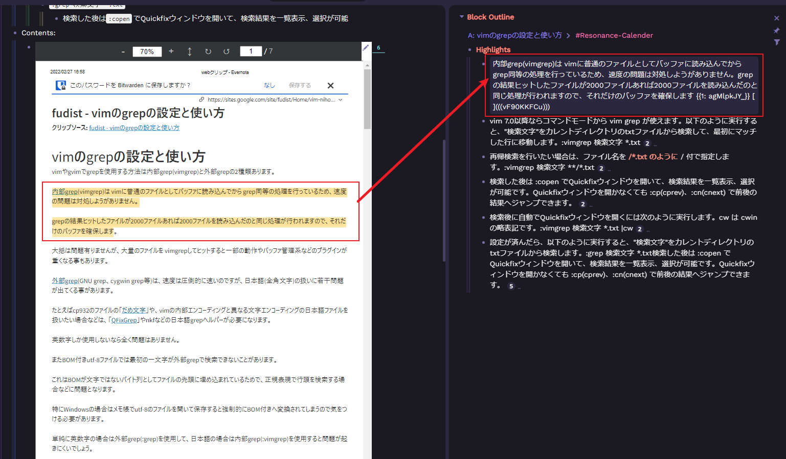
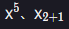
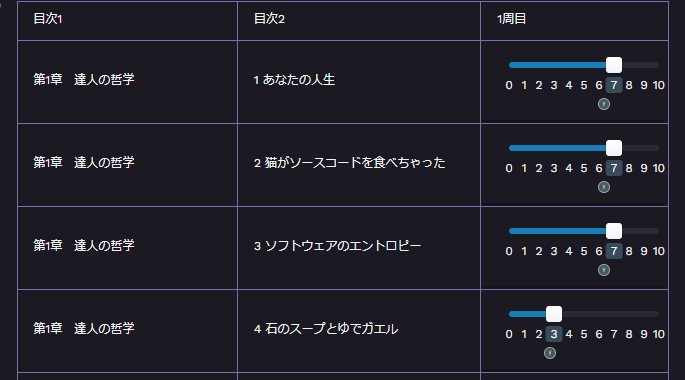
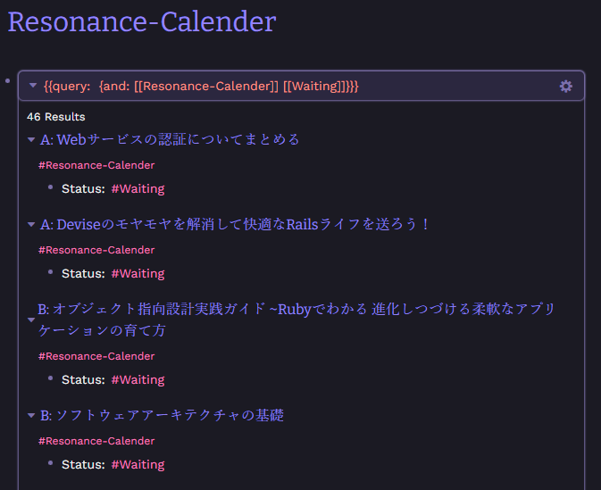
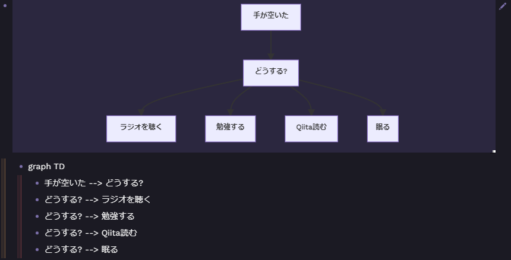

去年の 12 月くらいから使い始めて大体 4 か月経って使い方が固まってきたので今でもよく使う使い方を紹介します。

[[Roam Research]]に移行したときのことについては[[2021～2022年の年末年始にやった10のこと]]で少し触れています。

## Roam Research を使う上で大事にしている考え方

4 か月ほど使っていると[[Roam Research]]の使い方の方針みたいなものが見えてきました。

それは、第 2 の脳であることを意識することです。これかなり重要だと思ってます。

脳に記憶された情報を取り出すときは無意識に ○○ に書いてあったなとかといった感じで、何かに紐づけて記憶していたりすると思います。まさに[[Roam Research]]は脳と似たような感じで使うことができます。

例えば、ブラケット二つで`[[リンク]]`を作ることができます。この`[[リンク]]`が埋め込まれているブロックは紐づくので後から芋づる式に情報を取り出すことができます。`#タグ`も`[[リンク]]`と同じです。

このようにして後から取り出したい情報にリンクやタグを埋め込んでおくと後から第 2 の脳として機能します。これは[[Obsidian]]のときにはなかった体験で本当に脳のように機能します。

## Roam Research を 120%使いこなす

私は一度[[Roam Research]]を使ったときは上記の考え方や基本的な使い方がわからず、よくわからないまま使うのをやめました。

[[Roam Research]]はデイリーノートが自動で作成される作りなので、デイリーノートに後から見返したい言葉をリンクにしたり、タグをつけるだけで成立するのですが、基本的な使い方を知っているとさらに生産的な活動のために[[Roam Research]]を使うことができます。

そのきっかけとなったのが Shu Omi さんという方が作成されている[知的生産ツール「Roam Research」完全ガイド](https://shu-omi-s-school.teachable.com/courses/enrolled/994169)です。 ※アフェリエイトリンクではありません。

このガイドは有料(4,000 円)だったのですがこのガイドのおかげで効率的に[[Roam Research]]の使い方を学ぶことができました。長期的に見て確実におすすめできるので、時間を有効に使いたい方は購入をお勧めします。

## 生き残った運用方法・設定

色んな使い方ができるのは良いことですが、たくさんありすぎてよく分からなかったりします。私の中で今でもこの使い方はお勧めできる運用方法を紹介します。

### タグ運用

冒頭でも話しましたが、[[Roam Research]]は`#タグ`と文字の頭に`#`をつけることでそのブロックにタグを付与することができます。タグをつけることで後からそのタグの情報を取り出しやすいので色々なタグをつけましたが、最終的に手動でつけるタグは`#Fleeting-Notes`が生き残りました。

このタグは、いつか見返したい情報(気づき、アイデア、気持ち etc)に対してつけるタグです。なぜこのタグが生き残ったかというと[[Roam Research]]を一つの脳と考えたときにタグの粒度を細かくするほど、振り返るときにたくさんのタグを見返さねばいけなくなるので振り返りにくいです。そのため、現在振り返りたい情報に対してはこのタグ 1 個での運用に落ち着きました。※テンプレートなどで固定で使っているタグは除きます。

### ページタイトルの prefix

ページを作成するときに prefix をページ名の先頭につけると検索しやすくなるので、prefix のルールを決めて使っています。

- prefix
  - 説明
- `A: `
  - Article の略
- `B: `
  - Book の略
- `O: `
  - [[鬼速PDCA]]の略
- `V: `
  - Video の略
- `W: `
  - Weekly Review の略
- `Z: `
  - Zattana Memo の略。雑多なメモのタイトルの prefix として使用

### ショートカットキー

このほかにもショートカットキーではありませんが、インデントラインをクリックするとブロックを一気に閉じたり、開いたりできるのでかなり多用しています。

参考：
https://sumire10.info/roam-research-basic-course-4-shortcut-list-for-streamlining-work/

- key
  - 説明
- `S-Click`
  - ブロックをフォーカスしてサイドバーで開く
- `C-↓`／`C-↑`
  - ブロックを開く/閉じる
- `Alt-←`／`Alt-→`
  - ブロックをズームアウト/ズームイン
- `C-J`／`C-K`
  - 候補選択
- `C-C`の後に`C-B`
  - ブラケットの ON/OFF 切り替え

### roam/css： カラーテーマ

[[Roam Research]]では css を直接 import することでカラーテーマを切り替えることはできます。もちろん、自分で css をゴリゴリ書いてカスタマイズすることもできます。

私は、「Better Dark Age」というテーマを使っています。`roam/css`というページを作って、Css Code Block の中で import 文を貼り付けるだけで適用されます。
https://github.com/abhayprasanna/abhayprasanna.github.io

```css
@import url("https://abhayprasanna.github.io/dark-age-dracula.css");
```

### roam/css： カラーテーマ(追加機能)

「Better Dark Age」というテーマは追加機能も提供しています。

その中で、「Rainbow indents」がおすすめです。インデントごとに色がつくので、インデント単位での折り畳みやインデント単位での可読性があがります。これも同じ import 文を貼り付けるだけです。

https://github.com/abhayprasanna/abhayprasanna.github.io#-rainbow-indents

```css
@import url("https://abhayprasanna.github.io/rainbow-indent.css");
```

### roam/templates： デイリーノート

`[[roam/templates]] テンプレート名`として、その子ブロックに呼び出したいテンプレートを作っておくと`;;`で呼び出せるようになります。

毎朝、デイリーノートを開き下記テンプレートを呼び出して使っています。

```javascript
- [[roam/templates]] Daily Template
    - ## **Daily Template**
        - ## **Morning-Journal**
            - #Morning-Journal
                - 3つの感謝していることは？ #Thanks
                - 今日のハイライトは何にしたい？
                - 今考えていることは？
    - ## 👨‍💻**WorkSpace**
        - #WorkSpace
            -
```

- Morning-Journal
  - 毎朝、感謝していることなどを書く場所。
- WorkSpace
  - その日の作業ログを書いていく場所。
  - 例) 21:22 今日はブログ記事を書く。
  - [[Roam Research]]では`/time`と打つとその時間が自動で入ります。

### roam/templates： レゾナンスカレンダー

これは Shu Omi さんの完全ガイドで知ってから使っているテンプレートです。ここで、詳しい説明は省きますが、このテンプレートを使って記事、動画、本などで学んだ情報を管理しています。

```javascript
- [[roam/templates]]  Resonance Calender
    - #Resonance-Calender
        - Categories: #Article | #Video | #Book
        - Date: {{date}}
        - Author:
        - Source:
        - Status: #Waiting
        - Keywords:
        - #Literature-Notes
            -
        - Contents:
            -
```

### roam/js： todo-trigger

下記の記事で存在を知りました。`[[roam/js]]`での拡張機能を有効にする必要があり、その手順も下記記事に譲ります。[[Roam Research]]では TODO リストを`/todo`で簡単に作れます。この拡張機能を入れるとチェック時に完了日時を付与できるので便利です。

[Roam Research、タスク完了時の時刻と日付を自動付与｜ Sangmin Ahn ｜ note](https://note.com/sangmin/n/nc43a191898d3)

拡張機能自体のリンクは下記です。

https://roamjs.com/extensions/todo-trigger

```javascript
var existing = document.getElementById("roamjs-todo-trigger");
if (!existing) {
  var extension = document.createElement("script");
  extension.src = "https://roamjs.com/todo-trigger.js";
  extension.id = "roamjs-todo-trigger";
  extension.async = true;
  extension.type = "text/javascript";
  document.getElementsByTagName("head")[0].appendChild(extension);
}
```

### roam/js： mindmap

こちらは[[Roam Research]]のアウトラインがそのままマインドマップとして表示できる拡張機能です。ネストが深くなったりしたアウトラインの全体を俯瞰したいときなどに便利です。

[Roam Research でマインドマップを…｜ Sangmin Ahn ｜ note](https://note.com/sangmin/n/n662c6e46063d)

拡張機能自体のリンクは下記です。

https://roamjs.com/extensions/mindmap

```javascript
var existing = document.getElementById("roamjs-mindmap");
if (!existing) {
  var extension = document.createElement("script");
  extension.src = "https://roamjs.com/mindmap.js";
  extension.id = "roamjs-mindmap";
  extension.async = true;
  extension.type = "text/javascript";
  document.getElementsByTagName("head")[0].appendChild(extension);
}
```

### roam/js： serendipity

セレンディピティ（Serendipity）とは、「偶然の産物」という意味です。[[Roam Research]]はセレンディピティとも相性がいいです。

タグ運用で当時の気持ちやアイデアなどは全て`#Fleeting-Notes`というタグをつける運用をしていると話しました。

私は serendipity という拡張機能を使って、デイリーノートに毎日ランダムに`#Fleeting-Notes`の中から 3 つ書き込まれるように設定しています。

下記のツイートのように表示されるため、忘れていたアイデアを思い出すことなどができとてもいい仕組みを作ることができます。



たまに動かなかったりしますが、それでも良い拡張機能だと思います。
拡張機能のリンクです。

https://roamjs.com/extensions/serendipity

```javascript
var existing = document.getElementById("roamjs-serendipity");
if (!existing) {
  var extension = document.createElement("script");
  extension.src = "https://roamjs.com/serendipity.js";
  extension.id = "roamjs-serendipity";
  extension.async = true;
  extension.type = "text/javascript";
  document.getElementsByTagName("head")[0].appendChild(extension);
}
```

### roam/js： enhancedPDF

この拡張機能を見つけたときは興奮しました！

[[Roam Research]]に PDF をアップロードすると、ハイライトできるようになります。また、そのハイライトは[[Roam Research]]内に自動転記したりもできます。

https://github.com/c3founder/Roam-Enhancement#pdf-highlighter

下記のように、ハイライトした箇所を追加すれば[[Roam Research]]内に`Highlights`というブロックが作られてその子ブロックにハイライトした箇所の文字が転記されます。私は Evernote のウェブクリッパー機能が優秀なので、そこで簡易な記事として保存したものを PDF に書き出してアップロードしてレゾナンスカレンダーにまとめるなどしています。PDF のいいところは参照しているウェブページ自体が存在しなくなっても残り続ける点が良いなと思っています。



```javascript
window.pdfParams = {
  //Highlight
  ///Placement
  outputHighlighAt: "cousin", //cousin, child
  highlightHeading: "**Highlights**", //for cousin mode only
  appendHighlight: true, //append: true, prepend: false
  ///Rest of Highlight Options
  breadCrumbAttribute: "Title", //Title, Author, Citekey, etc.
  addColoredHighlight: true, //bring the color of highlights into your graph
  //Rerference to Highlight
  ///Block References Related
  copyBlockRef: true, //false: copy captured text
  sortBtnText: "sort them all!", //{{sort them all!}} button will sorted highlight references.
  ///Block Reference Buttons
  aliasChar: "✳", //use '' to disable
  textChar: "T", //use '' to disable
  //PDF Viewer
  pdfMinHeight: 900,
  //Citation
  ///Format
  ////use Citekey and page in any formating string
  ////page can be offset by `Page Offset` attribute.
  ////common usecase:
  /////Zotero imports with 'roam page title' = @Citekey and Citekey attribute
  ////examples:
  /////"[${Citekey}]([[@${Citekey}]])"
  /////"[(${Citekey}, ${page})]([[@${Citekey}]])"
  /////use '' to disable
  citationFormat: "",
  ///BlockQuote
  blockQPerfix: "", //use '' to disable. Alternatives are: > or [[>]].
};
var s = document.createElement("script");
s.type = "text/javascript";
s.src = "https://c3founder.github.io/Roam-Enhancement/enhancedPDF.js";
document.getElementsByTagName("head")[0].appendChild(s);
```

### roam/js： smartblocks

[[Roam Research]]で有名な拡張機能としてスマートブロックがあります。スマートブロックはテンプレートを拡張してくれます。スマートブロックの可能性は無限大なので各々調べてみてください。例えば、このブログでは[[Roam Research]]内のブログ記事一覧を抽出して JSON に変換したりしています。簡単なものでいうと、下記のような感じで yyyy-mm-dd 形式の日付を出力したりなどもできます。



考えようによっては GitHubActions を[[Roam Research]]から実行できるボタンを作ったりもできると思うので本当にすごい拡張機能だと思います。気になる人は拡張機能のリンクからリファレンスを読んでみると面白いと思います！

拡張機能のリンクです。

https://roamjs.com/extensions/smartblocks

### roam/js： static-site

[[Roam Research]]を静的サイトにする拡張機能(有料)です。このブログもこの拡張機能で[[Roam Research]]で書いたことをブログのような形にして公開することができています。結構奥深いので、時間が合ったらどういう設定をしているのか記事にできればなんて思っています。

### その他

[[Roam Research]]では Latex という記法も使えます。[[AtCoder]]の問題を解くときとかに重宝しています。こんなのです。



スライダーを使って読書管理などもたまーにします。



あとはこんな感じでクエリ`{{[[query]]: {and: [[Resonance-Calender]] [[Waiting]]}}}`を書いたりもできます。



## まとめ

4 か月使ってみて生き残った運用方法や設定を紹介しました。

使い方と設定方法も一緒に紹介していますので、即効性が高くすぐに使える使い方もたくさんあったと思います。

細かいのを上げるとキリがないので大まかにこれが便利だよ！っというものを紹介しました。

[[Roam Research]]よく分からんといった方や一度使ってみたけど挫折してみたという方に届くと嬉しいと思います。よき[[Roam Research]]ライフを！

## 2022/04/21 追記

mermaid も使えることを知りました！とても便利です。

[テキストで様々なダイアグラムが作成できる「mermaid」を Roam Research で実装する方法と実例｜ Sangmin Ahn ｜ note](https://note.com/sangmin/n/n75dbd2379f13)


