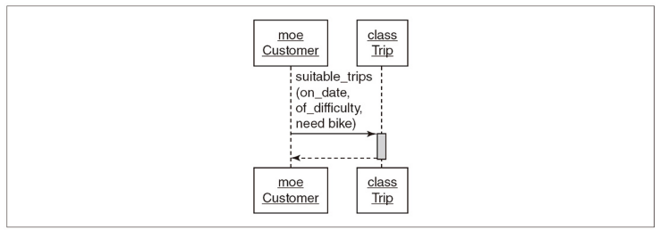

## 本

オブジェクト指向設計実践ガイド ～ Ruby でわかる 進化しつづける柔軟なアプリケーションの育て方

https://gihyo.jp/book/2016/978-4-7741-8361-9

## 4 章で大事だと思った箇所の要約

4 章では、クラス内のメソッドをどのように外部に晒すかについて 1 章割かれています。その中でも大事だと思った箇所があったので簡単に整理してみました。

## パブリックなメソッド、プライベートなメソッド

パブリックなメソッドとは料理屋でいうメニューみたいなもの(利用者から見える)

- **クラスの主要な責任を明らかにし、テストで完全に文書化されている**
  - プライベートなメソッドとは料理屋でいえば注文を受けてから厨房で料理する手順や味付けなどの内部詳細的なもの(利用者からは見えない)
- **パブリックなメソッドから呼び出され実装の詳細に関わる。テストでは言及さえされないこともある。**

## シーケンス図

設計をするときにシーケンス図を作ることが推奨されています。

例えば、下記のシーケンス図からは次のようなことが読み取れます。

- Customer が Trip クラスに suitable_trips メッセージを送っている
- suitable_trips は on_date(日程)、of_difficulty(難易度)、need_bike(自転車が必要)の 3 つのパラメータも送る。
- このシーケンス図からは日程と難易度によって旅行を見つけること、自転車も見つけてくれることを Trip クラスに期待していることが読み取れる

このようにシーケンス図を描くことで、次のメリットが得られます。

- **オブジェクト間でのメッセージ(パブリックインターフェース)が明らかになる。**
- **実装に移る前にシーケンス図という低コストな方法で実験することができる。**

さらに一番大きなメリットは**クラスに基づく設計から、メッセージに基づく設計になった**ことだと思いました。

そのメリットについては本から引用いたします。

> また、 シーケンス 図 を 描い た こと によって、 設計 に関する 議論 が 逆転 し た こと に 気づい て ください。 以前、 設計 の 重点 は、 クラス と、 クラス が だれ と 何 を 知る かに 置か れ て い まし た。 それ が 突然、 逆転 し た の です。 いま では、 議論 は メッセージ を 中心 に 回っ て い ます。 クラス を 決め、 その 責任 を 見つけ出す 代わり に、 いま は メッセージ を 決め、 そして それ を どこ に 送る かを 決め て い ます。

> この クラス に 基づく 設計 から、 メッセージ に 基づく 設計 への 移行 が、 設計 者 として の キャリア の 転機 となり ます。 **メッセージ に 基づく 視点 は、 クラス に 基づく 視点 よりも 柔軟 な アプリケーション を 生み出し ます。 基本 的 な 設計 の 質問 を、「 この クラス が 必要 なのは 知っ て いる けれど、 これ は 何 を す べき な ん だろ う」 から、「 この メッセージ を 送る 必要 が ある けれど、 だれ が 応答 す べき な ん だろ う」 へ 変える こと が、 キャリア 転向 への 第一歩 です。 オブジェクト が 存在 する から メッセージ を 送る のでは あり ませ ん。 メッセージ を 送る ため に オブジェクト は 存在 する の です。**

Sandi Metz. オブジェクト指向設計実践ガイド　～ Ruby でわかる 進化しつづける柔軟なアプリケーションの育て方 (pp.145-146). 株式会社技術評論社. Kindle 版.

## まとめ

私が実装する際にこのクラスは〇〇だから〇〇というメソッドを持たせるというクラスに基づく観点で実装していましたが、この章ではメッセージを送るためにオブジェクトが存在するんだという気づきをくれました。まだまだ実践で使うのは難しいですが思い出しながら設計に活かしてていきたいです。
