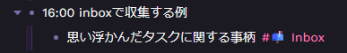
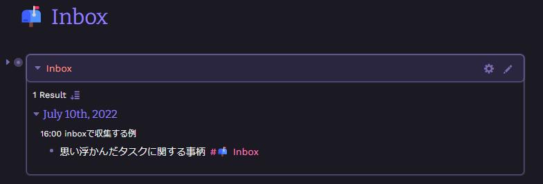
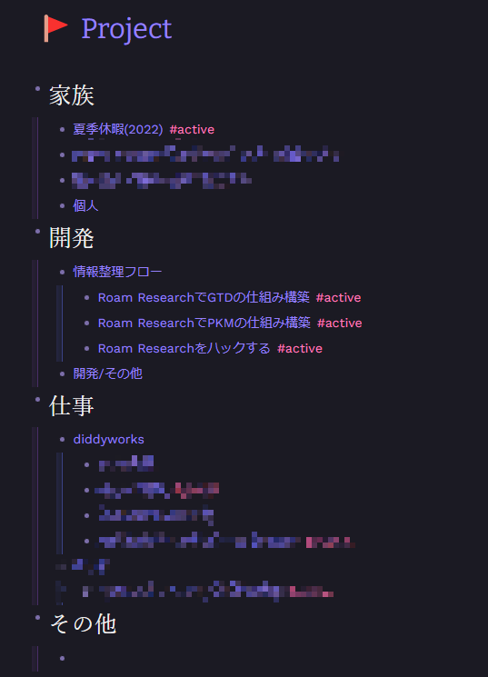
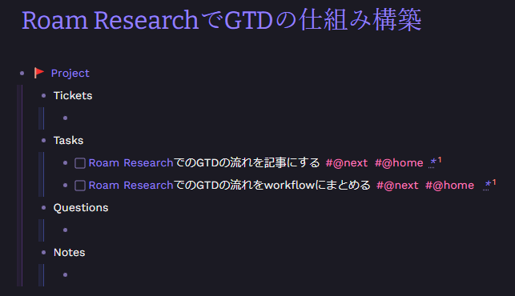
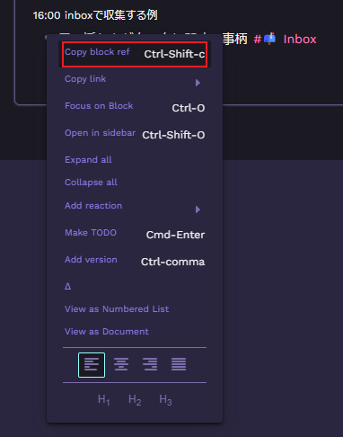
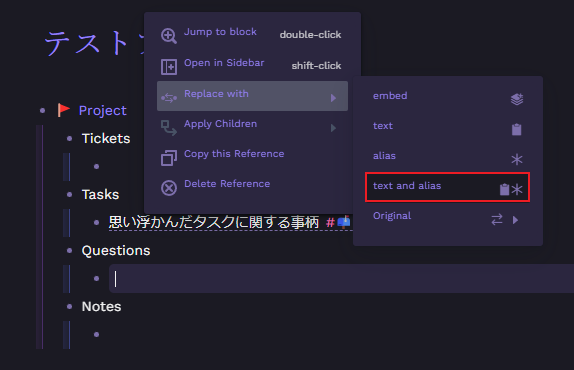
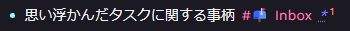
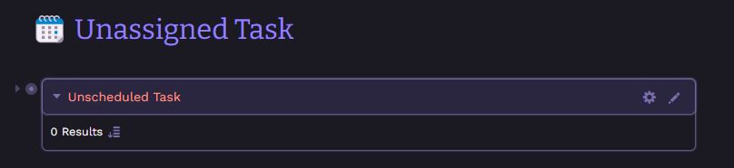
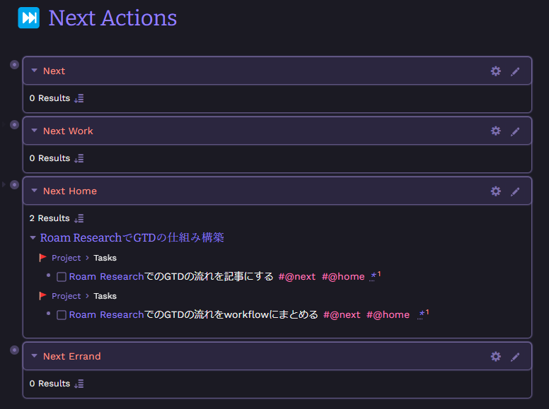

## 前置き

[[Roam Research]]を使い始めて半年以上経ちますがいまいち活用しきれていないところがありました。

とくに課題を感じていたのは**アイデアとタスクをどう管理するか**です。

この記事では「**タスクをどう管理するか**」という課題を解決するために[[Roam Research]]でどう実践するかという部分にフォーカスを当てて紹介したいと思います。

## 参考

私が[[Roam Research]]で GTD のシステムを構築するうえで大いに参考にした記事です。

自分のシステムとして構築する際に不要な部分はカットしたり、新しく追加した部分もありますが基本的な部分は全て参考にさせていただきました。この記事がなければ[[Roam Research]]で GTD をやろうとは思えなかったくらいです。

https://rjnestor.com/home/tasks-and-notes-a-match-made-in-roam/

## Roam Research と GTD は相性がいい

GTD は頭の中の気になることすべてを収集して GTD のフローに沿って処理していくタスク管理手法です。

[[Roam Research]]ではデイリーノートというノートが毎日自動で作られるのですが、GTD の「**頭の中の気になることすべてを収集する**」際の受け皿として[[Roam Research]]のデイリーノートは本当に相性がいいです。

[[Roam Research]]のデイリーノートは毎日自動で作られるノートのため、どこのフォルダに分類するかということを考えなくて済みます。また、デイリーノートはどの分類にも属さないノートだからこそ何でも書いて OK なノートです。そのため、「頭の中の気になることすべてを収集する」ノートとして最適です。

## Roam Research で GTD を実践する

### 収集

GTD で最初に行うことは「収集」です。

私が[[Roam Research]]で行う場合はとにかく難しく考えず頭に思いついたことや作業ログをデイリーノートに書いていきます。

**「収集」は書きながら気になるブロックの最後にブラケットで`[[📫 Inbox]]`と書くことで行います。**

例えば、こんな感じです。



- [[Roam Research]]では/の後に続けて todo と打って TODO を選択すると TODO 化できますが、「収集」時点で TOOD 化はしません。
- `[[📫 Inbox]]`で絵文字を使っているのは好みです。

Inbox ページに収集するためのクエリを書きます。

```javascript
- {{[[query]]: {and:[[📫 Inbox]] {not:[[🦄 Roam Framework]]}}}}
    - Alias
        - Inbox
```

- not 条件で収集したくないページを除外しています。

このような感じで`[[📫 Inbox]]`がついたブロックが収集されます。



### 処理

「処理」では、Inbox にある事柄一つ一つに対して対応すべきか判断してタスクを Inbox から各プロジェクトに移動します。

私のやり方では、「処理」したタスクはプロジェクトに属することになるので、先にプロジェクト一覧ページ、プロジェクトページを作ります。

実際のプロジェクト一覧ページです。

自分が優先するトピックを作り、その下にプロジェクトのページをネストさせます。プロジェクトの粒度は自由です。数日で終わるものもあれば、数年かかるもの、終わりがないものなど様々です。自分が管理しやすいように作ります。



実際のプロジェクトページです。



プロジェクトページのテンプレートです。

```javascript
- 🚩 Project
    - [[🚩 Project]]
        - Tasks
            -
        - Questions
            -
        - Notes
            -
```

- Tasks は Inbox で処理したタスクが含まれます。
- Questions や Notes はまだ使ったことないですが、参考にした記事に合わせています。

「処理」は次の手順で Inbox が空になるまで行います。

- 1. 右側のサイドバーで`[[📫 Inbox]]`を開き、メインビューで`[[🚩 Project]]`を開く
- 2. Inbox クエリのブロックの箇条書きを右クリックし、「Copy block ref」を選択して、アイテムのブロック参照をコピーする
  - 
- 3. ブロック参照を適切なプロジェクトページに貼り付ける
- 4. ほかの場所をクリックして参照したブロックが表示されるようにしてから、その参照の文字列をクリックする
- 5. 表示されるメニューから「Replace with」、「text and alias」の順に選択する
  - 
  - テキスト部分はただのテキストになり、アスタリスクだけブロック参照のリンクになる。
  - 
- 6. テキスト部分を明確で実用的なタスクに置き換える
- 7. 必要に応じてコンテキストタグを追加する
- 8. `C-Enter`で TODO にする
  - 
- 9. プロジェクトペーのテキストから Inbox タグを削除し、Inbox ページの元のブロックから Inbox タグを削除する

- MEMO
  - プロジェクトに移動するまでもないタスクは次のように処理しています。
    - ・処理すべきかどうか判断する
      - この時点で不要と思ったら Inbox タグを外す
    - ・すぐ処理できるなら実行する(2 分程度)
      - 処理したら Inbox タグを外す

## 整理・見直し

「整理・見直し」は私のやり方では今日何をやるかを洗い出すタイミングで行います。

各プロジェクトページを見直すのもいいですが、「🗓️ Unassigned Task」と「⏭️ Next Actions」というページをそれぞれ作ることでプロジェクトのタスクを Context 別で見れるようにしています。

タスクを見ながら次に対応するタスクには`#@next`タグをつけていきます。

Context は https://rjnestor.com/home/tasks-and-notes-a-match-made-in-roam/ を参考にしています。

「🗓️ Unassigned Task」



未アサインのタスクを収集するためのクエリです。

```javascript
{{[[query]]: {and:[[TODO]] [[🚩 Project]] {not:[[@next]]}}}}
```

「⏭️ Next Actions」



次に行うアクションは次の粒度で収集しています。

- `#@next`タグが付いたタスク
  - ```javascript
    {{[[query]]: {and:[[TODO]] [[@next]] {not:{or:[[@work]] [[@home]] [[@errand]]}}}}}
    ```
- `#@next`タグと`#@work`が付いたタスク
  - ```javascript
    {{[[query]]: {and:[[TODO]] [[@next]] [[@work]]}}}
    ```
- `#@next`タグと`#@home`タグが付いたタスク
  - ```javascript
    {{[[query]]: {and:[[TODO]] [[@next]] [[@home]]}}}
    ```
- `#@next`タグと`#@errand`が付いたタスク
  - ```javascript
    {{[[query]]: {and:[[TODO]] [[@next]] [[@errand]]}}}
    ```

## 実行

「実行」では、順にタスクをこなしていきます。

私の場合は、「⏭️ Next Actions」を元に[[TaskChute Cloud]]に転記していき順にタスクをこなしていきます。

[[TaskChute Cloud]]を使っている理由としてはルーチンタスクの管理やタイムブロッキングとしてとても優れているツールだからです。ルーチンタスクは[[Roam Research]]でも行えますがかなり手順が複雑になって大変だったのと、今日やることを認識しながら[[TaskChute Cloud]]に転記しながら見積もりの時間を入れたり、何時のセクションに実行するかなどのタイムブロッキングが素早く行えるためです。この部分はやはり[[TaskChute Cloud]]の唯一無二なところだなと思いました。

## さいごに

最近[[Roam Research]]で GTD を行うようになったばかりでこの記事を書くか迷いましたが少しでも参考になればという気持ちです。
