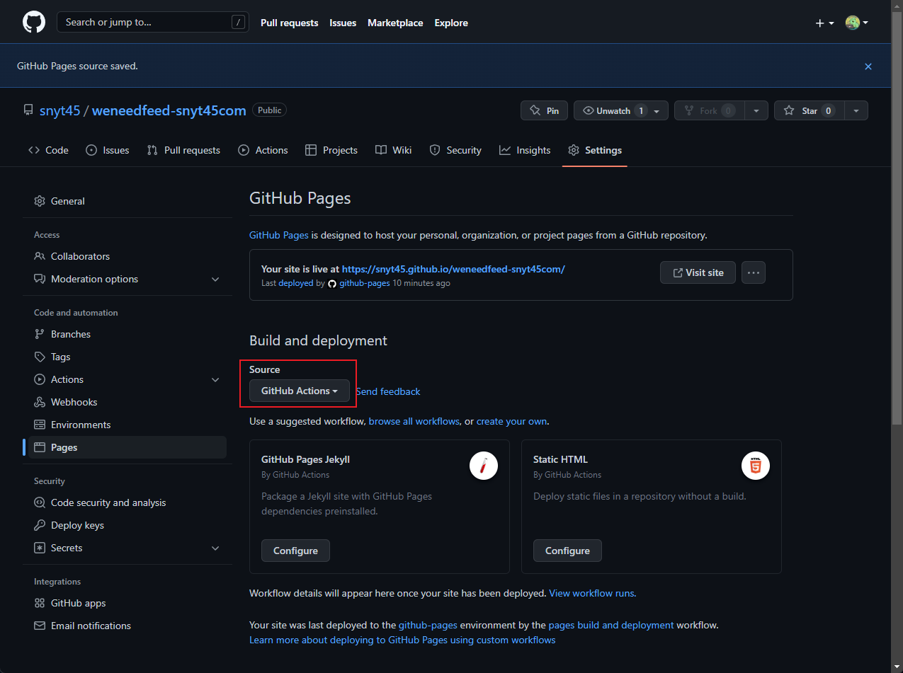

## 前置き

[[Roam Research]]でブログを構築してから RSS フィードを生成する方法として次のサービスを利用していました。

- https://feed43.com/
- https://happyou.info/fs/

特に不便はなかったのですが自前で RSS フィード用の XML を生成して、XML をホスティングする形で対応できないかと思ったので実際に調べて構築しました。

## 実現したいこと

[[GitHub Actions]]で RSS フィード用の XML を自動生成して、無料ホスティングサービスで XML をホスティングする。

## リポジトリ

実際に構築したリポジトリです。

https://github.com/snyt45/weneedfeed-snyt45com

## 今回の構成

今回の構成は以下の通りです。

- Weneedfeed
  - https://github.com/r7kamura/weneedfeed
- weneedfeed-action
  - https://github.com/marketplace/actions/weneedfeed
- GitHub Pages
  - https://pages.github.com/

## この構成の理由

今回自動生成したいなーと思ったときに[[GitHub Actions]]が浮かんだので、GitGhub Actions の Marketplace を覗いてみると、r7kamura さんが作成されている weneedfeed-action というのが目に止まりました。

- GitGhub Actions の Marketplace https://github.com/marketplace?type=actions

使い方を見た感じ簡単にできそうだったので weneedfeed-action を使う方針に決めました。

無料のホスティングサービス先としては、GitGhub Actions と相性の良い GitHub Pages を選びました。

また、この構成で r7kamura さんが実際に構築済みの参考にできるリポジトリがあったのも大きいです。

https://github.com/r7kamura/weneedfeed-sundaywebry

## Weneedfeed をローカルで試す

Weneedfeed はウェブページから XML を生成するツールのようです。実際にローカルで試してみました。

Weneedfeed は gem なのでインストールするために Gemfile を作成します。

```javascript
source 'https://rubygems.org'

gem 'weneedfeed
```

次に`bundle install`を実行します。

パスを通すために、`source ~/.bashrc`を実行して、`weneedfeed help`でコマンドが実行できることを確認します。

下記のように`weneedfeed build`を実行すると、`weneedfeed.yml`をもとに指定のウェブページから XML ファイルを`./output`ディレクトリに出力します。

```javascript
weneedfeed build --base-url=https://example.com
```

`--base-url`に指定した URL はホスティング先の URL(例：https://snyt45.github.io/weneedfeed-snyt45com/ )を指定する必要があるようです。

次に`weneedfeed.yml`を作成します。中身は Weneedfeed の README を参考に下記のようにしました。

```javascript
title: Small Changes RSS feeds

pages:
  - id: snyt45com
    title: Small Changes
    description: Small ChangesのRSSフィードです。
    url: https://snyt45.com/
    item_selector: article
    item_link_selector: a
    item_time_selector: time
    item_title_selector: a
```

ここまでディレクトリ構成です。

```javascript
~/dev/weneedfeed via 💎 v2.7.6 took 6s
❯ tree
.
├── Gemfile
├── Gemfile.lock
└── weneedfeed.yml

0 directories, 3 files
```

この状態で`weneedfeed build --base-url=https://example.com`を実行します。

- ローカルで試すだけなので`--base-url`は仮です。

下記のように`./output`ディレクトリが出力されます。

今回の目的の XML ファイルが`./output/feeds/snyt45com.xml` に生成されることも確認できました。

```javascript
~/dev/weneedfeed via 💎 v2.7.6
❯ tree
.
├── Gemfile
├── Gemfile.lock
├── output
│   ├── feeds
│   │   └── snyt45com.xml
│   ├── index.html
│   └── opml.xml
└── weneedfeed.yml

2 directories, 6 files
```

`./output/feeds/snyt45com.xml`は下記のように出力されていました。

```javascript
❯ cat output/feeds/snyt45com.xml
<?xml version="1.0" encoding="UTF-8"?>
<rss version="2.0"
  xmlns:atom="http://www.w3.org/2005/Atom"
  xmlns:content="http://purl.org/rss/1.0/modules/content/">
  <channel>
    <title><![CDATA[Small Changes]]></title>
    <link>https://snyt45.com/</link>
    <atom:link href="https://example.com/feeds/snyt45com.xml" rel="self"/>
    <description><![CDATA[Small ChangesのRSSフィードです。]]></description>
    <lastBuildDate>Sun, 28 Aug 2022 22:27:39 +0900</lastBuildDate>

    <item>
      <title><![CDATA[Ubuntu22.04でruby3.1.0以外をインストールするのに苦労した話]]></title>
      <link>https://snyt45.com/TdTglt5eQ</link>

        <pubDate>Sun, 28 Aug 2022 00:00:00 +0900</pubDate>

      <description><![CDATA[]]></description>
      <content:encoded><![CDATA[]]></content:encoded>
      <guid isPermaLink="true">https://snyt45.com/TdTglt5eQ</guid>

    </item>

    <item>
      <title><![CDATA[Roam ResearchでZettelkastenを実践する]]></title>
      <link>https://snyt45.com/18j8JdYuy</link>

        <pubDate>Mon, 01 Aug 2022 00:00:00 +0900</pubDate>

      <description><![CDATA[]]></description>
      <content:encoded><![CDATA[]]></content:encoded>
      <guid isPermaLink="true">https://snyt45.com/18j8JdYuy</guid>

    </item>

    <item>
      <title><![CDATA[2022年7月の振り返り]]></title>
      <link>https://snyt45.com/oKLBemvZw</link>

        <pubDate>Sat, 30 Jul 2022 00:00:00 +0900</pubDate>

      <description><![CDATA[]]></description>
      <content:encoded><![CDATA[]]></content:encoded>
      <guid isPermaLink="true">https://snyt45.com/oKLBemvZw</guid>

    </item>

    <item>
      <title><![CDATA[仙台出張前にChromeリモートデスクトップを試してみた]]></title>
      <link>https://snyt45.com/Ph5Yok7Zq</link>

        <pubDate>Sat, 16 Jul 2022 00:00:00 +0900</pubDate>

      <description><![CDATA[]]></description>
      <content:encoded><![CDATA[]]></content:encoded>
      <guid isPermaLink="true">https://snyt45.com/Ph5Yok7Zq</guid>

    </item>

    <item>
      <title><![CDATA[Roam ResearchでGTDを実践する]]></title>
      <link>https://snyt45.com/7nzMX-D02</link>

        <pubDate>Sun, 10 Jul 2022 00:00:00 +0900</pubDate>

      <description><![CDATA[]]></description>
      <content:encoded><![CDATA[]]></content:encoded>
      <guid isPermaLink="true">https://snyt45.com/7nzMX-D02</guid>

    </item>

    <item>
      <title><![CDATA[2022年6月の振り返り]]></title>
      <link>https://snyt45.com/pDgRjvIOd</link>

        <pubDate>Sat, 02 Jul 2022 00:00:00 +0900</pubDate>

      <description><![CDATA[]]></description>
      <content:encoded><![CDATA[]]></content:encoded>
      <guid isPermaLink="true">https://snyt45.com/pDgRjvIOd</guid>

    </item>

    <item>
      <title><![CDATA[2022年5月の振り返り]]></title>
      <link>https://snyt45.com/9W0vLoMdL</link>

        <pubDate>Sat, 28 May 2022 00:00:00 +0900</pubDate>

      <description><![CDATA[]]></description>
      <content:encoded><![CDATA[]]></content:encoded>
      <guid isPermaLink="true">https://snyt45.com/9W0vLoMdL</guid>

    </item>

    <item>
      <title><![CDATA[ようやくダックタイピングの意味が分かった]]></title>
      <link>https://snyt45.com/LR_aCZ8Mh</link>

        <pubDate>Fri, 06 May 2022 00:00:00 +0900</pubDate>

      <description><![CDATA[]]></description>
      <content:encoded><![CDATA[]]></content:encoded>
      <guid isPermaLink="true">https://snyt45.com/LR_aCZ8Mh</guid>

    </item>

    <item>
      <title><![CDATA[[読書メモ]オブジェクト指向設計実践ガイド／4章 柔軟なインターフェイスをつくる]]></title>
      <link>https://snyt45.com/YZMgwLMtL</link>

        <pubDate>Thu, 05 May 2022 00:00:00 +0900</pubDate>

      <description><![CDATA[]]></description>
      <content:encoded><![CDATA[]]></content:encoded>
      <guid isPermaLink="true">https://snyt45.com/YZMgwLMtL</guid>

    </item>

    <item>
      <title><![CDATA[2022年4月の振り返り]]></title>
      <link>https://snyt45.com/RcFrYkKmB</link>

        <pubDate>Wed, 04 May 2022 00:00:00 +0900</pubDate>

      <description><![CDATA[]]></description>
      <content:encoded><![CDATA[]]></content:encoded>
      <guid isPermaLink="true">https://snyt45.com/RcFrYkKmB</guid>

    </item>

  </channel>
</rss>
```

ローカルでいい感じの XML ファイルが生成されることを確認できたので次は https://github.com/r7kamura/weneedfeed-sundaywebry を参考にリポジトリを作成していきます。

## GitHub Pages を有効にします

リポジトリを作成したら、Settings > Pages から有効にして、Source の箇所で「GitHub Actions」を選択します。

この時点で、GitHub Pages ができていました。 https://snyt45.github.io/weneedfeed-snyt45com/



## GitHub Actions ワークフローで`./output`ディレクトリをアーティファクトとしてアップロードして、アーティファクトを GitHub Pages にデプロイする

GitHub Actions ワークフローで`./output`ディレクトリをアーティファクトとしてアップロードして、アーティファクトを GitHub Pages にデプロイする部分は https://zenn.dev/ssssota/articles/f2509a21b768ed の記事を参考に構築しました。

カスタム GitHub Actions ワークフローを作成して GitHub Pages にデプロイする方法については、公式のドキュメントも参考になります。

- https://docs.github.com/en/pages/getting-started-with-github-pages/configuring-a-publishing-source-for-your-github-pages-site#creating-a-custom-github-actions-workflow-to-publish-your-site

基本は、r7kamura さんの参考リポジトリ通りなのですが、GitHub Pages にデプロイする部分が変わっていました。

- https://github.com/r7kamura/weneedfeed-sundaywebry

最終的な publish.yml の内容です。

```javascript
name: publish

on:
  push:
    branches:
      - main
  schedule:
    - cron: "0 15 * * *"

jobs:
  publish:
    runs-on: ubuntu-latest
    steps:
      - uses: actions/checkout@v2
      # weneedfeed.ymlの内容でRSSフィードのXMLファイルを./outputディレクトリに出力
      # ref: https://r7kamura.com/articles/2020-11-15-weneedfeed
      - uses: r7kamura/weneedfeed-action@v3
        with:
          base_url: https://snyt45.github.io/weneedfeed-snyt45com
      # artifactsにoutputのコンテンツをアップロード
      # ref: https://zenn.dev/ssssota/articles/f2509a21b768ed
      - uses: actions/upload-pages-artifact@v1
        with:
          path: output
  deploy:
    needs: publish # publishのjobに依存するのでneedsに指定
    permissions:
      pages: write
      id-token: write
    environment:
      name: github-pages
      url: ${{ steps.deployment.outputs.page_url }}
    runs-on: ubuntu-latest
    steps:
      - name: Deploy to GitHub Pages
        id: deployment
        uses: actions/deploy-pages@v1
```

## 参考記事

[Weneedfeed](https://r7kamura.com/articles/2020-11-15-weneedfeed)

## さいごに

便利なライブラリや便利な GitHub Actions のおかげで当初の目的である「[[GitHub Actions]]で RSS フィード用の XML を自動生成して、無料ホスティングサービスで XML をホスティングする」を達成することができました！

cron で毎日 0 時にスケジュールされているので、その時点のブログの内容をもとに RSS フィードの XML ファイルを生成して GitHub Pages に自動デプロイしてくれるのでメンテナンスも不要で最高です。r7kamura さんに感謝です。
