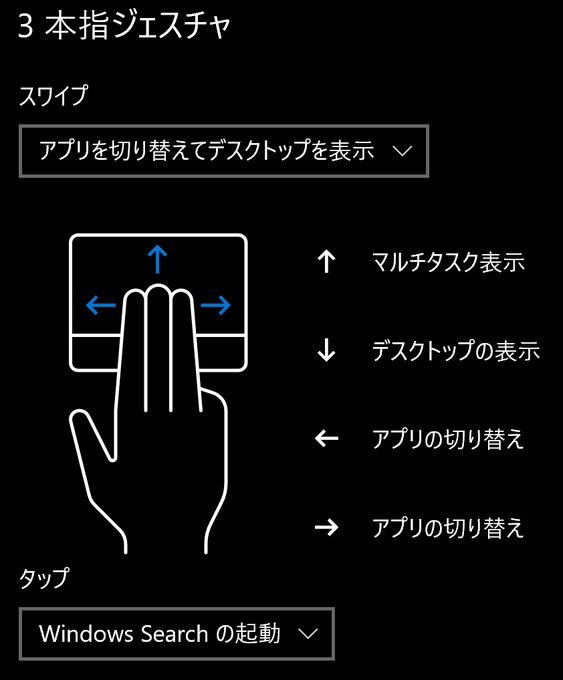
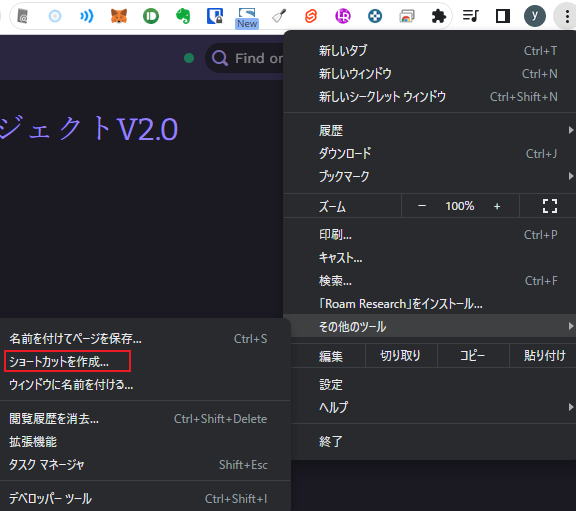
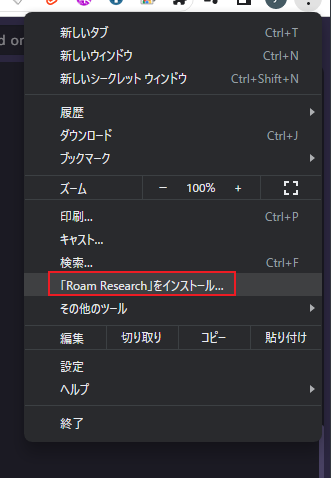

最近、Acer さんのセールでノート PC を購入しました。

https://store.acer.com/ja-jp/acer-conceptd-7-cn715-71p-f73z8

普段はトリプルディスプレイのデスクトップ PC で作業しているのですが、ノート PC でモニタを繋げずに作業するときにデスクトップ PC に比べて作業効率が悪いです。

作業効率をあげるために取り入れたことを紹介しようと思います。

## 3 本指スワイプ

Windows ではデフォルトで次のアクションが割り当てられていました。

スワイプ操作でアプリの切替ができるため一番最初に取り入れました。



## Chrome タブを別アプリとして開く

Chrome タブで開いているサイトでよく使うものは別アプリとして開くように設定しました。

この手順で別アプリとして開いたものは、先ほど **3 本指スワイプで説明したアプリの切替の対象に Chrome アプリも対象になるためとても便利** です。

参考： https://retu27.com/chrome_another_application.html

Chrome の右の 3 点リーダー > その他のツール > ショートカットを作成



または、インストールできるアプリはインストールする



## 「Windows キー + 数字」でタスクバー上のアプリを起動(開く)

Windows では、「Windows キー + 数字」でタスクバー上の対応したアプリを開けるようです（これは知りませんでした）。

参考： https://retu27.com/chrome_another_application.html

下記を例にすると、

- 「Windows キー + 1」で Chrome(1 つ目)
- 「Windows キー + 2」で TaskChute Cloud
- 「Windows キー + 3」で Chrom(2 つ目)

がそれぞれ対応します。


## Chrome 拡張機能の Popup Tab Switcher でタブ切替を便利にする

「Alt + y」で Chrome のタブを切り替えられるようになります。

基本は、Ctrl + Tab(Ctrl + Shift + Tab)で切り替えるのと変わりませんが、**最初に呼び出されるのが直近開いたタブを呼び出してくれるので切り替えながら作業したいときには高速で作業できる**ようになります。

参考： https://retu27.com/popup_tab_switch.html

Popup Tab Switcher

https://chrome.google.com/webstore/detail/popup-tab-switcher/cehdjppppegalmaffcdffkkpmoflfhkc

### チートシート

ここまでに説明したノート PC の生産性をあげるときのショートカットキーをまとめたものです。

- Windows

  - コマンド
    - 説明
  - 3 本指スワイプ(左/右)
    - アプリ切り替え(`Alt+Tab`と同じ)
      ※Chrome アプリも切替対象になる
  - 3 本指スワイプ(上)
    - マルチタスク表示
  - 3 本指スワイプ(下)
    - デスクトップ表示
  - `Win + 数字キー`
    - タスクバーのアプリに対応
      ※左から連番で 1,2,3,4...と数字が対応

- Google Chrome
  - コマンド
    - 説明
  - `Alt + y`
    - タブの切替(`Ctrl + Tab`と違い、直近開いたタブを呼び出し)
      (Popup Tab Switcher)

## キーボード設定を AutoHotkey に寄せる

今までキーボード設定は Microsoft IME に直接行っていました。

ですが、Microsoft IME は設定ファイルをエクスポート・インポートしての管理ができません。

今はデスクトップ PC とノート PC があり設定ファイルで共通化したいこともあり、この機会に AutoHotkey に寄せました。

今回は下記を参考に設定しました。

参考： https://snowsystem.net/other/windows/windows-capslock-ctrl-f13-key/

AutoHotkey をダウンロードします。

- https://www.autohotkey.com/
- 今回、Current Version(`AutoHotkey_1.1.34.03_setup`)をダウンロードしました。

最終的に下記設定になりました。

keysetting.ahk

```javascript
; ■■■■■■■■■■■■■■■■■■■■■■■■■■■■■■
; IMEのON/OFFの制御を行う関数
; IME_SET(0): IME OFF、IME_SET(1): IME ON
; ref: https://namayakegadget.com/765/
; ■■■■■■■■■■■■■■■■■■■■■■■■■■■■■■
IME_SET(SetSts, WinTitle="A")    {
	ControlGet,hwnd,HWND,,,%WinTitle%
	if	(WinActive(WinTitle))	{
		ptrSize := !A_PtrSize ? 4 : A_PtrSize
	    VarSetCapacity(stGTI, cbSize:=4+4+(PtrSize*6)+16, 0)
	    NumPut(cbSize, stGTI,  0, "UInt")   ;	DWORD   cbSize;
		hwnd := DllCall("GetGUIThreadInfo", Uint,0, Uint,&stGTI)
	             ? NumGet(stGTI,8+PtrSize,"UInt") : hwnd
	}

    return DllCall("SendMessage"
          , UInt, DllCall("imm32\ImmGetDefaultIMEWnd", Uint,hwnd)
          , UInt, 0x0283  ;Message : WM_IME_CONTROL
          ,  Int, 0x006   ;wParam  : IMC_SETOPENSTATUS
          ,  Int, SetSts) ;lParam  : 0 or 1
}


; ■■■■■■■■■■■■■■■■■■■■■■■■■■■■■■
; 無変換キーをベースとしたショートカットキー割当
; ref: https://snowsystem.net/other/win
; ■■■■■■■■■■■■■■■■■■■■■■■■■■■■■■

; 無変換の単発押しはIME OFF
vk1D::IME_SET(0)

; ----------------------------------
; vimのcursolkey
; ----------------------------------
vk1D & h::Left
vk1D & j::Down
vk1D & k::Up
vk1D & l::Right

; ----------------------------------
; word jump
; ----------------------------------
vk1D & u::
  if GetKeyState("Shift") {
    Send ^+{Left}
    return
  }
  Send ^{Left}
  return

vk1D & i::
  if GetKeyState("Shift") {
    Send ^+{Right}
    return
  }
  Send ^{Right}
  return

; ----------------------------------
; コロン(vkBA)とセミコロン(vkBB)をEnter
; ----------------------------------
vk1D & vkBA::Enter
vk1D & vkBB::Enter

; ----------------------------------
; Home/End/BS/Del
; ----------------------------------
vk1D & a::Home
vk1D & e::End
vk1D & n::BS
vk1D & m::Del

; ----------------------------------
; カーソル位置から行末まで削除
; ----------------------------------
vk1D & o::
  send {ShiftDown}{End}{ShiftUp}
  send ^c
  send {Del}
  return


; ■■■■■■■■■■■■■■■■■■■■■■■■■■■■■■
; 変換キーをベースとしたショートカットキー割当
; ref: https://snowsystem.net/other/win
; ■■■■■■■■■■■■■■■■■■■■■■■■■■■■■■

; 変換の単発押しはIME ON
vk1C::IME_SET(1)


; ■■■■■■■■■■■■■■■■■■■■■■■■■■■■■■
; かなキーをベースとしたショートカットキー割当
; ref: https://snowsystem.net/other/win
; ■■■■■■■■■■■■■■■■■■■■■■■■■■■■■■

; かなキーの単発押しはIME ON
vkF2::IME_SET(1)


; ■■■■■■■■■■■■■■■■■■■■■■■■■■■■■■
; ESCキーをベースとしたショートカットキー割当
; ref: https://snowsystem.net/other/win
; ■■■■■■■■■■■■■■■■■■■■■■■■■■■■■■

; ESCの単発押しはIME OFF
~Esc::IME_SET(0)
```

### チートシート

ここまでに説明した AutoHotkey を導入して使えるようになったショートカットキーをまとめたものです。

- AutoHotkey
  - コマンド
    - 説明
  - `無変換`
    - IME のオフ
  - `無変換 + hjkl`
    - 矢印に対応
  - `無変換 + ae`
    - Home、End に対応
  - `無変換 + nm`
    - Backspace、Delete に対応
  - `無変換 + ;:`
    - Enter に対応
  - `無変換 + ui`
    - 単語単位のカーソル移動
  - `無変換 + o`
    - カーソル位置から行末まで切り取り
  - `変換`
    - IME のオン
  - `かな`
    - IME のオン
  - `ESC`
    - IME のオフ
