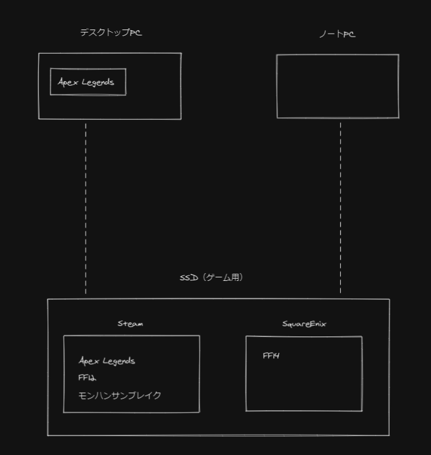

Acer さんのセールでノート PC を購入を購入してからというものを色々使い道に迷っていました。

https://store.acer.com/ja-jp/acer-conceptd-7-cn715-71p-f73z8

使い道を迷わす要因として、購入したノート PC がメモリも 32GB でハイスペックにもかかわらず、PC ゲームが動くグラフィックボードも搭載しているということです。

本当にたまたまこのスペックのノート PC が投げ売り状態の値段で買えたからこその贅沢な悩みですが、デスクトップ PC もゲーミングパソコンでハイスペックで PC ゲームもできてしまうのでどうノート PC を活用するかは結構な悩みでしたが、使わないのは勿体なのでどちらでもゲームするぞ！という結論に至りました w

次の悩みとしては出てきたのが、デスクトップ PC とノート PC どちらでも同じゲームをできるようにしたいというものです。それを実現するために試したことなどを共有したいと思います。

## 最終的な構成

基本的にゲームクライアントは Steam を使います。

FF14 は Steam にもあるのですが Steam 版はあまりよくないみたいなことを見かけたので普通に公式からインストールしてきました（FF14 はこの機にインストールしてやってみたもののまだがっつり遊べてません；；）。

次に試したのが SSD の Steam クライアントと FF14 が SSD を取り外してデスクトップ PC で動くか、ノート PC で動くかということです。

Steam クライアントのゲームも FF14 も問題なく起動できました。

SSD の良いところはデータを切り分けられることです。Windows 側にデータがあるわけではないので、よく初期化してクリーンアップする私としては毎回のゲームデータダウンロードはかなり負担だったのですが、初期化時は SSD を外しておくだけでゲーム環境は影響を受けないので、初期化後もすぐにゲームを始めることができます。

これでポータブル環境については完成です。

デスクトップ PC に Apex Legends が入っているのは奥さんと遊ぶためです。

デスクトップ PC に Apex Legends を入れて、ノート PC は SSD の Apex Legends を使い、それぞれアカウントも切り替えれば一緒にゲームすることができます（環境を構築したもののまだ一緒にできていないのでそのうちやりたいです；；）。

## 感想

ノート PC でもデスクトップ PC どちらでもゲームができる環境は最高です。

ノート PC はコントローラーでやるゲーム、ゴロゴロしながらしたいときなどのとき、デスクトップ PC はグラフィックボードなどがハイスペックなので綺麗な画面でプレイしたいとき、がっつりキーマウでゲームを楽しみたいときなどと使い分けられるようになりました。

また、ノート PC は出先でもゲームしたいときなど重宝しそうですｗ
