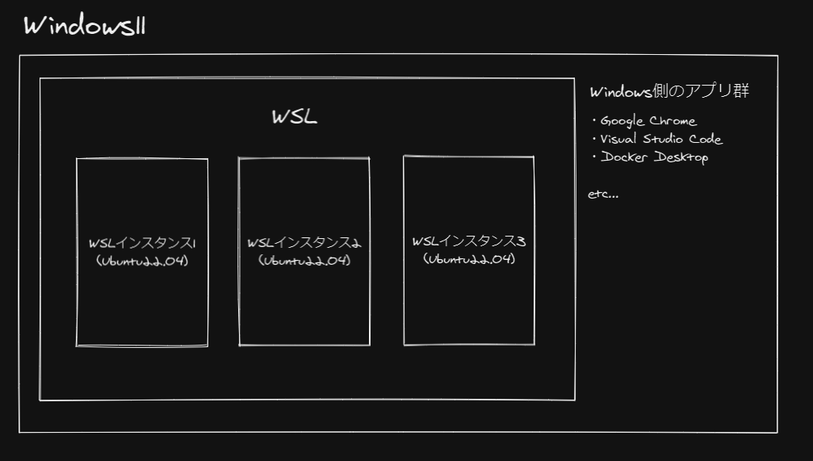
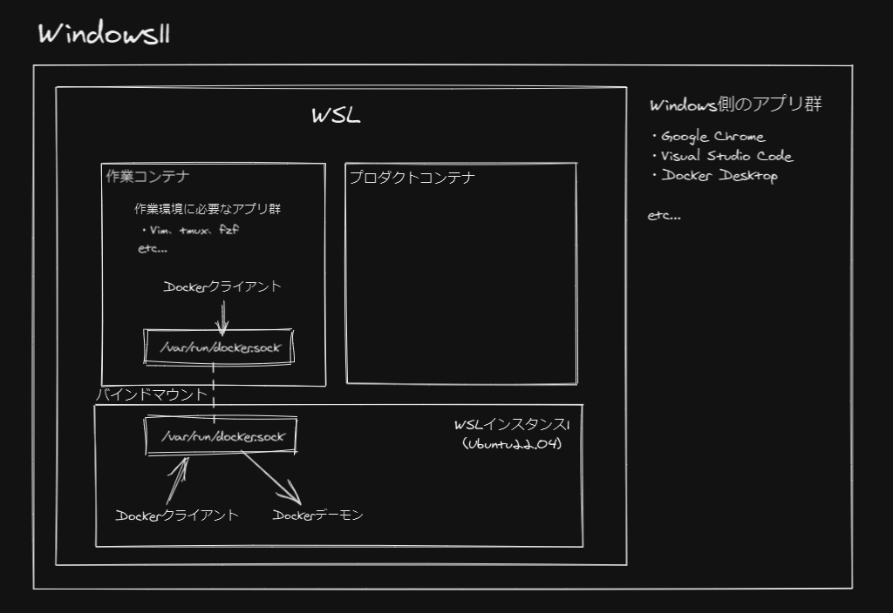

**定期的に PC を初期化（リストア）したくなる衝動に駆られるときはないですか？**

私はあります！

仕事でもプライベートでも同じデスクトップ PC（OS は Windows11）を使っています。

普通に生活しているだけで Windows の設定を変えたり、いろんなツールをインストールしたりするので知らない間に環境がどんどん汚れていきます。

そのうちよくわからない原因で PC が重くなったりすることがあったり、なかったりするので定期的に PC を初期化したくなります。

とはいえ、仕事でも使ってたり、プライベートで使うためのゲームなどのデータもあったりで気軽にはリストアできません；；また、セットアップも時間がかかるので大変です。

なので、開発環境のセットアップなど毎回同じことをする部分は忘れがちなので手順をメモしておいたり、インストールスクリプトや設定をを dotfiles 管理してできるだけ気軽にリストアできるような状態を保つように心がけています。

ある程度リストア後のセットアップ周りは私の中で落ち着いていたのですが、最近ノート PC が届いたことをきっかけにその熱が再燃しました。

**今回は「Windows 環境をいつでもリストアできるわがまま環境を作りたい」という願望をもとに全体的に大幅な見直しをしたので自分が今後参考にするためにもやったことなどを残しておこうと思います。**

## Windows 環境をいつでもリストアできるわがまま環境とは

私の場合、リストアするときに次のことが大体ネックになるのでそこら辺を解決できればいいなと思います。

- **PC ゲームの再インストールがめんどくさい**
  - → グラボが積んであって PC ゲームができるノート PC とデスクトップ PC があるので、ゲーム環境をポータブルにしたい
- **Windows 環境のセットアップ手順やインストールするアプリを忘れがち**
  - → できるだけスクリプト化して手順を自動化したい
- **作業環境の構築が大変**
  - → Dockerfile にして 1 コマンドで構築できるようにしたい

## わがまま環境その１：PC ゲーム環境をポータブルにした

すでにこちらは記事にまとめました。**SSD にデータを置くことで解決しました！**

思った以上に簡単にできて感動しました。これでゲームに関しては影響しないので心置きなくリストアできます。

- 参考：[[PCゲーム環境をポータブルにしてデスクトップPCとノートPCどちらでも同じゲームをできるようにした]]

## わがまま環境その２：Windows 環境のセットアップをできるだけ楽に

今回は主に Windows11 からの手順は整理しきれていなかったので整理したり、キーボード周りの設定を AutoHotkey に寄せたり、一部をスクリプト化したりと細かい改善を行いました。

### キーボード周りの設定を AutoHotkey に寄せた

キーボードは BAROCCO の MD770 という分割キーボードを使っています。

- 参考：[[BAROCCO MD770 JP（日本語配列）を買いました]]

BAROCCO の MD770 はキーボード本体にマクロ機能が搭載されており、本体に直接複雑な操作などを登録したりできます。

- 参考：[[MISTEL BAROCCO MD770のマクロ機能を使って文字列を[[]]で囲みたい]]

また、PowerToys や Microsoft IME などにも設定をしていたりと色んなところにキーボード設定が散らばっていて管理が大変でした。

そのため、 **できるだけ依存先を減らすためにほとんどの設定は AutoHotkey で実現することができたので AutoHotkey に寄せました。** 設定などは下記記事の最後あたりにまとめています。

- 参考：[[ノートPCのシングルディスプレイ環境で生産性高く作業するために取り入れたこと]]

ちょっとした設定だけは AutoHotkey で実現できないのでそこは引き続き Microsoft IME で設定していきます。

### Windows11 からは開発に関わる色んなことが便利に！

**Windows11 では最初から Windows Terminal が備わっているので別途インストールする必要がなくなりました！** セットアップの手順が一つ減るのでとてもありがたいです。

これは Windows11 からではないですが、 **Windows10 と 11 はデフォルトのパッケージ管理マネージャーとして winget が備わっています。** Chocolatey と比較するとパッケージはまだ充実しているとはいいがたい気がしますが有名なアプリは充実しているのでほとんど困りません。winget 本体はインストールする必要がないのでこれまたセットアップの手順が一つ減るのでとてもありがたいです。

- 参考：[winget、Chocolatey、scoop の比較と開発環境の構築自動化 \- Nodachisoft](https://nodachisoft.com/common/jp/article/jp000009/)

一番の目玉は WSL のインストールが`wsl --install`で 1 コマンドになったという点です。Windows の UI で Windows でしか使えないアプリを使いつつ、開発用で本物の Linux 環境が欲しいという開発者にとって WSL はとても便利なのでその **WSL がコマンド 1 発で導入できるようになった** のはとてもうれしい話です。

- 参考：https://docs.microsoft.com/ja-jp/windows/wsl/install#install-wsl-command

### Windows11 ～ WSL2 のセットアップまでの手順

ここまでの内容を踏まえて Windows11 ～ WSL2 のセットアップまでの手順を整理しました。

**下記のリポジトリの READEME にセットアップ手順をまとめています。**

- 参考：https://github.com/snyt45/windows11-dotfiles

今後は、Windows11 ～ WSL2 のセットアップまでに関しては下記リポジトリをメンテするだけでよくなりました。

工夫した点として、一部をスクリプト化し、`setup.ps1`を実行するだけである程度セットアップできるようにしました。

スクリプト化したこと

- Windows 設定
- ソフトウェアインストール
- `.wslconfig`はホームディレクトリにコピー
- AutoHotkey の設定ファイルをスタートアップディレクトリにショートカット作成

インストール後の Windows 設定、各ソフトウェアの設定、WSL2 のセットアップ周りはスクリプト化が難しかったためひとまず手順をまとめることにしました。タイミングを見てスクリプト化できそうなところはスクリプト化していきたいです。

## わがまま環境その３：作業環境を Dockerfile にまとめて WSL2 上で快適な開発ライフを送る

**今回の一番のメインであり、一番苦戦したのが作業環境を Dockerfile にまとめることです。**

そもそも Dockerfile にまとめようと思ったきっかけがひのしばさんの記事です。先駆者がいたこと、作業環境を Dockerfile にまとめるうえで検討した点が具体的でとても分かりやすかったこと、リポジトリを公開されていたことが決め手となり 1 か月ほどかけて構築しました。

- 参考：[作業環境を Dockerfile にまとめて、macOS でも Linux でも WSL2 でも快適に過ごせるようになった話](https://zenn.dev/hinoshiba/articles/workstation-on-docker)

**こちらが Dockerfile などをまとめた私のリポジトリになります。**

- 参考：https://github.com/snyt45/dockerfiles

### 今までの作業環境

構築したリポジトリの説明の前に 今までの作業環境がどんな作業環境だったのかを紹介します。

ざっくり説明すると次のような感じで WSL2 上に作業環境を構築していました。

- OS は Windows11
- 作業環境は開発先に合わせて 3 つの WSL インスタンスを構築
  - WSL インスタンス 1 ・・・ 自分が遊ぶ用の環境
  - WSL インスタンス 2 ・・・ 自社開発のプロダクト開発用環境
  - WSL インスタンス 3 ・・・ 開発支援先のプロダクト開発用環境
- WSL インスタンス毎に開発に必要なアプリ等をインストールしてセットアップ
  - 作業環境のセットアップは dotfiles にまとめては共通化していました。
    - 参考：https://github.com/snyt45/wsl-dotfiles2

この構成の良いところは、ほかの WSL インスタンスに影響しないところです。用途に合わせて WSL インスタンスを構築しているので何かあって初期化したいときはその WSL インスタンスを捨てて構築しなおせばよいだけです。

これで色々やって失敗してもその WSL インスタンスを捨てて入れなおせばよいと思って喜んでいましたが、実際に運用してみてそのメリットを享受できる場面はほぼなかったです。

どちらかといえば **WSL インスタンス毎にセットアップが必要なので dotfiles で共通化していても結構手間がかかるというデメリットのほうが上回っていました。**
また、 **Windows 全体をリストアしたいとなると WSL インスタンスのセットアップに時間がかかるため、Windows 全体を気軽にリストアできないとう状況に陥ってました。**

### 今回の作業環境

今までの作業環境から次の点が大きく変わりました。

- WSL インスタンスが 3 つから 1 つになりました。
  - WSL インスタンス内に複数の開発先の環境が混在するようになりましたが、**WSL インスタンス自体は 1 つでよくなるのでセットアップがかなり楽になりました**
- 作業環境がコンテナになりました。
  - **インストール手順や設定など永続的なものは Dockerfile にまとめたので今後は Dockerfile をメンテするだけでよくなりました。また、コンテナになったことで WSL インスタンス上の環境にいい意味で影響を与えないようになりました。**

### 作業環境を Dockerfile にまとめるうえでのポイント

- コメントアウトを多めに
  - dotfiles のメンテしたときはなぜそれをやったのかを覚えているのですが、その後は基本触るタイミングがくるのがだいぶ日が経ってからだったりして忘れてしまって手を加えづらくなるのでコメント多めにして後からでもわかるようにしました。
- Makefile
  - ひのしばさんの構築例をもとに私も docker 起動周りは Makefile にまとめました。
  - Makefile にまとめたことで`make target="workbench"`すれば使えるようになりました。
  - build し直すときは`make stop target="workbench"`して`make build target="workbench"`して`make target="workbench"`でコンテナにアタッチし直すだけです。
  - **複雑なことはすべて Makefile に書いて忘れることができるのですごく使っていて快適なところが良いです。**
- ユーザー周り

  - 私の場合はシェルスクリプトではなく Dockerfile 内でユーザー作成して作成したユーザーに切り替えるようにしました。volta のインストールなどは root ユーザーで行うと root ユーザーのホームディレクトリに必要なディレクトリが作成されてしまうので、作成したユーザーに切り替えたあとに行うなどしています。
  - また、 **作成したユーザーの UID や GID などもホスト側と揃えているので Docker コンテナ内でファイル作成してもホスト側でパーミッションを変更する必要がなくなったりといいことづくめでした。**

- docker outside of docker
  - ひのしばさんの構築例をもとに初めて docker outside of docker の構成にしました。
  - **コンテナからホスト側の Docker を操作することができるので作業コンテナの CLI の状態を引き継ぎながら、ホスト側と同じように Docker を操作することができるので作業コンテナに引きこもることがさらに快適になりました。**

### その他、開発時に気になる点について

- Docker について
  - Windows の Docker を WSL 上でも併用して使える(WSL に入れなおさなくて良い)ので、Docker Desktop は Windows 側にインストールします。
  - > Docker Desktop for Windows は、Docker でコンテナー化するアプリのビルド、配布、実行のための開発環境を提供します。 WSL 2 ベースのエンジンを有効にすることで、同じコンピューター上の Docker Desktop で Linux と Windows の両方のコンテナーを実行できます。
    > 参考： https://docs.microsoft.com/ja-jp/windows/wsl/tutorials/wsl-containers
- Visual Studio Code について
  - WSL と Visual Studio Code は親和性が高く、設定をすれば Windows 側の Visual Studio Code から WSL インスタンス上のソースコードを普段と変わらずに編集できるので Windows 側にインストールします。
  - また、 **作業コンテナと共有したいソースコードは WSL インスタンス上の`~/work/`配下にあるので普段通り Visual Studio Code から WSL インスタンス上のソースコードを編集もできます。**
  - > Visual Studio Code を Remote - WSL 拡張機能と併用することで、WSL をフルタイムの開発環境として VS Code から直接使用できます。
    > 参考：https://docs.microsoft.com/ja-jp/windows/wsl/tutorials/wsl-vscode
- SQL クライアントについて
  - SQL クライアントも Windows 側にインストールします。WSL で構築したサーバーは Windows 側で構築したときと同じように`localhost`でアクセスできます。プロダクトコンテナは WSL インスタンス上に立つので、Windows 側から WSL インスタンス上の DB にも`localhost:3306`などでアクセスすることができます。
    - > Linux ディストリビューションでネットワーク アプリ (たとえば、Node.js または SQL Server で実行されるアプリ) を構築する場合、(通常の場合と同様に) localhost を使用して (Microsoft Edge または Chrome インターネット ブラウザーなどの) Windows アプリからアクセスすることができます。
      > 参考：https://docs.microsoft.com/ja-jp/windows/wsl/networking#accessing-linux-networking-apps-from-windows-localhost

## まとめ

具体的なコードなども説明できたらよかったのですが記事自体が長くなってしまうのと全体像の説明でだいぶ疲れてしまったので、細かいところはリポジトリを見に行っていただけれと思います！

実際に仕事で使うのはこれからなのでまだはまりポイントやつらいポイントが出てくるかもしれませんが、 **作業環境が Dockerfile にまとまっているので手順や設定を忘れることができるメリットはとても大きいなと思いました。**

**build は 5 分～ 10 分くらいかかりますが頻繁に設定を変えることがなければ初回だけなのであまり気になりませんし、コンテナの起動自体はサクサクでちょっと変なものを間違って入れてしまったときなどはコンテナを削除して建て直せばいいので、今のところ Dockerfile に移行してよかったなという感想でした。**
