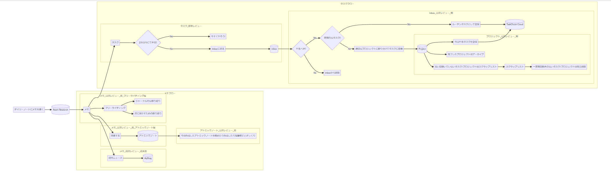

v1.0 として公開しています。検討段階のフローも多分に含まれています。

## 全体像

## 全てのアクションは Roam Research のデイリーノートに思考のメモを取ることから始めます。

なぜなら、タスクやアイデアは全てメモ(思考)が起点にあり、そこから人が「これはタスクだな、これはアイデアだ」と振り分けることで始めて、タスクやアイデアといった具体的なものになるからです。

メモを全てデイリーノートから書き始める理由は、デイリーノートがとにかく書くこと・思考を進めるノートとして最適だからです。デイリーノートは毎日自動で作成されるノートで、書き始めるときにそのメモをどこに書くか、これがタスクなのか、アイデアなのかは考えずにとにかく書くことができます。また、デイリーノートで書き始めることでメモを書くハードルも格段に下がるため、量を増やすことができます。このとき質は問いません。質は後からでも向上させることは可能ですが、量についてはそのとき思考したことを書き留めなければもう思い出すことはできずに一生失われるかもしれないからです。

## タスクは「振り返り」を行い、ただのメモからタスクに変換し、実行レーンに登録して実行する。

メモを取りながら、すぐに実行できそうであればその流れで実行してしまいます。

それ以外の場合は Roam Research 上で「Inbox」というタグをつけて、Inbox に送ります。

Inbox に送ったメモは、次の日の朝になったら見直します。

- まず、やるべきかどうかを判断します。1 日おくとそのときは必要だと思ったけど、やっぱりやらなくていいなというものもあります。その場合は「Inbox」タグを外して Inbox から削除します。
- 次にやるべきだと思うメモが定期的なタスクであれば、そのまま TackChute Cloud に登録して実行レーンに乗せます。
- やるべきだと思うメモが一時的なプロジェクトやタスクであれば、適切なプロジェクトのタスクとして登録します。

次に、朝の同じタイミングくらいで「Project」にあるタスクを見直します。

- 今日やるタスクは「TackChute Cloud」に登録して実行レーンに乗せます。
- 完了しているプロジェクトやタスクはアーカイブしたり DONE にします。
- 長い間動いていないタスク/プロジェクトはスクラップリストに移動します。
- スクラップリストに移動したタスク/プロジェクトで長い間動いていないものは削除します。
  - 長い間動いていないタスク/プロジェクトはスクラップリストに移動 → 完全削除という二段階の振り返りをすることで、「やらないタスク/プロジェクトが残り続ける」「消すか不安なものを確固たる意思で削除できる」メリットがあります。

## メモは「振り返り」を行い、ただのメモから最終的にはアトミックノートに変換する。

その日に書いたメモは基本的にその日のうちに振り返ります。

- 振り返るときに思ったことをそのまま書くフリーライティングという手法で振り返ります。
- 大体がジャーナル的な感じで振り返ったり、こうすれば次に活かせるみたいな振り返りをしていることが多いです。今のところこう振り返るという型を決めずに行っています。それは、そのときで注目する点が違ったりし、それが新しいアイデアに繋がったりすることが多いと感じているからです。

その日の振り返りの後に清書するための時間を設けます。

- 清書=アトミックノートにするための時間です。アトミックノートはひとつのことを書いたノートです。
- 最初はひとつのことが書けそうだなというメモからタイトルを考えてノートにしていきます。
- アトミックノートの考え方は Zettelkasten やエバーグリーンノートを参考にしていますが、アトミックノートの状態はこの型のプロセスを参考に 4 段階(どんぐり(acorn) → 苗木(seedlings) → 出芽(budding) → 常緑(evergreen))で進化させていきます。
  - 参考：https://matt.roam.garden/Evergreen-Notes
- アトミックノートも必ず「見直し」が必要です。まだ検討段階ですが次のようなフローで見直すことを考えています。
  - 作成されてから 2 週間以内 && ステータスが 「acorn」 または 「seedlings」
    - budding の構造化された状態にする
  - 作成されてから 2 週間経過 && ステータスが 「acorn」 または 「seedlings」
    - ステータスが acorn
      - 2 週間経って思い出しながら書くのは難しいため、削除
    - ステータスが seedlings
      - 振り返りできないほど、忙しい可能性もあるため、様子見
  - 作成されてから 4 週間経過 && ステータスが 「acorn」 または 「seedlings」
    - ステータスが acorn
      - 削除が漏れているだけなので迷いなく、削除
    - ステータスが seedlings
      - 4 週間経っても構造化できていないものを構造化するのも難しい & 構造化されていないと後から読むときも役に立たないため、削除
  - ステータスが「budding」 または 「evergreen」
    - anki でランダムに振り返られる仕組みを構築して振り返る
      - このとき、文章中や関連としてリンクできるものがあればリンクする
      - 定期的に振り返ることでそこから新しいアイデアや関連が生まれるかも。セレンディピティやメモの鮮度を保つために実施。

1 週間のメモを振り返ります。

- 時間を置くことでその日のうちに見えなかった発見があります。
- その週の印象な出来事を公開できる程度の文章に直して、週間ニュースとして公開します。

## 重要だと思う原則

- メモを書くときに、置く場所・分類を考えずに書けるようにする
- 書いたメモは必ず「振り返り」を行い、清書する(タスクに変換/アトミックノートにする etc)
- 清書したものも必ず「見直し」を行い、信頼できる新鮮な状態を保つ
