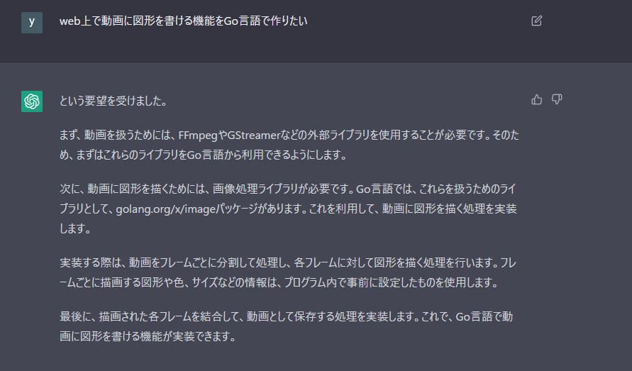

今週は仕事のほうが忙しくてやりたいことがあまりできていないですね…

## 11 月 26 日(土)

[[Roam Researchを起点に全てが動き出す]]の v1.0 のタスク管理方法にちゃんと移行しました。

- [[Roam Researchを起点に全てが動き出す]]の v1.0 でタスク・プロジェクト管理の仕組みを見直しましたが管理方法を実際には移行できていなかったため移行しました。
- タスクやプロジェクトを作成したものの作りっぱなしで着手されることはなく長い間ほこりを被っていたものがほとんどでした。そのため、個人管理ということもあり、プロジェクトなどの階層を作らずにフラットに OPEN・DONE・Scrap のリストのみで管理するように移行しました。
- このとき、改めて知ったのですが Roam Reserch でブロックの先頭の中黒部分をホバーすると作成日時が見えるのでそれをもとに自信を持って長い間ほこりを被っているタスクを削除できそうです。

二段階構えで振り返ることの大事さ

- 自信を持って次の日に進むためには毎日のメモを振り返りをことは欠かせません。
- ただ振り返っただけでは振り返っただけで終わってしまうため、その振り返りの結果を清書することも大事です。
- 今まで清書せずに進んでいた場合、清書するだけでも目覚ましい成長ですがそこで満足してはいけません。色んな自分の興味・関心の文脈でさらなるアイデアの発展につなげるためにも清書したものも定期的に振り返り、ノート同士でリンクをして他の概念とつながることで初めてその清書したノートの価値が生まれます。

Trello の card aging 機能は全てのタスク管理できるシステムに入れてほしい

- Trello をタスク管理で現在使ってはいないのですが、そういえば card aging 機能便利だなーと思い久しぶりに使うことを検討しました。
- 検討したときは、複数プロジェクトを管理するワークスペース機能が有料だったので使うことを見送ったのですが今はプロジェクト横断で全てのタスクを管理する形で雑にやっているので Trello でやるのもありかもしれません。
- card aging 機能は長期間タスクが放置されているとタスクカードがボロボロな表示になるので見た目でわかりやすいのでまた検討してみようと思います。

## 11 月 27 日(日)

Roam Research の query builder を使って、作成したアトミックノートが振り返れる仕組みを作りました

- 作成した query です。
  - Atomic Notes\_作成されてから 2 週間以内 && ステータスが 「acorn」 また「seedlings」
  - Atomic Notes\_作成されてから 2 週間経過 && ステータスが 「acorn」 または 「seedlings」
  - Atomic Notes\_作成されてから 4 週間経過 && ステータスが 「acorn」 または 「seedlings」
  - Atomic Notes\_ステータスが「budding」 または 「evergreen」
- https://twitter.com/snyt45/status/1597804872241643522

目的のための手段が楽しめるなら上手くいくタイプだと改めて思いました。

- 最近、スポーツの課題を解決するためのチャンネルを立ち上げてみたり、将来構想としてあるトークンを作るということに対して短期的にはこれができたら絶対最高！というモチベーションで目的思考で始めてみたのですが、目的を達成するための手段が楽しめないと長続きしないなと改めて思いました。
- それは、元々の目的が自分の得意領域からかけ離れすぎていたこと、目的の過程が楽しめなかったことが長続きしない理由なのだと思います。
- 今の仕事も開発しながら Vim を育てたり、Vim のことを知れたりしてさらに開発自体が便利になって楽しいから続けられるとかもひとつ大きなモチベーションになっています。最近だと Go 言語を使って開発したいなという気持ちがあり、積極的に情報を取りに行っています。
- 自分は目的は二の次でその過程が自分が楽しめる技術だからエンジニアという仕事が長続きしているのだと改めて思いました。

## 11 月 28 日(月)

特に書くことがないのでスキップ

## 11 月 29 日(火)

リファクタリングや負債返済などはプロダクトにとってすごく重要なことだと思うものも他の人にどう説明すれば理解してもらえるのかなと思い考えてみました。

- 要約すると、下記のようなことですね。
  - 価値提供につながる機能開発とは異なり、リファクタリングや設計変更などは価値提供につながらないため、切り捨てられやすい。しかし、このような変更は開発者のワークスペースを整理し、仕事を快適にするために重要である。長生きするプロダクトでは、価値提供と開発効率のバランスがとても重要である。
- 開発者もプロダクトのコアユーザーの一人であり長生きするプロダクトであればあるほど、開発者はプロダクトと向き合う時間が長いんですね。ある意味、プロダクトは仕事場であるのでその仕事場が散らかっていれば仕事が完了するまでの時間は長くかかるわけですし、最悪の場合仕事環境が良くなければそこで仕事をしたくなるので開発者も離れていくわけです。

## 11 月 30 日(水)

技術ファーストでのチャレンジは大事

- これはバリュースピーチで褒めてもらったときの一言です。
- 技術ファーストでチャレンジするとその先でつながることがある。これはまさに真理ですね。目的ファーストでも技術ファーストでも無駄なチャレンジはひとつもないと思うので、色んな観点で動き続けていたいですね。

開発フローの全体の見直し

- いまリファクタリング期間ということもあり、今までその場でその場でやってきた開発フローを図解してボトルネックを解消していこうとしています。
- 図解すると全体像が見えてきますし、何より各フローで個々人が最適化して吸収してくれていたのだなと思う箇所も見えてきます。そういう個々人で頑張っている部分は大きくなったときに絶対にスケールしないので、仕組みに落としてみんなが楽しく開発できるようにしていきたいですね。

apt-fast を導入

- 自分の開発環境で apt install で結構時間かかっていたのですが、だいぶ早くなったのでたくさん apt install している Dockerfile で導入するのはいいと思いました。
- https://c-a-p-engineer.github.io/tech/2022/09/25/docker-speedup/

## 12 月 1 日(木)

Go は言語仕様がシンプル

- 最近なぜ Go がいいと思ったかという話をするときに Go は言語仕様がシンプルという話をしたのですが、どこで見たっけ？となったので、見つけたソースを貼っておきます。
- > Go の主要な特徴として、言語仕様の薄さがあります。 たとえば Java 17 の言語仕様は、A4 にしておよそ 800 ページ分もあるわけですが、 Go の言語仕様は、たった 80 ページ程度で収まってしまうほどです。 それだけ、Go が持つ仕様や機能の構成がとてもミニマルであることがわかります。
  > https://inside.dmm.com/entry/2021/12/10/ex-java-engineer-thoughts-about-go

## 12 月 2 日(金)

canvas の getting start やってみました

- Go で canvas を扱うためのライブラリです。
  - https://github.com/tdewolff/canvas/wiki/Getting-Started
- 簡単に次のような画像が作れました。これを応用して図作成ツールなど作ってみたいです。
  - 

Rspec のテストで特定の callback だけ無視したい

- `モデル名.__callbacks`でコールバック一覧を確認できます。
- `モデル名.skip_callback(:commit, :after, :method_name)`でコールバックを無視できます。
- スキップしたら再設定を行わないとエラーになるため、`モデル名.set_callback(:commit, :after, :method_name)`でコールバックを再定義する必要があります。
- このときの注意点としては、skip したコールバックが`after_commit :method_name, on: :create`など`on`で指定しているところまでは再定義できていません。そのため、全ての commit 後に動いてしまいます。
- `class モデル名; after_commit :method_name, on: :create; end`で再定義するのが良さそうです。ただ、グローバルに再定義するのはよくないため、できればコールバックを無視する`insert`などを使ってテスト時は無視するのが良さそうです。

ChatGPT は天才です。

- 動画に図を書き込む機能とかをどう作ればいいんだろうと思ったときに 1 日くらい使って調べてみてもそのときはわからずじまいだったのですが、試しに ChatGPT に聞いたら一発でした。
  - 
- 今まで勉強したい、作りたいと思ったときに何をすればいいか調べて悩む時間がかなり削減されそうですね
