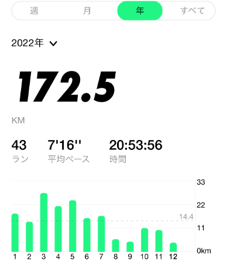
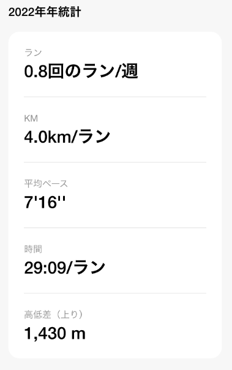

2022 年ももう終わりですね。時間が経つのがどんどん早くなっている気がします。

今週は週刊ニュースをお休みして、2022 年の振り返りをしようと思います。

## 今年の総括：2022 年はどんな年だった？

[2021 年の振り返りと 2022 年の目標](https://snyt45.com/_FAShXgwu)を見ると、「小さく目標設定し、小さく行動し、小さく振り返り、小さく次の行動につなげるための土台を作る」ということを目標にしていました。

結果としては目標を達成することができました！

目標を達成するまでの話をすると、目標を達成するために動いていたのは実質 3 月くらいまででした。

3 月くらいまで、目標を細分化して、行動レベルまで落とし込み、毎週振り返りを行うという鬼速 PDCA を実践していました。効果は絶大なものの、目標を達成するための振り返りの質も高いため時間がかかったり、目標を達成するために頑張るというのが続かず、自分に合わないという思い途中でやめていました。

**そこからは目標を達成するために頑張るというよりは自分の興味があることを少しずつやっていきました。**

Obsidian から Roam Research に移行したり、Zettelkasten を実践したり、アトミックノートを作るようになったり、開発環境を Docker 化したりと目標とは遠いところでたくさんの PDCA を回していました。

結果として、点と点がつながって今では週単位でメモを振り返る週刊ニュースをやっていたり、仕事面でも開発以外にも組織を加速させるための施策をやったり、興味を持ったプログラミング言語の勉強に集中できたりと少しずつ種まきしていた事が実を結んだ年でもありました。

これらの成果が生まれたのは、目の前のことばかりではなく 1 つ 1 つできることを着実に増やしたことで、次のステップが見えてきて、またできることを増やして、次のステップに集中するというサイクルが回ったからだと思います。

**来年は、あえて目標は立てずに大きな方向感や価値観、直感を大事にして進んでいけたらと思います。**

## 2022 年 月別ダイジェスト

### 1 月

- [エルゴヒューマンエンジョイ](https://www.ergohuman.jp/product/ergohuman_enjoy.php)を買った
- Roam Research を本格的に使い始めた
- ゴリラ.vim のヘルプ読書会に参加した

### 2 月

- AtCoder を始めた
- Roam Research にブログを移行した
- BASE FOOD を頼み始めた

### 3 月

- [分割キーボード](https://snyt45.com/AIPxVB8ni)を買った
- nosh を頼み始めた

### 4 月

- Vim をたくさん触っていた

### 5 月

- 配信環境を整えてみた
- 人生で初フグ・コース料理を食べた

### 6 月

- graphql-devise を使った実装を頑張った

### 7 月

- Zettelkasten についてとことん学んだ

### 8 月

- Windows のスペック高めのノート PC を買った
- 麻雀にハマった

### 9 月

- Windows のセットアップ周りを見直した
- 作業環境を Dockerfile へ移行した
- 仙台に出張した

### 10 月

- Google アドセンスの審査に通った
- Vim の記事を Zenn に書いた
- Go 言語の勉強を始めた

### 11 月

- 週刊ニュースを始めた
- アトミックノートを始めた

### 12 月

- 整体に通い出した
- 断捨離した
- 業務改善に力を入れ始めた

## 振り返りレポート

### 第 2 領域に使った時間は「901 時間」でした

TaskChute Cloud 集計です。

2022 年は、901 時間は自分の種まきの時間に使うことができたようです。

内容は読書、開発環境基盤づくり、Vim、Go、ノートテイキングのことなど様々でしたが、そのとき気になることに時間を使ってコツコツとアクションを積み重ねることで目の前のことに集中できるというメリットもあったと思います。

### Zenn

今まで Qiita に書いていましたが、[Vim の記事](https://zenn.dev/snyt45/articles/e320e5c67b26b4)を Zenn で書いてみました。

ネットにある色々な人の記事に支えながらここまでこれたのでその感謝も込めて、自分が Vim を使いながら色々試したことを詰め込んだ記事となりました。

憧れの mattn さんにも記事を認知してもらえてとても嬉しかったです！

https://twitter.com/mattn_jp/status/1587718919288016896

### LAPRAS

https://twitter.com/snyt45/status/1609145878216060931

### Nike Run Club

後半は徐々に距離が下火になっていますね…

ランニングはハードルが高いのですが、走ると気持ちがいいので続けていきたいです。

