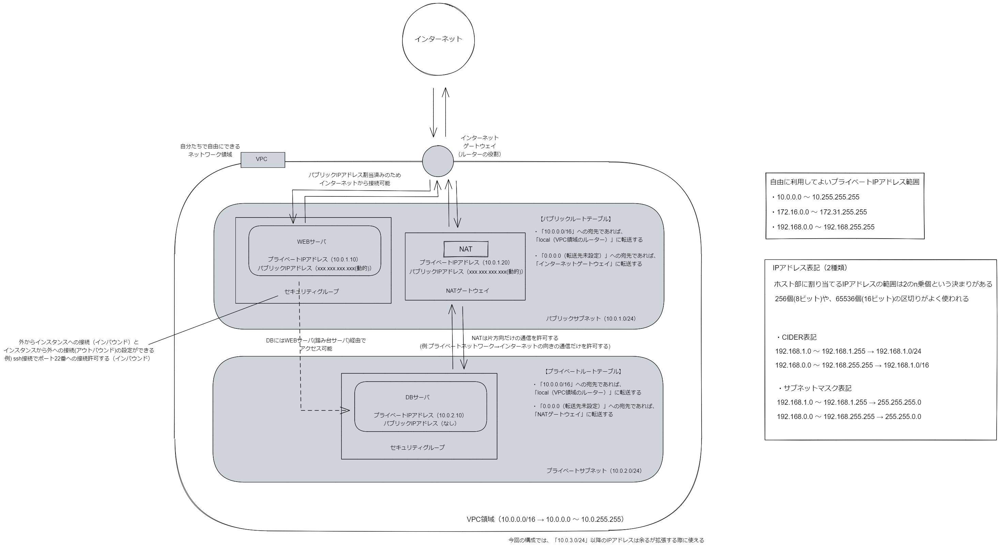

あけましておめでとうございます。今年もいい 1 年にしていきましょう。
さっそく振り返っていきます。

## 12 月 31 日(土)

デスクトップ PC のリストアをしました

- 年末大掃除ということで PC まわりもスッキリさせるためにリストアをしました。
- 手順や設定ファイルに関しては git 管理しています。
  - windows11 のセットアップ手順
    - https://github.com/snyt45/windows11-dotfiles
  - 作業コンテナ構築用のセットアップ手順
    - https://github.com/snyt45/dockerfiles
- リストアを行う度に手順や設定ファイルが充実していくため、今回はかなりスムーズに進めることができました。
- だいぶ安定して行えるようになってくるといつ PC が壊れても復帰できるという安心感がありとても心理的に良いです。

## 1 月 1 日(日)

やりたいことがどんどん出てくる

- 業務改善や Go 言語を深めたり、インフラの知識を深めたりとやりたいことがどんどん出てきて時間が足りないなーと改めて思いました。こういうときはすごく焦りますが、着実にひとつずつやっていくしかないのでコツコツやっていきます。

Notion の Slack 連携の強化 2 はまだきていなさそう

- こちらのツイートを見て、Slack 連携の強化 2 がきていたら Notion から Slack への通知周りがはかどると思い、色々調べたり試してみたのですが、[Notion の新着情報](https://www.notion.so/ja-jp/releases)を見るとまだきていなさそうでした。
- サブタスクと依存関係はすでにきているので Slack 通知する際に Notion イベントの種類を選択できる機能も早くきてほしいです。
- https://twitter.com/ken_tbdz/status/1591001064438108160

## 1 月 2 日(月)

Amazon Web Services 基礎からのネットワーク&サーバー構築 をチャプター 3 まで進めた

- 年末年始でなにかやろうと思っていて AWS 周りﾅﾆﾓﾜｶﾗﾅｲ状態だったのでやってみました。
- チャプター 3 までの感想です。
  - ところどころ操作 UI が変わっていて苦労するものの設定の本質は変わっていないのでなんとか進める
  - 画面ポチポチで設定していくのが辛いのを実際に体験できた(自社では Terraform を使っている)
  - 2 章はネットワーク部分で辛いけど大事な章。CIDER 表記がわかるだけでもだいぶ違った
  - 3 章でインスタンス作成したがペアキーを紐づけ忘れると作り直すしかないのは辛い

## 1 月 3 日(火)

Amazon Web Services 基礎からのネットワーク&サーバー構築 をチャプター 8 まで進めた

- 2 日目はチャプター 4 からでした。ネットワークを構築してインスタンスを作成したあとの話でインスタンスにインストールする系が多かったのでどんどん進めることができました。
- 4 章では WEB サーバにアクセスするときにアクセスできずにハマっていたのですが、`https`で接続していたからでした。`http`にすると接続できました…
- 6 章でプライベートサブネットを作るのですがサブネットの作成はパブリックサブネットを作る時と何も変わらなかったので何が違うのだろうと思ったのですが、インスタンスにパブリック IP アドレスを割り当てないという点が大きく違いました。あくまでもサブネット側でパブリックかどうか設定するのではないんだなという感想でした。
- また、WEB サーバを踏み台にして DB サーバに SSH するということもやり、これが踏み台サーバなのかと理解できました。
- 細かいところは結構無視したものの 8 章まで進めて、自分が知りたかったネットワークの全体像を短期間でキャッチアップすることができたのでかなり良かったです。
- 

## 1 月 4 日(水)

React で「Invalid Hook Call Warning」というエラーが出た

- ApolloCient の onError の中で useNavigate を使い、navigate で遷移させるということをやろうとしていたのですが、「Invalid Hook Call Warning」というエラーが出ました

  - ```javascript
    const errorLink = onError(({ graphQLErrors, networkError }) => {
      const navigate = useNavigate(); // NG

      if (graphQLErrors) {
        const { code } = graphQLErrors[0].extensions;

        if (code === "NOT_FOUND") {
          navigate("/not_found"); //NG
        }
      }
    });
    ```

- https://ja.reactjs.org/warnings/invalid-hook-call-warning.html
- このエラーが出るときの大まかなケースは次の 3 つのときのようです。
  - 1. React と React DOM のバージョン不整合
  - 2. フックのルールへの違反
  - 3. 重複した React のコピー
- 色々調べた結果、2 のフックを「イベントハンドラ内で呼び出さないでください。」というルールに違反していたようです。
- イベントハンドラ内で呼び出さずに独自の use 関数で該当のコードを囲み、独自の use 関数の最初の行で`const navigate = useNavigate()`を呼び出すようにすると解消できました。

## 1 月 5 日(木)

Notion から Slack 通知をするのに make を使ってみた

- こちらの記事を参考に make を使ってみました。
- https://news.mynavi.jp/techplus/article/howtonotion-18/
- 使ってみた感想としてはかなり良かったです。
  - 無料プランでもフィルタ機能が使える
  - 無料プランではアクティブなシナリオ数が 2 個まで
    - make の場合は次のプランにあげれば無制限になり、料金もかなり良心的
  - シナリオを作るのは慣れるまでちょっと設定がむずかしい
  - ポーリングが最短で 15 分感覚で設定可能

## 1 月 6 日(金)

Apollo Client で ErrorLink を使って高度なエラー処理ができますが、ErrorLink の中で throw した例外が捕捉できずにドはまりしました

- サーバ側からエラーを返す時に共通の CODE を返すようにしており、その CODE をもとに Apollo Client から例外を throw して、react-router で例外を捕捉してコンポーネントをエラー内容に合わせて動的に出し分けるということがやりたかったのですがそれができずにドはまりしました。
- 色々試したもののちゃんとした原因がわかっていないのですが、Apollo Client の仕組みをしっかり理解できていないことがボトルネックになったなと感じたので、次に活かしていこうと思います。
