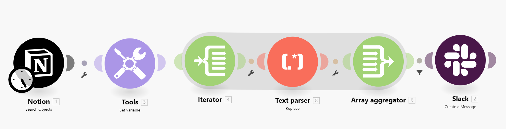
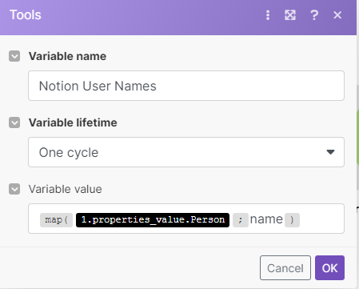
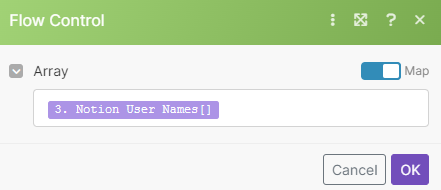
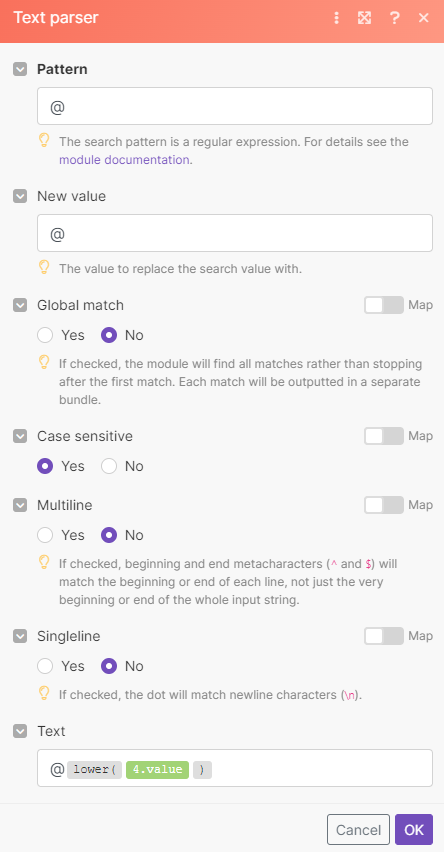
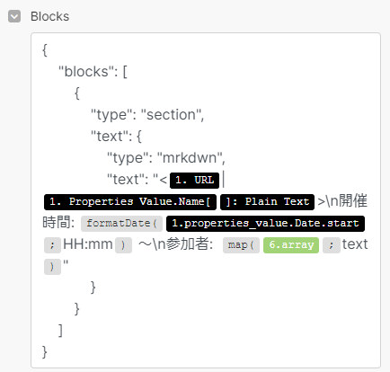

## 背景

zapier の代用で make を使っています。

make は無料プランでフィルタ機能が使えたり、プランは個人に最適化されていて試しやすいプランになっているのですが日本語の情報量が少なめです。

今は Notion x Slack 連携で使っており、ミーティングノートを 30 分前になったら専用の Slack チャンネルに自動通知するようにしています。

## Slack で通知したい文章

通知する文章は下記のような感じです。参加者の部分は Notion のユーザー名を元に取得しています。

```javascript
テストtitle
開催時間: 17:15 ～
参加者: test.taro, test.hanako
```

## make の map 関数のみだと実現できなさそう

make では、map 関数があり、配列を繰り返し処理する場合に便利です。下記のようにすると次のような出力が得られます。

- `map(array; name)` => `test.taro, test.hanako`

今回は Slack 側でメンションされるように`@`を入れると構文エラーになってしまいます。

- `map(array; @name)` => エラー

配列の文字列の先頭に`@`をつけたいだけでしたが map 関数では実現できないようでした。

かなり遠回りですが、自分の場合は Itelator → text parser(replace) → array aggregator を挟むことで実現できました。

## 実現するためにやったこと

- モジュールの全体像
  - 

1. Set Variables
   - Notion User Names という name の配列を作ります。
   - 
2. Iterator
   - 配列を Iterator で分割する。
   - 
3. Replace
   - Iterator で要素ごとに文字列が渡ってくるので、先頭に@をつける
   - 
4. Array aggregator
   - 置換後の要素を再度配列に加工しなおします。
5. Create a Message
   - Array aggregator で作成した配列をループします。
   - 
